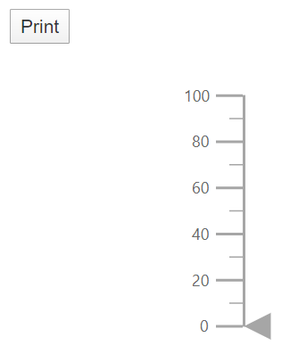
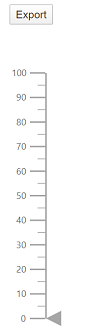

# Print and Export in Blazor Linear Gauge Component

## Print

To use the print functionality, we should set the [`AllowPrint`](https://help.syncfusion.com/cr/blazor/Syncfusion.Blazor~Syncfusion.Blazor.LinearGauge.LinearGaugeModel~AllowPrint.html) property to **true**. The rendered linear gauge can be printed directly from the browser by calling the method [`print`](https://help.syncfusion.com/cr/blazor/Syncfusion.Blazor~Syncfusion.Blazor.LinearGauge.SfLinearGauge~Print.html). You can get the Linear Gauge component object using `@ref="Gauge"`

```csharp
@using Syncfusion.Blazor.LinearGauge

<button @onclick="PrintGauge">Print</button>
<SfLinearGauge @ref="Gauge" AllowPrint="true">
</SfLinearGauge>

@code {
    SfLinearGauge Gauge;
    void PrintGauge()
    {
        this.Gauge.Print();
    }
}
```



## Export

### Image Export

To use the image export functionality, we should set the [`AllowImageExport`](https://help.syncfusion.com/cr/blazor/Syncfusion.Blazor~Syncfusion.Blazor.LinearGauge.LinearGaugeModel~AllowImageExport.html) property to **true**. The rendered linear gauge can be exported as an image using the [`export`](https://help.syncfusion.com/cr/blazor/Syncfusion.Blazor~Syncfusion.Blazor.LinearGauge.SfLinearGauge~Export.html) method. The method requires two parameters: image type and file name. The linear gauge can be exported as an image in the following formats.

* JPEG
* PNG
* SVG

```csharp
@using Syncfusion.Blazor.LinearGauge
<button @onclick="ExportGauge">Export</button>
<SfLinearGauge @ref="Gauge" AllowImageExport="true">
</SfLinearGauge>

@code {
    SfLinearGauge Gauge;
    void ExportGauge()
    {
        this.Gauge.Export(ExportType.PNG, "LinearGauge");
    }
}
```



### PDF Export

To use the PDF export functionality, we should set the [`AllowPdfExport`](https://help.syncfusion.com/cr/blazor/Syncfusion.Blazor~Syncfusion.Blazor.LinearGauge.LinearGaugeModel~AllowPdfExport.html) property to **true**. The rendered linear gauge can be exported as PDF using the [`export`](https://help.syncfusion.com/cr/blazor/Syncfusion.Blazor~Syncfusion.Blazor.LinearGauge.SfLinearGauge~Export.html) method. The [`export`](https://help.syncfusion.com/cr/blazor/Syncfusion.Blazor~Syncfusion.Blazor.LinearGauge.SfLinearGauge~Export.html) method requires three parameters: file type, file name and orientation of the PDF document. The orientation setting is optional and "0" indicates portrait and "1" indicates landscape.

```csharp
@using Syncfusion.Blazor.LinearGauge
<button @onclick="ExportGauge">Export</button>
<SfLinearGauge @ref="Gauge" AllowPdfExport="true">
</SfLinearGauge>

@code {
    SfLinearGauge Gauge;
    void ExportGauge()
    {
        this.Gauge.Export(ExportType.PDF, "LinearGauge", 0);
    }
}
```

