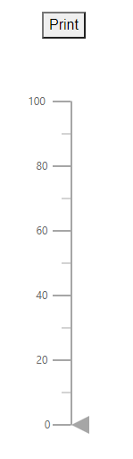

# Print And Export in Blazor Linear Gauge Component

## Print

The rendered Linear Gauge can be printed directly from the browser by calling the [PrintAsync](https://help.syncfusion.com/cr/blazor/Syncfusion.Blazor.LinearGauge.SfLinearGauge.html#methods) method. Enable printing by setting the [AllowPrint](https://help.syncfusion.com/cr/blazor/Syncfusion.Blazor.LinearGauge.SfLinearGauge.html#Syncfusion_Blazor_LinearGauge_SfLinearGauge_AllowPrint) property to **true**.

```cshtml

@using Syncfusion.Blazor.LinearGauge

<button @onclick="PrintGauge">Print</button>

<SfLinearGauge @ref="gauge" AllowPrint="true">
    <LinearGaugeAxes>
        <LinearGaugeAxis Minimum="0" Maximum="100">
            <LinearGaugeMajorTicks Interval="20"></LinearGaugeMajorTicks>
            <LinearGaugeMinorTicks Interval="10"></LinearGaugeMinorTicks>
            <LinearGaugePointers>
                <LinearGaugePointer>
                </LinearGaugePointer>
            </LinearGaugePointers>
        </LinearGaugeAxis>
    </LinearGaugeAxes>
</SfLinearGauge>

@code {
    SfLinearGauge gauge;

    public async Task PrintGauge()
    {
        await this.gauge.PrintAsync();
    }
}

```



## Export

### Image Export

Enable image export by setting [AllowImageExport](https://help.syncfusion.com/cr/blazor/Syncfusion.Blazor.LinearGauge.SfLinearGauge.html#Syncfusion_Blazor_LinearGauge_SfLinearGauge_AllowImageExport) property to **true**. Then call [ExportAsync](https://help.syncfusion.com/cr/blazor/Syncfusion.Blazor.LinearGauge.SfLinearGauge.html#methods) method with the desired export type and file name to export the rendered Linear Gauge. Supported image formats include:

* JPEG
* PNG
* SVG

```cshtml

@using Syncfusion.Blazor.LinearGauge

<button @onclick="ExportGauge">Export</button>

<SfLinearGauge @ref="gauge" AllowImageExport="true">
    <LinearGaugeAxes>
        <LinearGaugeAxis Minimum="0" Maximum="100">
            <LinearGaugeMajorTicks Interval="20"></LinearGaugeMajorTicks>
            <LinearGaugeMinorTicks Interval="10"></LinearGaugeMinorTicks>
        </LinearGaugeAxis>
    </LinearGaugeAxes>
</SfLinearGauge>

@code {
    SfLinearGauge gauge;

    public async Task ExportGauge()
    {
        await this.gauge.ExportAsync(ExportType.PNG, "LinearGauge");
    }
}

```


### PDF Export

Enable PDF export by setting the [AllowPdfExport](https://help.syncfusion.com/cr/blazor/Syncfusion.Blazor.LinearGauge.SfLinearGauge.html#Syncfusion_Blazor_LinearGauge_SfLinearGauge_AllowPdfExport) property to **true**. Export the rendered Linear Gauge as a PDF using the [ExportAsync](https://help.syncfusion.com/cr/blazor/Syncfusion.Blazor.LinearGauge.SfLinearGauge.html#methods) method. The method supports specifying the export type and file name, and optionally the PDF page orientation (**Portrait** or **Landscape**).

```cshtml

@using Syncfusion.Blazor.LinearGauge

<button @onclick="ExportGauge">Export</button>

<SfLinearGauge @ref="gauge" AllowPdfExport="true">
    <LinearGaugeAxes>
        <LinearGaugeAxis Minimum="0" Maximum="100">
            <LinearGaugeMajorTicks Interval="20"></LinearGaugeMajorTicks>
            <LinearGaugeMinorTicks Interval="10"></LinearGaugeMinorTicks>
        </LinearGaugeAxis>
    </LinearGaugeAxes>
</SfLinearGauge>

@code {
    SfLinearGauge gauge;

    public async Task ExportGauge()
    {
        await this.gauge.ExportAsync(ExportType.PDF, "LinearGauge");
    }
}

```


### Exporting Linear Gauge as base64 string of the file

The Linear Gauge can be exported as a base64 string in JPEG, PNG, and PDF formats. Use the [ExportAsync](https://help.syncfusion.com/cr/blazor/Syncfusion.Blazor.LinearGauge.SfLinearGauge.html#methods) method and pass the export type, file name, PDF orientation (set to **null** for image formats), and set the **allowDownload** parameter to **false** to receive a base64 string instead of downloading the file.

```cshtml

@using Syncfusion.Blazor.LinearGauge

<button @onclick="ExportGauge">Export</button>

<SfLinearGauge @ref="gauge" AllowImageExport="true">
    <LinearGaugeAxes>
        <LinearGaugeAxis Minimum="0" Maximum="100">
            <LinearGaugeMajorTicks Interval="20"></LinearGaugeMajorTicks>
            <LinearGaugeMinorTicks Interval="10"></LinearGaugeMinorTicks>
        </LinearGaugeAxis>
    </LinearGaugeAxes>
</SfLinearGauge>

@code {
    SfLinearGauge gauge;

    public async Task ExportGauge()
    {
       string exportString = await this.gauge.ExportAsync(ExportType.PNG, "LinearGauge", null, false);
       Console.WriteLine(exportString);
    }
}

```

N> Exporting the Linear Gauge as a base64 string is not applicable for the **SVG** format.
