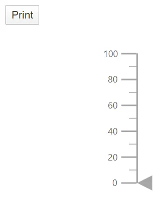
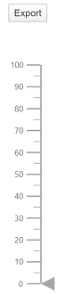

# Blazor Linear Gauge Print and Export

## Print

The rendered Linear Gauge can be printed directly from the browser by calling the [PrintAsync](https://help.syncfusion.com/cr/blazor/Syncfusion.Blazor.LinearGauge.SfLinearGauge.html#methods) method. To use the print functionality, set the [AllowPrint](https://help.syncfusion.com/cr/blazor/Syncfusion.Blazor.LinearGauge.SfLinearGauge.html#Syncfusion_Blazor_LinearGauge_SfLinearGauge_AllowPrint) property as **true**.

```cshtml
@using Syncfusion.Blazor.LinearGauge

<button @onclick="PrintGauge">Print</button>

<SfLinearGauge @ref="gauge" AllowPrint="true">
    <LinearGaugeAxes>
        <LinearGaugeAxis Minimum="0" Maximum="100">
            <LinearGaugeMajorTicks Interval="20"></LinearGaugeMajorTicks>
            <LinearGaugeMinorTicks Interval="10"></LinearGaugeMinorTicks>
            <LinearGaugePointers>
                <LinearGaugePointer>
                </LinearGaugePointer>
            </LinearGaugePointers>
        </LinearGaugeAxis>
    </LinearGaugeAxes>
</SfLinearGauge>

@code {
    SfLinearGauge gauge;
    public async Task PrintGauge()
    {
        await this.gauge.PrintAsync();
    }
}
```



## Export

### Image export

To use the image export functionality, set the [AllowImageExport](https://help.syncfusion.com/cr/blazor/Syncfusion.Blazor.LinearGauge.SfLinearGauge.html#Syncfusion_Blazor_LinearGauge_SfLinearGauge_AllowImageExport) property to **true**. The rendered Linear Gauge can be exported as an image using the [ExportAsync](https://help.syncfusion.com/cr/blazor/Syncfusion.Blazor.LinearGauge.SfLinearGauge.html#methods) method. This method requires the following two parameters: export type and file name. The Linear Gauge can be exported as an image in any of the following formats.

* JPEG
* PNG
* SVG

```cshtml
@using Syncfusion.Blazor.LinearGauge

<button @onclick="ExportGauge">Export</button>

<SfLinearGauge @ref="gauge" AllowImageExport="true">
    <LinearGaugeAxes>
        <LinearGaugeAxis Minimum="0" Maximum="100">
            <LinearGaugeMajorTicks Interval="20"></LinearGaugeMajorTicks>
            <LinearGaugeMinorTicks Interval="10"></LinearGaugeMinorTicks>
        </LinearGaugeAxis>
    </LinearGaugeAxes>
</SfLinearGauge>

@code {
    SfLinearGauge gauge;

    public async Task ExportGauge()
    {
        await this.gauge.ExportAsync(ExportType.PNG, "LinearGauge");
    }
}
```



### PDF Export

To use the PDF export functionality, set the [AllowPdfExport](https://help.syncfusion.com/cr/blazor/Syncfusion.Blazor.LinearGauge.SfLinearGauge.html#Syncfusion_Blazor_LinearGauge_SfLinearGauge_AllowPdfExport) property to **true**. The rendered Linear Gauge can be exported as a PDF using the [ExportAsync](https://help.syncfusion.com/cr/blazor/Syncfusion.Blazor.LinearGauge.SfLinearGauge.html#methods) method, which requires three parameters: export type, file name, and the orientation of the PDF document. The orientation of the PDF document can be set to **Portrait** or **Landscape**.

```cshtml
@using Syncfusion.Blazor.LinearGauge

<button @onclick="ExportGauge">Export</button>

<SfLinearGauge @ref="gauge" AllowPdfExport="true">
    <LinearGaugeAxes>
        <LinearGaugeAxis Minimum="0" Maximum="100">
            <LinearGaugeMajorTicks Interval="20"></LinearGaugeMajorTicks>
            <LinearGaugeMinorTicks Interval="10"></LinearGaugeMinorTicks>
        </LinearGaugeAxis>
    </LinearGaugeAxes>
</SfLinearGauge>

@code {
    SfLinearGauge gauge;

    public async Task ExportGauge()
    {
        await this.gauge.ExportAsync(ExportType.PDF, "LinearGauge");
    }
}
```


### Export as base64 string

The Linear Gauge can be exported as a base64 string for the JPEG, PNG, and PDF formats. The rendered Linear Gauge can be exported as a base64 string of the exported image or PDF document using the [ExportAsync](https://help.syncfusion.com/cr/blazor/Syncfusion.Blazor.LinearGauge.SfLinearGauge.html#methods) method. The arguments required for this method are export type, file name, the orientation of the exported PDF document, and the **allowDownload** boolean value, which is set to **false** to return a base64 string. The orientation of the exported PDF document is set to **null** for image export and to **Portrait** or **Landscape** for the PDF document.

```cshtml
@using Syncfusion.Blazor.LinearGauge

<button @onclick="ExportGauge">Export</button>

<SfLinearGauge @ref="gauge" AllowImageExport="true">
    <LinearGaugeAxes>
        <LinearGaugeAxis Minimum="0" Maximum="100">
            <LinearGaugeMajorTicks Interval="20"></LinearGaugeMajorTicks>
            <LinearGaugeMinorTicks Interval="10"></LinearGaugeMinorTicks>
        </LinearGaugeAxis>
    </LinearGaugeAxes>
</SfLinearGauge>

@code {
    SfLinearGauge gauge;
    public async Task ExportGauge()
    {
       string exportString = await this.gauge.ExportAsync(ExportType.PNG, "LinearGauge", null, false);
       Console.WriteLine(exportString);
    }
}
```

N> Base64 string export is not supported for the SVG format.

## See also

* [Getting Started with Blazor Linear Gauge](getting-started.md)
* [Methods in Blazor Linear Gauge](methods.md)
* [Blazor Linear Gauge User Interaction](user-interaction.md)