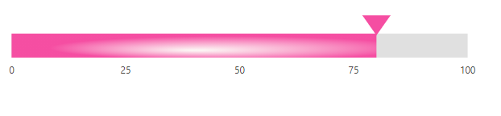

# Ranges in Blazor Linear Gauge Component

A range highlights a span of axis values. Define a range using the [Start](https://help.syncfusion.com/cr/blazor/Syncfusion.Blazor.LinearGauge.LinearGaugeRange.html#Syncfusion_Blazor_LinearGauge_LinearGaugeRange_Start) and [End](https://help.syncfusion.com/cr/blazor/Syncfusion.Blazor.LinearGauge.LinearGaugeRange.html#Syncfusion_Blazor_LinearGauge_LinearGaugeRange_End) properties of [LinearGaugeRange](https://help.syncfusion.com/cr/blazor/Syncfusion.Blazor.LinearGauge.LinearGaugeRange.html). Multiple ranges can be added using [LinearGaugeRanges](https://help.syncfusion.com/cr/blazor/Syncfusion.Blazor.LinearGauge.LinearGaugeRanges.html).

```cshtml

@using Syncfusion.Blazor.LinearGauge

<SfLinearGauge>
    <LinearGaugeAxes>
        <LinearGaugeAxis Minimum="0" Maximum="100">
            <LinearGaugeRanges>
                <LinearGaugeRange Start="50" End="80" StartWidth="20" EndWidth="20">
                </LinearGaugeRange>
            </LinearGaugeRanges>
            <LinearGaugePointers>
                <LinearGaugePointer></LinearGaugePointer>
            </LinearGaugePointers>
        </LinearGaugeAxis>
    </LinearGaugeAxes>
</SfLinearGauge>

```


## Customizing the range

Customize ranges using the following [LinearGaugeRange](https://help.syncfusion.com/cr/blazor/Syncfusion.Blazor.LinearGauge.LinearGaugeRange.html) properties:

* [StartWidth](https://help.syncfusion.com/cr/blazor/Syncfusion.Blazor.LinearGauge.LinearGaugeRange.html#Syncfusion_Blazor_LinearGauge_LinearGaugeRange_StartWidth) – Sets the range thickness at the start value.
* [EndWidth](https://help.syncfusion.com/cr/blazor/Syncfusion.Blazor.LinearGauge.LinearGaugeRange.html#Syncfusion_Blazor_LinearGauge_LinearGaugeRange_EndWidth) – Sets the range thickness at the end value.
* [Color](https://help.syncfusion.com/cr/blazor/Syncfusion.Blazor.LinearGauge.LinearGaugeRange.html#Syncfusion_Blazor_LinearGauge_LinearGaugeRange_Color) – Sets the range color.
* [Position](https://help.syncfusion.com/cr/blazor/Syncfusion.Blazor.LinearGauge.LinearGaugeRange.html#Syncfusion_Blazor_LinearGauge_LinearGaugeRange_Position) – Controls where the range is placed. The default is outside the axis. Set to [Inside](https://help.syncfusion.com/cr/blazor/Syncfusion.Blazor.LinearGauge.Position.html#Syncfusion_Blazor_LinearGauge_Position_Inside), [Outside](https://help.syncfusion.com/cr/blazor/Syncfusion.Blazor.LinearGauge.Position.html#Syncfusion_Blazor_LinearGauge_Position_Outside), [Cross](https://help.syncfusion.com/cr/blazor/Syncfusion.Blazor.LinearGauge.Position.html#Syncfusion_Blazor_LinearGauge_Position_Cross), or [Auto](https://help.syncfusion.com/cr/blazor/Syncfusion.Blazor.LinearGauge.Position.html#Syncfusion_Blazor_LinearGauge_Position_Auto).
* [Offset](https://help.syncfusion.com/cr/blazor/Syncfusion.Blazor.LinearGauge.LinearGaugeRange.html#Syncfusion_Blazor_LinearGauge_LinearGaugeRange_Offset) – Applies a distance offset from the axis.
* [LinearGaugeRangeBorder](https://help.syncfusion.com/cr/blazor/Syncfusion.Blazor.LinearGauge.LinearGaugeRangeBorder.html) – Configures the border color and width.

```cshtml

@using Syncfusion.Blazor.LinearGauge

<SfLinearGauge>
    <LinearGaugeAxes>
        <LinearGaugeAxis Minimum="0" Maximum="100">
            <LinearGaugeRanges>
                <LinearGaugeRange Start="50" End="80" StartWidth="2" EndWidth="15"
                                  Color="orange" Position="Position.Inside"
                                  Offset="4">
                    <LinearGaugeRangeBorder Color="red" Width="2">
                    </LinearGaugeRangeBorder>
                </LinearGaugeRange>
            </LinearGaugeRanges>
            <LinearGaugePointers>
                <LinearGaugePointer></LinearGaugePointer>
            </LinearGaugePointers>
        </LinearGaugeAxis>
    </LinearGaugeAxes>
</SfLinearGauge>

```


## Setting the range color for the labels

To color axis labels to match the corresponding range, set [UseRangeColor](https://help.syncfusion.com/cr/blazor/Syncfusion.Blazor.LinearGauge.LinearGaugeAxisLabelStyle.html#Syncfusion_Blazor_LinearGauge_LinearGaugeAxisLabelStyle_UseRangeColor) to true in [LinearGaugeAxisLabelStyle](https://help.syncfusion.com/cr/blazor/Syncfusion.Blazor.LinearGauge.LinearGaugeAxisLabelStyle.html).

```cshtml

@using Syncfusion.Blazor.LinearGauge

<SfLinearGauge>
    <LinearGaugeAxes>
        <LinearGaugeAxis>
           <LinearGaugeAxisLabelStyle UseRangeColor="true">
           </LinearGaugeAxisLabelStyle>
            <LinearGaugeRanges>
                <LinearGaugeRange Start="20" End="60" Color="red">
                </LinearGaugeRange>
            </LinearGaugeRanges>
        </LinearGaugeAxis>
    </LinearGaugeAxes>
</SfLinearGauge>

```


## Multiple ranges

Add multiple ranges by including multiple [LinearGaugeRange](https://help.syncfusion.com/cr/blazor/Syncfusion.Blazor.LinearGauge.LinearGaugeRange.html) instances within [LinearGaugeRanges](https://help.syncfusion.com/cr/blazor/Syncfusion.Blazor.LinearGauge.LinearGaugeRanges.html). Customize each range using its properties.

```cshtml

@using Syncfusion.Blazor.LinearGauge

<SfLinearGauge>
    <LinearGaugeAxes>
        <LinearGaugeAxis>
            <LinearGaugeRanges>
                <LinearGaugeRange Start="1" End="30" StartWidth="10" EndWidth="10"
                                  Color="#41f47f">
                </LinearGaugeRange>
                <LinearGaugeRange Start="30" End="50" StartWidth="10" EndWidth="10"
                                  Color="#f49441">
                </LinearGaugeRange>
                <LinearGaugeRange Start="50" End="80" StartWidth="10" EndWidth="10"
                                  Color="#cd41f4">
                </LinearGaugeRange>
            </LinearGaugeRanges>
            <LinearGaugePointers>
                <LinearGaugePointer></LinearGaugePointer>
            </LinearGaugePointers>
        </LinearGaugeAxis>
    </LinearGaugeAxes>
</SfLinearGauge>

```


## Gradient Color

Gradient support enables applying multiple colors to a range. The Linear Gauge supports two gradient types:

* Linear gradient
* Radial gradient

### Linear Gradient

A linear gradient applies colors in a straight progression. Set the start using [StartValue](https://help.syncfusion.com/cr/blazor/Syncfusion.Blazor.LinearGauge.LinearGaugeLinearGradient.html#Syncfusion_Blazor_LinearGauge_LinearGaugeLinearGradient_StartValue) and the end using [EndValue](https://help.syncfusion.com/cr/blazor/Syncfusion.Blazor.LinearGauge.LinearGaugeLinearGradient.html#Syncfusion_Blazor_LinearGauge_LinearGaugeLinearGradient_EndValue). Specify color stops with [Color](https://help.syncfusion.com/cr/blazor/Syncfusion.Blazor.LinearGauge.ColorStop.html#Syncfusion_Blazor_LinearGauge_ColorStop_Color), [Opacity](https://help.syncfusion.com/cr/blazor/Syncfusion.Blazor.LinearGauge.ColorStop.html#Syncfusion_Blazor_LinearGauge_ColorStop_Opacity), and [Offset](https://help.syncfusion.com/cr/blazor/Syncfusion.Blazor.LinearGauge.ColorStop.html#Syncfusion_Blazor_LinearGauge_ColorStop_Offset) in [ColorStop](https://help.syncfusion.com/cr/blazor/Syncfusion.Blazor.LinearGauge.ColorStop.html).

```cshtml

@using Syncfusion.Blazor.LinearGauge

<SfLinearGauge Orientation="Orientation.Horizontal">
    <LinearGaugeContainer Width="30" Offset="30">
        <LinearGaugeContainerBorder Width="0" />
        <LinearGaugeAxes>
            <LinearGaugeAxis>
                <LinearGaugeAxisLabelStyle Offset="55">
                    <LinearGaugeAxisLabelFont Color="#424242" />
                </LinearGaugeAxisLabelStyle>
                <LinearGaugeLine Width="0" />
                <LinearGaugeMajorTicks Height="0" Interval="25" />
                <LinearGaugeMinorTicks Height="0" />
                <LinearGaugePointers>
                    <LinearGaugePointer PointerValue="80" Height="25" Width="35"
                                Color="#f54ea2" Offset="-40" MarkerType="MarkerType.Triangle"
                                Placement="Syncfusion.Blazor.LinearGauge.Placement.Near">
                    </LinearGaugePointer>
                </LinearGaugePointers>
                <LinearGaugeRanges>
                    <LinearGaugeRange Color="#f54ea2" Start="0" End="80"
                                      StartWidth="30" EndWidth="30" Offset="30">
                        <LinearGradient StartValue="1%" EndValue="99%">
                            <ColorStops>
                                <ColorStop Opacity="1" Offset="0%" Color="#fef3f9">
                                </ColorStop>
                                <ColorStop Opacity="1" Offset="100%" Color="#f54ea2">
                                </ColorStop>
                            </ColorStops>
                        </LinearGradient>
                    </LinearGaugeRange>
                </LinearGaugeRanges>
            </LinearGaugeAxis>
        </LinearGaugeAxes>
    </LinearGaugeContainer>
</SfLinearGauge>

```


### Radial Gradient

A radial gradient applies colors in a circular progression. Configure the inner circle position using [InnerPosition](https://help.syncfusion.com/cr/blazor/Syncfusion.Blazor.LinearGauge.InnerPosition.html) and the outer circle position using [OuterPosition](https://help.syncfusion.com/cr/blazor/Syncfusion.Blazor.LinearGauge.OuterPosition.html). Define color stops with [Color](https://help.syncfusion.com/cr/blazor/Syncfusion.Blazor.LinearGauge.ColorStop.html#Syncfusion_Blazor_LinearGauge_ColorStop_Color), [Opacity](https://help.syncfusion.com/cr/blazor/Syncfusion.Blazor.LinearGauge.ColorStop.html#Syncfusion_Blazor_LinearGauge_ColorStop_Opacity), and [Offset](https://help.syncfusion.com/cr/blazor/Syncfusion.Blazor.LinearGauge.ColorStop.html#Syncfusion_Blazor_LinearGauge_ColorStop_Offset) in [ColorStop](https://help.syncfusion.com/cr/blazor/Syncfusion.Blazor.LinearGauge.ColorStop.html).

```cshtml

@using Syncfusion.Blazor.LinearGauge

<SfLinearGauge Orientation="Orientation.Horizontal">
    <LinearGaugeContainer Width="30" Offset="30">
        <LinearGaugeContainerBorder Width="0" />
        <LinearGaugeAxes>
            <LinearGaugeAxis>
                <LinearGaugeAxisLabelStyle Offset="55">
                    <LinearGaugeAxisLabelFont Color="#424242" />
                </LinearGaugeAxisLabelStyle>
                <LinearGaugeLine Width="0" />
                <LinearGaugeMajorTicks Height="0" Interval="25" />
                <LinearGaugeMinorTicks Height="0" />
                <LinearGaugePointers>
                    <LinearGaugePointer PointerValue="80" Height="25" Width="35"
                                Color="#f54ea2" Offset="-40" MarkerType="MarkerType.Triangle"
                                Placement="Syncfusion.Blazor.LinearGauge.Placement.Near">
                    </LinearGaugePointer>
                </LinearGaugePointers>
                <LinearGaugeRanges>
                    <LinearGaugeRange Color="#f54ea2" Start="0" End="80"
                                      StartWidth="30" EndWidth="30" Offset="30">
                        <RadialGradient Radius="65%">
                             <InnerPosition X="50%" Y="70%"></InnerPosition>
                             <OuterPosition X="60%" Y="60%"></OuterPosition>
                            <ColorStops>
                                <ColorStop Opacity="0.9" Color= "#fff5f5" Offset="5%">
                                </ColorStop>
                                <ColorStop Opacity="1" Color="#f54ea2" Offset="99%">
                                </ColorStop>
                            </ColorStops>
                        </RadialGradient>
                    </LinearGaugeRange>
                </LinearGaugeRanges>
            </LinearGaugeAxis>
        </LinearGaugeAxes>
    </LinearGaugeContainer>
</SfLinearGauge>

```



N> If both gradients are configured for a range, the linear gradient is rendered. To render the radial gradient instead, set the [StartValue](https://help.syncfusion.com/cr/blazor/Syncfusion.Blazor.LinearGauge.LinearGaugeLinearGradient.html#Syncfusion_Blazor_LinearGauge_LinearGaugeLinearGradient_StartValue) and [EndValue](https://help.syncfusion.com/cr/blazor/Syncfusion.Blazor.LinearGauge.LinearGaugeLinearGradient.html#Syncfusion_Blazor_LinearGauge_LinearGaugeLinearGradient_EndValue) of [LinearGradient](https://help.syncfusion.com/cr/blazor/Syncfusion.Blazor.LinearGauge.LinearGaugeLinearGradient.html) to empty strings.
