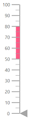
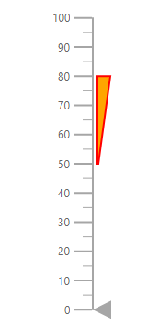

# Ranges

You can categorize the axis values using the [`Start`](https://help.syncfusion.com/cr/aspnetcore-blazor/Syncfusion.Blazor~Syncfusion.Blazor.LinearGauge.LinearGaugeRange~Start.html) and [`End`](https://help.syncfusion.com/cr/aspnetcore-blazor/Syncfusion.Blazor~Syncfusion.Blazor.LinearGauge.LinearGaugeRange~End.html) properties in the [`LinearGaugeRange`](https://help.syncfusion.com/cr/aspnetcore-blazor/Syncfusion.Blazor~Syncfusion.Blazor.LinearGauge.LinearGaugeRange_members.html). You can add any number of ranges for an axis using array of range objects.

```csharp
@using Syncfusion.Blazor.LinearGauge

<SfLinearGauge>
    <LinearGaugeAxes>
        <LinearGaugeAxis>
            <LinearGaugeRanges>
                <LinearGaugeRange Start="50" End="80">
                </LinearGaugeRange>
            </LinearGaugeRanges>
        </LinearGaugeAxis>
    </LinearGaugeAxes>
</SfLinearGauge>
```



## Ranges customization

Ranges can be customized using the following properties.

* [`LinearGaugeRange`](https://help.syncfusion.com/cr/aspnetcore-blazor/Syncfusion.Blazor~Syncfusion.Blazor.LinearGauge.LinearGaugeRange_members.html)
    * [`StartWidth`](https://help.syncfusion.com/cr/aspnetcore-blazor/Syncfusion.Blazor~Syncfusion.Blazor.LinearGauge.LinearGaugeRange~StartWidth.html) - Specifies start width of the range
    * [`EndWidth`](https://help.syncfusion.com/cr/aspnetcore-blazor/Syncfusion.Blazor~Syncfusion.Blazor.LinearGauge.LinearGaugeRange~EndWidth.html) - Specifies end width of the range
    * [`Color`](https://help.syncfusion.com/cr/aspnetcore-blazor/Syncfusion.Blazor~Syncfusion.Blazor.LinearGauge.LinearGaugeRange~Color.html) - Specifies color of the range
    * [`Position`](https://help.syncfusion.com/cr/cref_files/aspnetcore-blazor/Syncfusion.Blazor~Syncfusion.Blazor.LinearGauge.LinearGaugeRange~Position.html) - Specifies the range bar position. Its possible values are 'Position.Inside', 'Position.Outside' and 'Position.Cross'
    * [`Offset`](https://help.syncfusion.com/cr/cref_files/aspnetcore-blazor/Syncfusion.Blazor~Syncfusion.Blazor.LinearGauge.LinearGaugeRange~Offset.html) - Specifies offset value from its default position
    * [`LinearGaugeRangeBorder`](https://help.syncfusion.com/cr/cref_files/aspnetcore-blazor/Syncfusion.Blazor~Syncfusion.Blazor.LinearGauge.LinearGaugeRangeBorder.html) - Specifies range bar border color and width.

```csharp
@using Syncfusion.Blazor.LinearGauge

<SfLinearGauge>
    <LinearGaugeAxes>
        <LinearGaugeAxis>
            <LinearGaugeRanges>
                <LinearGaugeRange Start="50"
                                  End="80"
                                  StartWidth="2"
                                  EndWidth="15"
                                  Color="orange"
                                  Position="Position.Inside"
                                  Offset="4">
                    <LinearGaugeRangeBorder Color="red" Width="2"></LinearGaugeRangeBorder>
                </LinearGaugeRange>
            </LinearGaugeRanges>
        </LinearGaugeAxis>
    </LinearGaugeAxes>
</SfLinearGauge>
```



## Multiple ranges

You can add multiple ranges to an axis as demonstrated in the following code sample.

```csharp
@using Syncfusion.Blazor.LinearGauge

<SfLinearGauge>
    <LinearGaugeAxes>
        <LinearGaugeAxis>
            <LinearGaugeRanges>
                <LinearGaugeRange Start="1"
                                  End="30"
                                  StartWidth="10"
                                  EndWidth="10"
                                  Color="#41f47f">
                </LinearGaugeRange>
                <LinearGaugeRange Start="30"
                                  End="50"
                                  StartWidth="10"
                                  EndWidth="10"
                                  Color="#f49441">
                </LinearGaugeRange>
                <LinearGaugeRange Start="50"
                                  End="80"
                                  StartWidth="10"
                                  EndWidth="10"
                                  Color="#cd41f4">
                </LinearGaugeRange>
            </LinearGaugeRanges>
        </LinearGaugeAxis>
    </LinearGaugeAxes>
</SfLinearGauge>
```


## Gradient Color

Gradient support allows to add multiple colors in the range and pointer of the linear gauge. The following gradient types are supported in the linear gauge.

* Linear Gradient
* Radial Gradient

### Linear Gradient

Using linear gradient, colors will be applied in a linear progression. The start value of the linear gradient can be set using the [`StartValue`](https://help.syncfusion.com/cr/blazor/Syncfusion.Blazor~Syncfusion.Blazor.LinearGauge.LinearGaugeLinearGradient~StartValue.html) property. The end value of the linear gradient will be set using the [`EndValue`](https://help.syncfusion.com/cr/blazor/Syncfusion.Blazor~Syncfusion.Blazor.LinearGauge.LinearGaugeLinearGradient~EndValue.html) property. The color stop values such as color, opacity and offset are set using [`ColorStop`](https://help.syncfusion.com/cr/blazor/Syncfusion.Blazor~Syncfusion.Blazor.LinearGauge.LinearGaugeLinearGradient~ColorStop.html) property.

To apply linear gradient to the range, follow the below code sample.

```csharp
@using Syncfusion.Blazor.LinearGauge

<SfLinearGauge Orientation="Orientation.Horizontal">
<LinearGaugeContainer Width="30" Offset="30">
    <LinearGaugeAxes>
        <LinearGaugeAxis>
            <LinearGaugeAxisLabelStyle Offset="55">
               <LinearGaugeAxisLabelFont Color="#424242"/>
            </LinearGaugeAxisLabelStyle>
            <LinearGaugeLine Width="0"/>
            <LinearGaugeMajorTicks Height="0" Interval="25"/>
            <LinearGaugeMinorTicks Height="0"/>
            <LinearGaugePointers>
                <LinearGaugePointer Value="80" Height="25" Width="35"  Offset="-40" Color="#f54ea2"               MarkerType="MarkerType.Triangle"
                        Placement="Syncfusion.Blazor.LinearGauge.Placement.Near">
                </LinearGaugePointer>
            </LinearGaugePointers>
            <LinearGaugeRanges>
                <LinearGaugeRange Start="0" End="80" StartWidth="30" EndWidth="30" Offset="30" LinearGradient="@RangeLinearModel">
                </LinearGaugeRange>
            </LinearGaugeRanges>
        </LinearGaugeAxis>
    </LinearGaugeAxes>
    </LinearGaugeContainer>
</SfLinearGauge>
@code {
    public static LinearGradient RangeLinearModel = new LinearGradient() {
        StartValue = "1%",
        EndValue = "99%",
        ColorStop = new List<ColorStop>() {
            new ColorStop { Opacity=1, Color= "#fef3f9", Offset="1%" },
            new ColorStop { Opacity=1, Color= "#f54ea2", Offset="100%" }
        }
    };
}
```

### Radial Gradient

Using radial gradient, colors will be applied in circular progression. The inner circle position of the radial gradient will be set using the [`InnerPosition`](https://help.syncfusion.com/cr/blazor/Syncfusion.Blazor~Syncfusion.Blazor.LinearGauge.LinearGaugeRadialGradient~InnerPosition.html) property. The outer circle position of the radial gradient can be set using the [`OuterPosition`](https://help.syncfusion.com/cr/blazor/Syncfusion.Blazor~Syncfusion.Blazor.LinearGauge.LinearGaugeRadialGradient~OuterPosition.html) property. The color stop values such as color, opacity and offset are set using [`ColorStop`](https://help.syncfusion.com/cr/blazor/Syncfusion.Blazor~Syncfusion.Blazor.LinearGauge.LinearGaugeRadialGradient~ColorStop.html) property.

To apply radial gradient to the range, follow the below code sample.

```csharp
@using Syncfusion.Blazor.LinearGauge

<SfLinearGauge Orientation="Orientation.Horizontal">
<LinearGaugeContainer Width="30" Offset="30">
    <LinearGaugeAxes>
        <LinearGaugeAxis>
            <LinearGaugeAxisLabelStyle Offset="55">
               <LinearGaugeAxisLabelFont Color="#424242"/>
            </LinearGaugeAxisLabelStyle>
            <LinearGaugeLine Width="0"/>
            <LinearGaugeMajorTicks Height="0" Interval="25"/>
            <LinearGaugeMinorTicks Height="0"/>
            <LinearGaugePointers>
                <LinearGaugePointer Value="80" Height="25" Width="35"  Offset="-40" Color="#f54ea2"               MarkerType="MarkerType.Triangle"
                    Placement="Syncfusion.Blazor.LinearGauge.Placement.Near">
                </LinearGaugePointer>
            </LinearGaugePointers>
            <LinearGaugeRanges>
                <LinearGaugeRange Start="0" End="80" StartWidth="30" EndWidth="30" Offset="30" RadialGradient="@RangeRadialModel">
                </LinearGaugeRange>
            </LinearGaugeRanges>
        </LinearGaugeAxis>
    </LinearGaugeAxes>
    </LinearGaugeContainer>
</SfLinearGauge>
@code {
    public static RadialGradient RangeRadialModel = new RadialGradient() {
        Radius="65%",
        OuterPosition = new OuterPosition(){ X="50%", Y="70%"},
        InnerPosition = new InnerPosition() { X="60%", Y="60%" },
        ColorStop = new List<ColorStop>() {
            new ColorStop { Opacity=0.9, Color= "#fff5f5", Offset="5%" },
            new ColorStop { Opacity=1, Color= "#f54ea2", Offset="99%" }
        }
    };
}
```