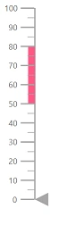
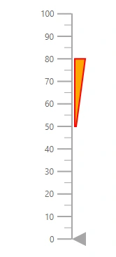
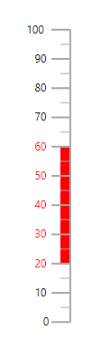
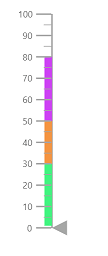
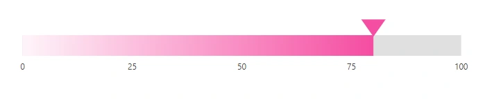
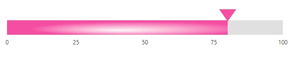

# Blazor Linear Gauge Ranges

A range is a set of values along the axis that visually represents a threshold or a region of interest. The range can be defined using the [Start](https://help.syncfusion.com/cr/blazor/Syncfusion.Blazor.LinearGauge.LinearGaugeRange.html#Syncfusion_Blazor_LinearGauge_LinearGaugeRange_Start) and [End](https://help.syncfusion.com/cr/blazor/Syncfusion.Blazor.LinearGauge.LinearGaugeRange.html#Syncfusion_Blazor_LinearGauge_LinearGaugeRange_End) properties of the [LinearGaugeRange](https://help.syncfusion.com/cr/blazor/Syncfusion.Blazor.LinearGauge.LinearGaugeRange.html). Any number of ranges can be added to the Linear Gauge using the [LinearGaugeRanges](https://help.syncfusion.com/cr/blazor/Syncfusion.Blazor.LinearGauge.LinearGaugeRanges.html) collection.

```cshtml
@using Syncfusion.Blazor.LinearGauge

<SfLinearGauge>
    <LinearGaugeAxes>
        <LinearGaugeAxis Minimum="0" Maximum="100">
            <LinearGaugeRanges>
                <LinearGaugeRange Start="50" End="80" StartWidth="20" EndWidth="20">
                </LinearGaugeRange>
            </LinearGaugeRanges>
            <LinearGaugePointers>
                <LinearGaugePointer></LinearGaugePointer>
            </LinearGaugePointers>
        </LinearGaugeAxis>
    </LinearGaugeAxes>
</SfLinearGauge>
```



## Customizing the range

Ranges can be customized using the following properties in [LinearGaugeRange](https://help.syncfusion.com/cr/blazor/Syncfusion.Blazor.LinearGauge.LinearGaugeRange.html).

* [StartWidth](https://help.syncfusion.com/cr/blazor/Syncfusion.Blazor.LinearGauge.LinearGaugeRange.html#Syncfusion_Blazor_LinearGauge_LinearGaugeRange_StartWidth) - Customize the range thickness at the start axis value.
* [EndWidth](https://help.syncfusion.com/cr/blazor/Syncfusion.Blazor.LinearGauge.LinearGaugeRange.html#Syncfusion_Blazor_LinearGauge_LinearGaugeRange_EndWidth) - Customize the range thickness at the end axis value.
* [Color](https://help.syncfusion.com/cr/blazor/Syncfusion.Blazor.LinearGauge.LinearGaugeRange.html#Syncfusion_Blazor_LinearGauge_LinearGaugeRange_Color) - Customize the range color.
* [Position](https://help.syncfusion.com/cr/blazor/Syncfusion.Blazor.LinearGauge.LinearGaugeRange.html#Syncfusion_Blazor_LinearGauge_LinearGaugeRange_Position) - To place the range. By default, the range is placed outside of the axis. To change the position, this property can be set as "[Inside](https://help.syncfusion.com/cr/blazor/Syncfusion.Blazor.LinearGauge.Position.html#Syncfusion_Blazor_LinearGauge_Position_Inside)", "[Outside](https://help.syncfusion.com/cr/blazor/Syncfusion.Blazor.LinearGauge.Position.html#Syncfusion_Blazor_LinearGauge_Position_Outside)", "[Cross](https://help.syncfusion.com/cr/blazor/Syncfusion.Blazor.LinearGauge.Position.html#Syncfusion_Blazor_LinearGauge_Position_Cross)", or "[Auto](https://help.syncfusion.com/cr/blazor/Syncfusion.Blazor.LinearGauge.Position.html#Syncfusion_Blazor_LinearGauge_Position_Auto)".
* [Offset](https://help.syncfusion.com/cr/blazor/Syncfusion.Blazor.LinearGauge.LinearGaugeRange.html#Syncfusion_Blazor_LinearGauge_LinearGaugeRange_Offset) - To place the range with specified distance from the axis.
* [LinearGaugeRangeBorder](https://help.syncfusion.com/cr/blazor/Syncfusion.Blazor.LinearGauge.LinearGaugeRangeBorder.html) - Customize color and width of range border.

```cshtml
@using Syncfusion.Blazor.LinearGauge

<SfLinearGauge>
    <LinearGaugeAxes>
        <LinearGaugeAxis Minimum="0" Maximum="100">
            <LinearGaugeRanges>
                <LinearGaugeRange Start="50" End="80" StartWidth="2" EndWidth="15"
                                  Color="orange" Position="Position.Inside"
                                  Offset="4">
                    <LinearGaugeRangeBorder Color="red" Width="2">
                    </LinearGaugeRangeBorder>
                </LinearGaugeRange>
            </LinearGaugeRanges>
            <LinearGaugePointers>
                <LinearGaugePointer></LinearGaugePointer>
            </LinearGaugePointers>
        </LinearGaugeAxis>
    </LinearGaugeAxes>
</SfLinearGauge>
```



## Setting the range color for the labels

To make the axis labels inherit the color of the range they fall within, set the [UseRangeColor](https://help.syncfusion.com/cr/blazor/Syncfusion.Blazor.LinearGauge.LinearGaugeAxisLabelStyle.html#Syncfusion_Blazor_LinearGauge_LinearGaugeAxisLabelStyle_UseRangeColor) property to **true** in the [LinearGaugeAxisLabelStyle](https://help.syncfusion.com/cr/blazor/Syncfusion.Blazor.LinearGauge.LinearGaugeAxisLabelStyle.html).

```cshtml
@using Syncfusion.Blazor.LinearGauge

<SfLinearGauge>
    <LinearGaugeAxes>
        <LinearGaugeAxis>
           <LinearGaugeAxisLabelStyle UseRangeColor="true">
           </LinearGaugeAxisLabelStyle>
            <LinearGaugeRanges>
                <LinearGaugeRange Start="20" End="60" Color="red">
                </LinearGaugeRange>
            </LinearGaugeRanges>
        </LinearGaugeAxis>
    </LinearGaugeAxes>
</SfLinearGauge>
```



## Multiple ranges

Multiple ranges can be added to the Linear Gauge by adding a collection of [LinearGaugeRange](https://help.syncfusion.com/cr/blazor/Syncfusion.Blazor.LinearGauge.LinearGaugeRange.html) elements to the [LinearGaugeRanges](https://help.syncfusion.com/cr/blazor/Syncfusion.Blazor.LinearGauge.LinearGaugeRanges.html) tag. Each range can be customized individually using the properties available in [LinearGaugeRange](https://help.syncfusion.com/cr/blazor/Syncfusion.Blazor.LinearGauge.LinearGaugeRange.html).

```cshtml
@using Syncfusion.Blazor.LinearGauge

<SfLinearGauge>
    <LinearGaugeAxes>
        <LinearGaugeAxis>
            <LinearGaugeRanges>
                <LinearGaugeRange Start="1" End="30" StartWidth="10" EndWidth="10"
                                  Color="#41f47f">
                </LinearGaugeRange>
                <LinearGaugeRange Start="30" End="50" StartWidth="10" EndWidth="10"
                                  Color="#f49441">
                </LinearGaugeRange>
                <LinearGaugeRange Start="50" End="80" StartWidth="10" EndWidth="10"
                                  Color="#cd41f4">
                </LinearGaugeRange>
            </LinearGaugeRanges>
            <LinearGaugePointers>
                <LinearGaugePointer></LinearGaugePointer>
            </LinearGaugePointers>
        </LinearGaugeAxis>
    </LinearGaugeAxes>
</SfLinearGauge>
```



## Gradient color

Gradients allow the range to be filled with multiple colors that blend smoothly. The Linear Gauge supports the following gradient types:

* Linear Gradient
* Radial Gradient

### Linear gradient

Using a linear gradient, colors are applied in a linear progression. The start position of the gradient is set using the [StartValue](https://help.syncfusion.com/cr/blazor/Syncfusion.Blazor.LinearGauge.LinearGaugeLinearGradient.html#Syncfusion_Blazor_LinearGauge_LinearGaugeLinearGradient_StartValue) property. The end position of the gradient is set using the [EndValue](https://help.syncfusion.com/cr/blazor/Syncfusion.Blazor.LinearGauge.LinearGaugeLinearGradient.html#Syncfusion_Blazor_LinearGauge_LinearGaugeLinearGradient_EndValue) property. The [Color](https://help.syncfusion.com/cr/blazor/Syncfusion.Blazor.LinearGauge.ColorStop.html#Syncfusion_Blazor_LinearGauge_ColorStop_Color), [Opacity](https://help.syncfusion.com/cr/blazor/Syncfusion.Blazor.LinearGauge.ColorStop.html#Syncfusion_Blazor_LinearGauge_ColorStop_Opacity), and [Offset](https://help.syncfusion.com/cr/blazor/Syncfusion.Blazor.LinearGauge.ColorStop.html#Syncfusion_Blazor_LinearGauge_ColorStop_Offset) for each color stop are defined in [ColorStop](https://help.syncfusion.com/cr/blazor/Syncfusion.Blazor.LinearGauge.ColorStop.html).

```cshtml
@using Syncfusion.Blazor.LinearGauge

<SfLinearGauge Orientation="Orientation.Horizontal">
    <LinearGaugeContainer Width="30" Offset="30">
        <LinearGaugeContainerBorder Width="0" />
        <LinearGaugeAxes>
            <LinearGaugeAxis>
                <LinearGaugeAxisLabelStyle Offset="55">
                    <LinearGaugeAxisLabelFont Color="#424242" />
                </LinearGaugeAxisLabelStyle>
                <LinearGaugeLine Width="0" />
                <LinearGaugeMajorTicks Height="0" Interval="25" />
                <LinearGaugeMinorTicks Height="0" />
                <LinearGaugePointers>
                    <LinearGaugePointer PointerValue="80" Height="25" Width="35"
                                Color="#f54ea2" Offset="-40" MarkerType="MarkerType.Triangle"
                                Placement="Syncfusion.Blazor.LinearGauge.Placement.Near">
                    </LinearGaugePointer>
                </LinearGaugePointers>
                <LinearGaugeRanges>
                    <LinearGaugeRange Color="#f54ea2" Start="0" End="80"
                                      StartWidth="30" EndWidth="30" Offset="30">
                        <LinearGradient StartValue="1%" EndValue="99%">
                            <ColorStops>
                                <ColorStop Opacity="1" Offset="0%" Color="#fef3f9">
                                </ColorStop>
                                <ColorStop Opacity="1" Offset="100%" Color="#f54ea2">
                                </ColorStop>
                            </ColorStops>
                        </LinearGradient>
                    </LinearGaugeRange>
                </LinearGaugeRanges>
            </LinearGaugeAxis>
        </LinearGaugeAxes>
    </LinearGaugeContainer>
</SfLinearGauge>
```



### Radial gradient

Using a radial gradient, colors are applied in a circular progression. The inner-circle position of the gradient is set using the [InnerPosition](https://help.syncfusion.com/cr/blazor/Syncfusion.Blazor.LinearGauge.InnerPosition.html) class. The outer circle position of the gradient is set using the [OuterPosition](https://help.syncfusion.com/cr/blazor/Syncfusion.Blazor.LinearGauge.OuterPosition.html) class. The [Color](https://help.syncfusion.com/cr/blazor/Syncfusion.Blazor.LinearGauge.ColorStop.html#Syncfusion_Blazor_LinearGauge_ColorStop_Color), [Opacity](https://help.syncfusion.com/cr/blazor/Syncfusion.Blazor.LinearGauge.ColorStop.html#Syncfusion_Blazor_LinearGauge_ColorStop_Opacity), and [Offset](https://help.syncfusion.com/cr/blazor/Syncfusion.Blazor.LinearGauge.ColorStop.html#Syncfusion_Blazor_LinearGauge_ColorStop_Offset) for each color stop are defined in [ColorStop](https://help.syncfusion.com/cr/blazor/Syncfusion.Blazor.LinearGauge.ColorStop.html).

```cshtml
@using Syncfusion.Blazor.LinearGauge

<SfLinearGauge Orientation="Orientation.Horizontal">
    <LinearGaugeContainer Width="30" Offset="30">
        <LinearGaugeContainerBorder Width="0" />
        <LinearGaugeAxes>
            <LinearGaugeAxis>
                <LinearGaugeAxisLabelStyle Offset="55">
                    <LinearGaugeAxisLabelFont Color="#424242" />
                </LinearGaugeAxisLabelStyle>
                <LinearGaugeLine Width="0" />
                <LinearGaugeMajorTicks Height="0" Interval="25" />
                <LinearGaugeMinorTicks Height="0" />
                <LinearGaugePointers>
                    <LinearGaugePointer PointerValue="80" Height="25" Width="35"
                                Color="#f54ea2" Offset="-40" MarkerType="MarkerType.Triangle"
                                Placement="Syncfusion.Blazor.LinearGauge.Placement.Near">
                    </LinearGaugePointer>
                </LinearGaugePointers>
                <LinearGaugeRanges>
                    <LinearGaugeRange Color="#f54ea2" Start="0" End="80"
                                      StartWidth="30" EndWidth="30" Offset="30">
                        <RadialGradient Radius="65%">
                             <InnerPosition X="50%" Y="70%"></InnerPosition>
                             <OuterPosition X="60%" Y="60%"></OuterPosition>
                            <ColorStops>
                                <ColorStop Opacity="0.9" Color= "#fff5f5" Offset="5%">
                                </ColorStop>
                                <ColorStop Opacity="1" Color="#f54ea2" Offset="99%">
                                </ColorStop>
                            </ColorStops>
                        </RadialGradient>
                    </LinearGaugeRange>
                </LinearGaugeRanges>
            </LinearGaugeAxis>
        </LinearGaugeAxes>
    </LinearGaugeContainer>
</SfLinearGauge>
```



N> When both gradients are defined for a range, only the linear gradient is rendered. To fall back to the radial gradient, set the [StartValue](https://help.syncfusion.com/cr/blazor/Syncfusion.Blazor.LinearGauge.LinearGaugeLinearGradient.html#Syncfusion_Blazor_LinearGauge_LinearGaugeLinearGradient_StartValue) and [EndValue](https://help.syncfusion.com/cr/blazor/Syncfusion.Blazor.LinearGauge.LinearGaugeLinearGradient.html#Syncfusion_Blazor_LinearGauge_LinearGaugeLinearGradient_EndValue) of the [LinearGradient](https://help.syncfusion.com/cr/blazor/Syncfusion.Blazor.LinearGauge.LinearGaugeLinearGradient.html) to empty strings.

## See also

* [Axes in Blazor Linear Gauge](axis.md)
* [Pointers in Blazor Linear Gauge](pointers.md)
* [Annotations in Blazor Linear Gauge](annotations.md)
* [Animations in Blazor Linear Gauge](animation.md)
* [Appearance in Blazor Linear Gauge](linear-gauge-appearance.md)
