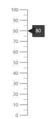
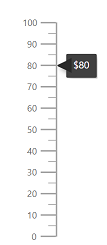
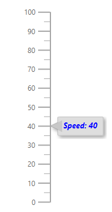

# User Interaction

## Tooltip

Linear Gauge displays the details about a pointer value through [`LinearGaugeTooltipSettings`](https://help.syncfusion.com/cr/aspnetcore-blazor/Syncfusion.Blazor~Syncfusion.Blazor.LinearGauge.LinearGaugeTooltipSettings_members.html), when the mouse is hovered over the pointer. By default, tooltip will not be visible, and you can enable the tooltip by setting [`Enable`](https://help.syncfusion.com/cr/aspnetcore-blazor/Syncfusion.Blazor~Syncfusion.Blazor.LinearGauge.LinearGaugeTooltipSettings~Enable.html) property to true.

```csharp
@using Syncfusion.Blazor.LinearGauge

<SfLinearGauge>
    <LinearGaugeAxes>
        <LinearGaugeAxis>
            <LinearGaugeTooltipSettings Enable="true">
            </LinearGaugeTooltipSettings>
            <LinearGaugePointers>
                <LinearGaugePointer Value="80">
                </LinearGaugePointer>
            </LinearGaugePointers>
        </LinearGaugeAxis>
    </LinearGaugeAxes>
</SfLinearGauge>
```



### Tooltip format

By default, tooltip shows the pointer value only. In addition to that, you can show more information in tooltip. For example, the format `${value}` shows pointer value with currency symbol using the [`Format`](https://help.syncfusion.com/cr/aspnetcore-blazor/Syncfusion.Blazor~Syncfusion.Blazor.LinearGauge.LinearGaugeTooltipSettings~Format.html) property.

```csharp
@using Syncfusion.Blazor.LinearGauge

<SfLinearGauge>
    <LinearGaugeAxes>
        <LinearGaugeAxis>
            <LinearGaugeTooltipSettings Enable="true" Format="${value}">
            </LinearGaugeTooltipSettings>
            <LinearGaugePointers>
                <LinearGaugePointer Value="80">
                </LinearGaugePointer>
            </LinearGaugePointers>
        </LinearGaugeAxis>
    </LinearGaugeAxes>
</SfLinearGauge>
```



### Customize the appearance of tooltip

* [`Fill`](https://help.syncfusion.com/cr/aspnetcore-blazor/Syncfusion.Blazor~Syncfusion.Blazor.LinearGauge.LinearGaugeTooltipSettings~Fill.html) - Specifies fill color for tooltip
* [`EnableAnimation`](https://help.syncfusion.com/cr/aspnetcore-blazor/Syncfusion.Blazor~Syncfusion.Blazor.LinearGauge.LinearGaugeTooltipSettings~EnableAnimation.html) - Enable or disable the tooltip animation
* [`LinearGaugeTooltipBorder`](https://help.syncfusion.com/cr/aspnetcore-blazor/Syncfusion.Blazor~Syncfusion.Blazor.LinearGauge.LinearGaugeTooltipBorder_members.html) - Specifies tooltip border width and color
* [`LinearGaugeTooltipTextStyle`](https://help.syncfusion.com/cr/aspnetcore-blazor/Syncfusion.Blazor~Syncfusion.Blazor.LinearGauge.LinearGaugeTooltipSettings~TextStyle.html) - Specifies the tooltip text style, such as color, font family, font style and font weight

```csharp
@using Syncfusion.Blazor.LinearGauge

<SfLinearGauge>
    <LinearGaugeAxes>
        <LinearGaugeAxis>
            <LinearGaugeTooltipSettings Enable="true"
                                        Format="Speed: {value}"
                                        Fill="lightgray"
                                        EnableAnimation="true">
                <LinearGaugeTooltipBorder Color="darkgray"
                                          Width="1">
                </LinearGaugeTooltipBorder>
                <LinearGaugeTooltipTextStyle Color="blue"
                                             FontStyle="italic"
                                             FontWeight="bold">
                </LinearGaugeTooltipTextStyle>
            </LinearGaugeTooltipSettings>
            <LinearGaugePointers>
                <LinearGaugePointer Value="40">
                </LinearGaugePointer>
            </LinearGaugePointers>
        </LinearGaugeAxis>
    </LinearGaugeAxes>
</SfLinearGauge>
```



## Pointer drag

You can drag either marker or bar pointer to the desired axis value using the [`EnableDrag`](https://help.syncfusion.com/cr/aspnetcore-blazor/Syncfusion.Blazor~Syncfusion.Blazor.LinearGauge.LinearGaugePointer~EnableDrag.html) property in the [`LinearGaugePointer`](https://help.syncfusion.com/cr/aspnetcore-blazor/Syncfusion.Blazor~Syncfusion.Blazor.LinearGauge.LinearGaugePointer_members.html).

```csharp
@using Syncfusion.Blazor.LinearGauge

<SfLinearGauge>
    <LinearGaugeAxes>
        <LinearGaugeAxis>
            <LinearGaugePointers>
                <LinearGaugePointer Value="80" EnableDrag="true">
                </LinearGaugePointer>
            </LinearGaugePointers>
        </LinearGaugeAxis>
    </LinearGaugeAxes>
</SfLinearGauge>
```

