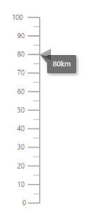
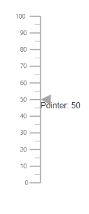
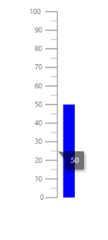
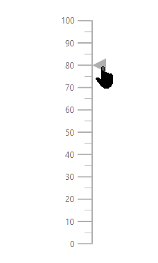

# User Interaction in Blazor Linear Gauge Component

## Tooltip

The Linear Gauge displays pointer details through [LinearGaugeTooltipSettings](https://help.syncfusion.com/cr/blazor/Syncfusion.Blazor.LinearGauge.LinearGaugeTooltipSettings.html) when the pointer is hovered. To enable the tooltip, set the [Enable](https://help.syncfusion.com/cr/blazor/Syncfusion.Blazor.LinearGauge.LinearGaugeTooltipSettings.html#Syncfusion_Blazor_LinearGauge_LinearGaugeTooltipSettings_Enable) property to **true**.

```cshtml

@using Syncfusion.Blazor.LinearGauge

<SfLinearGauge>
    <LinearGaugeAxes>
        <LinearGaugeAxis>
            <LinearGaugeTooltipSettings Enable="true">
            </LinearGaugeTooltipSettings>
            <LinearGaugePointers>
                <LinearGaugePointer PointerValue="80">
                </LinearGaugePointer>
            </LinearGaugePointers>
        </LinearGaugeAxis>
    </LinearGaugeAxes>
</SfLinearGauge>

```


### Tooltip format

The tooltip in the Linear Gauge can be formatted using the [Format](https://help.syncfusion.com/cr/blazor/Syncfusion.Blazor.LinearGauge.LinearGaugeTooltipSettings.html#Syncfusion_Blazor_LinearGauge_LinearGaugeTooltipSettings_Format) property in [LinearGaugeTooltipSettings](https://help.syncfusion.com/cr/blazor/Syncfusion.Blazor.LinearGauge.LinearGaugeTooltipSettings.html). Use it to render the tooltip in a specific format or to add a unit. By default, the tooltip shows only the pointer value. Additional information can be included; for example, the format **{value}km** shows the pointer value with the kilometer unit.

```cshtml

@using Syncfusion.Blazor.LinearGauge

<SfLinearGauge>
    <LinearGaugeAxes>
        <LinearGaugeAxis>
            <LinearGaugeTooltipSettings Enable="true" Format="{value}km">
            </LinearGaugeTooltipSettings>
            <LinearGaugePointers>
                <LinearGaugePointer PointerValue="80">
                </LinearGaugePointer>
            </LinearGaugePointers>
        </LinearGaugeAxis>
    </LinearGaugeAxes>
</SfLinearGauge>

```



### Tooltip Template

An HTML element can be rendered in the tooltip of the Linear Gauge using the [TooltipTemplate](https://help.syncfusion.com/cr/blazor/Syncfusion.Blazor.LinearGauge.LinearGaugeTooltipSettings.html#Syncfusion_Blazor_LinearGauge_LinearGaugeTooltipSettings_TooltipTemplate) in [LinearGaugeTooltipSettings](https://help.syncfusion.com/cr/blazor/Syncfusion.Blazor.LinearGauge.LinearGaugeTooltipSettings.html).

```cshtml

@using Syncfusion.Blazor.LinearGauge

<SfLinearGauge>
    <LinearGaugeTooltipSettings Enable="true">
        <TooltipTemplate>
            <div style="height:100px;width:100px;">Pointer: 80</div>
        </TooltipTemplate>
    </LinearGaugeTooltipSettings>
    <LinearGaugeAxes>
        <LinearGaugeAxis>
            <LinearGaugePointers>
                <LinearGaugePointer PointerValue="80">
                </LinearGaugePointer>
            </LinearGaugePointers>
        </LinearGaugeAxis>
    </LinearGaugeAxes>
</SfLinearGauge>

```



### Customize the appearance of the tooltip

The tooltip can be customized using the following properties in [LinearGaugeTooltipSettings](https://help.syncfusion.com/cr/blazor/Syncfusion.Blazor.LinearGauge.LinearGaugeTooltipSettings.html).

- [Fill](https://help.syncfusion.com/cr/blazor/Syncfusion.Blazor.LinearGauge.LinearGaugeTooltipSettings.html#Syncfusion_Blazor_LinearGauge_LinearGaugeTooltipSettings_Fill) – Specifies the tooltip background color.
- [EnableAnimation](https://help.syncfusion.com/cr/blazor/Syncfusion.Blazor.LinearGauge.LinearGaugeTooltipSettings.html#Syncfusion_Blazor_LinearGauge_LinearGaugeTooltipSettings_EnableAnimation) – Enables or disables tooltip animation.
- [LinearGaugeTooltipBorder](https://help.syncfusion.com/cr/blazor/Syncfusion.Blazor.LinearGauge.LinearGaugeTooltipBorder.html) – Sets the border color and width of the tooltip.
- [LinearGaugeTooltipTextStyle](https://help.syncfusion.com/cr/blazor/Syncfusion.Blazor.LinearGauge.LinearGaugeTooltipTextStyle.html) – Customizes the tooltip text style.
- [ShowAtMousePosition](https://help.syncfusion.com/cr/blazor/Syncfusion.Blazor.LinearGauge.LinearGaugeTooltipSettings.html#Syncfusion_Blazor_LinearGauge_LinearGaugeTooltipSettings_ShowAtMousePosition) – Shows the tooltip at the mouse position.

```cshtml

@using Syncfusion.Blazor.LinearGauge

<SfLinearGauge>
    <LinearGaugeAxes>
        <LinearGaugeAxis>
            <LinearGaugeTooltipSettings Enable="true" Format="Speed: {value}"
                                        Fill="lightgray" EnableAnimation="true">
                <LinearGaugeTooltipBorder Color="darkgray" Width="1">
                </LinearGaugeTooltipBorder>
                <LinearGaugeTooltipTextStyle Color="blue" FontStyle="italic"
                                             FontWeight="bold">
                </LinearGaugeTooltipTextStyle>
            </LinearGaugeTooltipSettings>
            <LinearGaugePointers>
                <LinearGaugePointer PointerValue="40">
                </LinearGaugePointer>
            </LinearGaugePointers>
        </LinearGaugeAxis>
    </LinearGaugeAxes>
</SfLinearGauge>

```


### Positioning the tooltip

The tooltip is positioned at the [End](https://help.syncfusion.com/cr/blazor/Syncfusion.Blazor.LinearGauge.TooltipPosition.html#Syncfusion_Blazor_LinearGauge_TooltipPosition_End) of the pointer. To position the tooltip at the start or center of the pointer, set the [Position](https://help.syncfusion.com/cr/blazor/Syncfusion.Blazor.LinearGauge.LinearGaugeTooltipSettings.html#Syncfusion_Blazor_LinearGauge_LinearGaugeTooltipSettings_Position) property to [Start](https://help.syncfusion.com/cr/blazor/Syncfusion.Blazor.LinearGauge.TooltipPosition.html#Syncfusion_Blazor_LinearGauge_TooltipPosition_Start) or [Center](https://help.syncfusion.com/cr/blazor/Syncfusion.Blazor.LinearGauge.TooltipPosition.html#Syncfusion_Blazor_LinearGauge_TooltipPosition_Center).

```cshtml

@using Syncfusion.Blazor.LinearGauge

<SfLinearGauge>
    <LinearGaugeTooltipSettings Enable="true" Position="TooltipPosition.Center">
    </LinearGaugeTooltipSettings>
    <LinearGaugeAxes>
        <LinearGaugeAxis>
            <LinearGaugePointers>
                <LinearGaugePointer PointerValue="50" Type="Point.Bar" Color="blue">
                </LinearGaugePointer>
            </LinearGaugePointers>
        </LinearGaugeAxis>
    </LinearGaugeAxes>
</SfLinearGauge>

```



## Pointer drag

To drag either marker or bar pointer to the desired axis value, set the [EnableDrag](https://help.syncfusion.com/cr/blazor/Syncfusion.Blazor.LinearGauge.LinearGaugePointer.html#Syncfusion_Blazor_LinearGauge_LinearGaugePointer_EnableDrag) property to **true** in the [LinearGaugePointer](https://help.syncfusion.com/cr/blazor/Syncfusion.Blazor.LinearGauge.LinearGaugePointer.html).

```cshtml

@using Syncfusion.Blazor.LinearGauge

<SfLinearGauge>
    <LinearGaugeAxes>
        <LinearGaugeAxis>
            <LinearGaugePointers>
                <LinearGaugePointer PointerValue="80" EnableDrag="true">
                </LinearGaugePointer>
            </LinearGaugePointers>
        </LinearGaugeAxis>
    </LinearGaugeAxes>
</SfLinearGauge>

```


