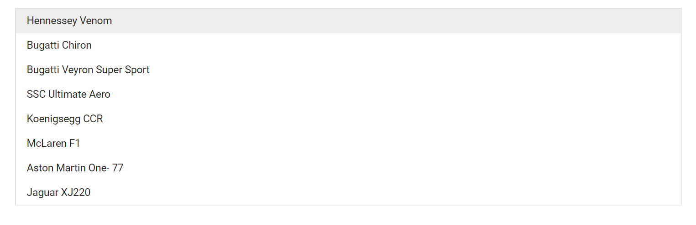
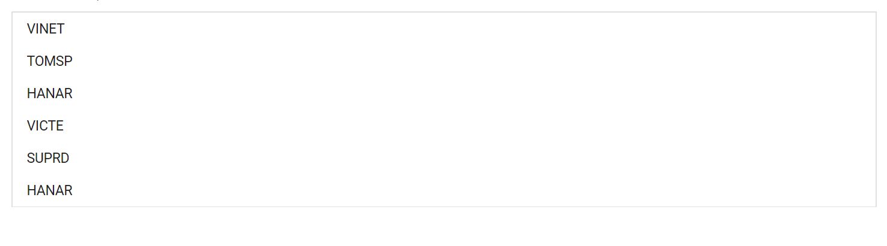

# Data Binding in Blazor ListBox Component

The ListBox loads the data from local data sources using the [DataSource](https://help.syncfusion.com/cr/blazor/Syncfusion.Blazor.DropDowns.SfListBox-2.html) property.

| Fields | Type | Description |
|------|------|-------------|
| [Text](https://help.syncfusion.com/cr/blazor/Syncfusion.Blazor.DropDowns.FieldSettingsModel.html#Syncfusion_Blazor_DropDowns_FieldSettingsModel_Text) |  `string` | Specifies the display text of each list item. |
| [Value](https://help.syncfusion.com/cr/blazor/Syncfusion.Blazor.DropDowns.FieldSettingsModel.html#Syncfusion_Blazor_DropDowns_FieldSettingsModel_Value) |  `string` | Specifies the hidden data value mapped to each list item that should contain a unique value. |
| [GroupBy](https://help.syncfusion.com/cr/blazor/Syncfusion.Blazor.DropDowns.FieldSettingsModel.html#Syncfusion_Blazor_DropDowns_FieldSettingsModel_GroupBy) |  `string` | Specifies the category under which the list item has to be grouped. |
| [IconCss](https://help.syncfusion.com/cr/blazor/Syncfusion.Blazor.DropDowns.FieldSettingsModel.html#Syncfusion_Blazor_DropDowns_FieldSettingsModel_IconCss) |  `string` | Specifies the iconCss class that needs to be mapped. |
| [HtmlAttributes](https://help.syncfusion.com/cr/blazor/Syncfusion.Blazor.DropDowns.FieldSettingsModel.html#Syncfusion_Blazor_DropDowns_FieldSettingsModel_HtmlAttributes) |  `string` | Allows additional attributes to configure the elements in various ways to meet the criteria. |

N> When binding complex data to the ListBox, fields should be mapped correctly. Otherwise, the selected item remains undefined.

## Local Data

Local data can be represented by the following ways.

### Array of string

The ListBox has support to load array of primitive data such as strings or numbers. Here, both value and text field acts as same.

```cshtml
@using Syncfusion.Blazor.DropDowns
<SfListBox TValue="string[]" DataSource="@Games" TItem="string"></SfListBox>
@code{
public string[] Games = new string[] { "Badminton", "Cricket", "Football", "Golf", "Tennis", "Basket Ball", "Base Ball", "Hockey", "Volley Ball" };
}
```


### Array of object

The ListBox can generate its list items through an array of object data. For this, the appropriate columns should be mapped to the [Fields](https://help.syncfusion.com/cr/blazor/Syncfusion.Blazor.DropDowns.SfListBox-2.html) property.

In the following example, `id` and `sports` column from complex data have been mapped to the `Value` field and `Text` field, respectively.

```cshtml
@using Syncfusion.Blazor.DropDowns

<SfListBox TValue="string[]" DataSource="@Vehicles" TItem="VehicleData">
<ListBoxFieldSettings Text="Text" Value="Id" />
</SfListBox>

@code {
    public List<VehicleData> Vehicles = new List<VehicleData> {
        new VehicleData { Text = "Hennessey Venom", Id = "Vehicle-01" },
        new VehicleData { Text = "Bugatti Chiron", Id = "Vehicle-02" },
        new VehicleData { Text = "Bugatti Veyron Super Sport", Id = "Vehicle-03" },
        new VehicleData { Text = "SSC Ultimate Aero", Id = "Vehicle-04" },
        new VehicleData { Text = "Koenigsegg CCR", Id = "Vehicle-05" },
        new VehicleData { Text = "McLaren F1", Id = "Vehicle-06" },
        new VehicleData { Text = "Aston Martin One- 77", Id = "Vehicle-07" },
        new VehicleData { Text = "Jaguar XJ220", Id = "Vehicle-08" }
    };

    public class VehicleData {
      public string Text  { get; set; }
      public string Id  { get; set; }
    }
}
```



### Array of complex object

The ListBox can generate its list items through an array of complex data. For this, the appropriate columns should be mapped to the [Fields](https://help.syncfusion.com/cr/blazor/Syncfusion.Blazor.DropDowns.SfListBox-2.html) property.

In the following example, `sports.Name` column from complex data have been mapped to the `Text` field.

```cshtml
@using Syncfusion.Blazor.DropDowns

<SfListBox TValue="string[]" DataSource="@SprotsDetails" TItem="SportsData">
<ListBoxFieldSettings Text="Sports.Name" Value="Id" />
</SfListBox>

@code {
    public List<SportsData> SprotsDetails = new List<SportsData>
    {
        new SportsData{ Id = "game0", Sports = new GameData{ Name = "Badminton" } },
        new SportsData{ Id = "game1", Sports = new GameData{ Name = "Cricket" } },
        new SportsData{ Id = "game2", Sports = new GameData{ Name = "Football" } },
        new SportsData{ Id = "game3", Sports = new GameData{ Name = "Golf" } },
        new SportsData{ Id = "game4", Sports = new GameData{ Name = "Tennis" } },
        new SportsData{ Id = "game5", Sports = new GameData{ Name = "Basket Ball" } },
        new SportsData{ Id = "game6", Sports = new GameData{ Name = "Base Ball" } },
        new SportsData{ Id = "game7", Sports = new GameData{ Name = "Hockey" } }
    };

    public class GameData {
        public string Name { get; set; }
    }
    public class SportsData {
        public string Id { get; set; }
        public GameData Sports { get; set; }
    }
}
```


## Remote Data

The ListBox supports retrieval of data from remote data services with the help of [DataManager](https://help.syncfusion.com/cr/blazor/Syncfusion.Blazor.Data.SfDataManager.html).

The following sample displays the employee names from `Employee` table.

```csharp

@using Syncfusion.Blazor.DropDowns
@using Syncfusion.Blazor.Data

<SfListBox TValue="string[]" TItem="OrderDetails" Query="@RemoteDataQuery">
<SfDataManager Url="https://js.syncfusion.com/demos/Sfervices/Wcf/Northwind.svc/Orders" CrossDomain="true" Adaptor="Syncfusion.Blazor.Adaptors.ODataAdaptor"></SfDataManager>
<ListBoxFieldSettings Text="CustomerID" Value="CustomerID" />
</SfListBox>

@code{
    public Query RemoteDataQuery = new Query().Select(new List<string>{ "CustomerID" }).Take(6).RequiresCount();
    public class OrderDetails
    {
    public int? OrderID { get; set; }
    public string CustomerID { get; set; }
    public int? EmployeeID { get; set; }
    public double? Freight { get; set; }
    public string ShipCity { get; set; }
    public bool Verified { get; set; }
    public DateTime? OrderDate { get; set; }
    public string ShipName { get; set; }
    public string ShipCountry { get; set; }
    public DateTime? ShippedDate { get; set; }
    public string ShipAddress { get; set; }
    }
}

```

