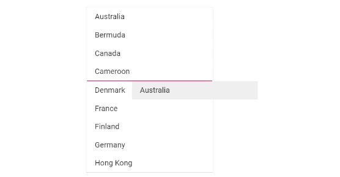

# Drag And Drop in Blazor ListBox Component

The Blazor ListBox supports dragging a single item or a group of selected items and dropping them within the same ListBox or into another ListBox.

Customize drag-and-drop behavior by handling the following events on the [ListBoxEvents](https://help.syncfusion.com/cr/blazor/Syncfusion.Blazor.DropDowns.ListBoxEvents-2.html) child component:

| Events | Description |
|------|------|
| [DragStart](https://help.syncfusion.com/cr/blazor/Syncfusion.Blazor.DropDowns.ListBoxEvents-2.html#Syncfusion_Blazor_DropDowns_ListBoxEvents_2_DragStart) | Triggers when dragging starts for the selected item(s). |
| [OnDrop](https://help.syncfusion.com/cr/blazor/Syncfusion.Blazor.DropDowns.ListBoxEvents-2.html#Syncfusion_Blazor_DropDowns_ListBoxEvents_2_OnDrop) | Triggers before the selected item(s) are dropped. |
| [Dropped](https://help.syncfusion.com/cr/blazor/Syncfusion.Blazor.DropDowns.ListBoxEvents-2.html#Syncfusion_Blazor_DropDowns_ListBoxEvents_2_Dropped) | Triggers after the selected item(s) are dropped. |

## Drag and drop events

The following example shows how to handle the `DragStart`, `OnDrop`, and `Dropped` events to log information about the dragged item(s) and prevent specific items from being dropped.

```cshtml
@using Syncfusion.Blazor.DropDowns

<SfListBox TValue="string[]" DataSource="@GroupA" TItem="CountryCode" AllowDragAndDrop="true">
    <ListBoxFieldSettings Text="Name" Value="Code" />
    <ListBoxEvents TValue="string[]" TItem="CountryCode"
                   DragStart="OnDragStart"
                   OnDrop="OnDropHandler"
                   Dropped="OnDroppedHandler" />
</SfListBox>

@code {
    public List<CountryCode> GroupA = new List<CountryCode>
    {
        new CountryCode{ Name = "Australia", Code = "AU" },
        new CountryCode{ Name = "Bermuda", Code = "BM" },
        new CountryCode{ Name = "Canada", Code = "CA" },
        new CountryCode{ Name = "Cameroon", Code = "CM" },
        new CountryCode{ Name = "Denmark", Code = "DK" }
    };

    public class CountryCode
    {
        public string Name { get; set; }
        public string Code { get; set; }
    }

    private void OnDragStart(DragEventArgs<CountryCode> args)
    {
        // Fires when dragging starts. Use args.Items to access the dragged item(s).
        Console.WriteLine($"Drag started for: {string.Join(", ", args.Items.Select(i => i.Name))}");
    }

    private void OnDropHandler(DropEventArgs<CountryCode> args)
    {
        // Fires before the item is dropped. Set args.Cancel = true to prevent the drop.
        Console.WriteLine($"About to drop: {string.Join(", ", args.Items.Select(i => i.Name))}");
    }

    private void OnDroppedHandler(DropEventArgs<CountryCode> args)
    {
        // Fires after the item has been dropped successfully.
        Console.WriteLine($"Dropped: {string.Join(", ", args.Items.Select(i => i.Name))}");
    }
}
```

## Single ListBox

Drag and drop within a single ListBox can be achieved by setting the [AllowDragAndDrop](https://help.syncfusion.com/cr/blazor/Syncfusion.Blazor.DropDowns.SfListBox-2.html#Syncfusion_Blazor_DropDowns_SfListBox_2_AllowDragAndDrop) property to `true`.

```cshtml
@using Syncfusion.Blazor.DropDowns

<SfListBox TValue="string[]" DataSource="@GroupA" TItem="CountryCode" AllowDragAndDrop="true">
<ListBoxFieldSettings Text="Name" Value="Code" />
</SfListBox>

@code {
    public List<CountryCode> GroupA = new List<CountryCode>
    {
        new CountryCode{ Name = "Australia", Code = "AU" },
        new CountryCode{ Name = "Bermuda", Code = "BM" },
        new CountryCode{ Name = "Canada", Code = "CA" },
        new CountryCode{ Name = "Cameroon", Code = "CM" },
        new CountryCode{ Name = "Denmark", Code = "DK" },
        new CountryCode{ Name = "France", Code = "FR" },
        new CountryCode{ Name = "Finland", Code = "FI" },
        new CountryCode{ Name = "Germany", Code = "DE" },
        new CountryCode{ Name = "Hong Kong", Code = "HK" }
    };

    public class CountryCode {
        public string Name  { get; set; }
        public string Code  { get; set; }
    }
}

```



## Multiple ListBox

Enable drag and drop between two or more ListBoxes by setting `AllowDragAndDrop` to `true` and assigning the same [Scope](https://help.syncfusion.com/cr/blazor/Syncfusion.Blazor.DropDowns.SfListBox-2.html#Syncfusion_Blazor_DropDowns_SfListBox_2_Scope) value to each ListBox. `Scope` is the logical group name that links ListBoxes for cross-list drag-and-drop, so every ListBox that should share items must use the same value. The wrapping HTML element IDs must remain unique and are independent of `Scope`.

```cshtml
@using Syncfusion.Blazor.DropDowns

<div id="listbox1">
    <h4>Group A</h4>
    <SfListBox TValue="string[]" DataSource="@GroupA" AllowDragAndDrop="true" Scope="combined-list" Height="290px" TItem="CountryCode">
        <ListBoxFieldSettings Text="Name" Value="Code" />
    </SfListBox>
</div>
<div id="listbox2">
    <h4>Group B</h4>
    <SfListBox TValue="string[]" DataSource="@GroupB" Scope="combined-list" AllowDragAndDrop="true" Height="290px" TItem="CountryCode">
        <ListBoxFieldSettings Text="Name" Value="Code" />
    </SfListBox>
</div>

@code {
    public List<CountryCode> GroupA = new List<CountryCode>
    {
        new CountryCode{ Name = "Australia", Code = "AU" },
        new CountryCode{ Name = "Bermuda", Code = "BM" },
        new CountryCode{ Name = "Canada", Code = "CA" },
        new CountryCode{ Name = "Cameroon", Code = "CM" },
        new CountryCode{ Name = "Denmark", Code = "DK" },
        new CountryCode{ Name = "France", Code = "FR" },
        new CountryCode{ Name = "Finland", Code = "FI" },
        new CountryCode{ Name = "Germany", Code = "DE" },
        new CountryCode{ Name = "Hong Kong", Code = "HK" }
    };

    public List<CountryCode> GroupB = new List<CountryCode>
    {
        new CountryCode{ Name = "India", Code = "IN" },
        new CountryCode{ Name = "Italy", Code = "IT" },
        new CountryCode{ Name = "Japan", Code = "JP" },
        new CountryCode{ Name = "Mexico", Code = "MX" },
        new CountryCode{ Name = "Norway", Code = "NO" },
        new CountryCode{ Name = "Poland", Code = "PL" },
        new CountryCode{ Name = "Switzerland", Code = "CH" },
        new CountryCode{ Name = "United Kingdom", Code = "GB" },
        new CountryCode{ Name = "United States", Code = "US" }
    };

    public class CountryCode
    {
        public string Name { get; set; }
        public string Code { get; set; }
    }
}

<style>
    #listbox1 {
        width: 48%;
        float: left;
    }

    #listbox2 {
        width: 48%;
        float: right;
    }
</style>
```


## Dual ListBox with drag and drop

The toolbar and drag-and-drop actions between two ListBoxes can be enabled by assigning a unique `Id` and the same [Scope](https://help.syncfusion.com/cr/blazor/Syncfusion.Blazor.DropDowns.SfListBox-2.html#Syncfusion_Blazor_DropDowns_SfListBox_2_Scope) value to both instances. `Id` identifies each ListBox in the DOM, while `Scope` groups the ListBoxes so the toolbar and drag-and-drop actions operate across them.

```cshtml
@using Syncfusion.Blazor.DropDowns

<div id="listbox1">
    <h4>Group A</h4>
    <SfListBox TValue="string[]" Id="scope1" Scope="scope1" DataSource="@GroupA" TItem="CountryCode" AllowDragAndDrop="true">
        <ListBoxFieldSettings Text="Name"></ListBoxFieldSettings>
        <ListBoxToolbarSettings Items="@Items"></ListBoxToolbarSettings>
    </SfListBox>
</div>
<div id="listbox2">
    <h4>Group B</h4>
    <SfListBox TValue="string[]" Id="scope2" Scope="scope1" DataSource="@GroupB" TItem="CountryCode" AllowDragAndDrop="true">
        <ListBoxFieldSettings Text="Name"></ListBoxFieldSettings>
    </SfListBox>
</div>

@code {
    public string[] Items = new string[] { "MoveTo", "MoveFrom", "MoveAllTo", "MoveAllFrom" };

    public List<CountryCode> GroupA = new List<CountryCode>
    {
        new CountryCode{ Name = "Australia", Code = "AU" },
        new CountryCode{ Name = "Bermuda", Code = "BM" },
        new CountryCode{ Name = "Canada", Code = "CA" },
        new CountryCode{ Name = "Cameroon", Code = "CM" },
        new CountryCode{ Name = "Denmark", Code = "DK" }
    };

    public List<CountryCode> GroupB = new List<CountryCode>
    {
        new CountryCode{ Name = "India", Code = "IN" },
        new CountryCode{ Name = "Italy", Code = "IT" },
        new CountryCode{ Name = "Japan", Code = "JP" },
        new CountryCode{ Name = "Mexico", Code = "MX" },
        new CountryCode{ Name = "Norway", Code = "NO" }
    };

    public class CountryCode
    {
        public string Name { get; set; }
        public string Code { get; set; }
    }
}

<style>
    #listbox1 {
        width: 48%;
        float: left;
    }

    #listbox2 {
        width: 48%;
        float: right;
    }
</style>
```


## See also

* [Dual ListBox in Blazor](./dual-listbox.md)
* [Getting Started with Blazor ListBox](./getting-started.md)
* [Selection in Blazor ListBox](./selection.md)
* [Accessibility in Blazor ListBox](./accessibility.md)