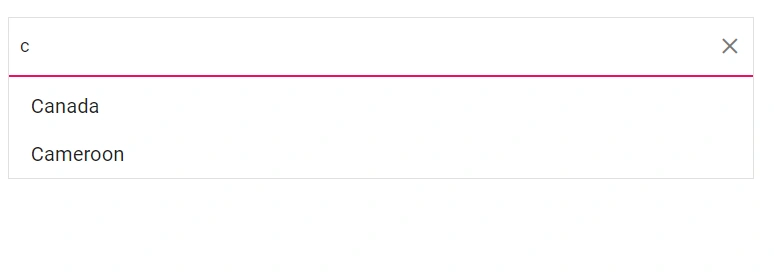
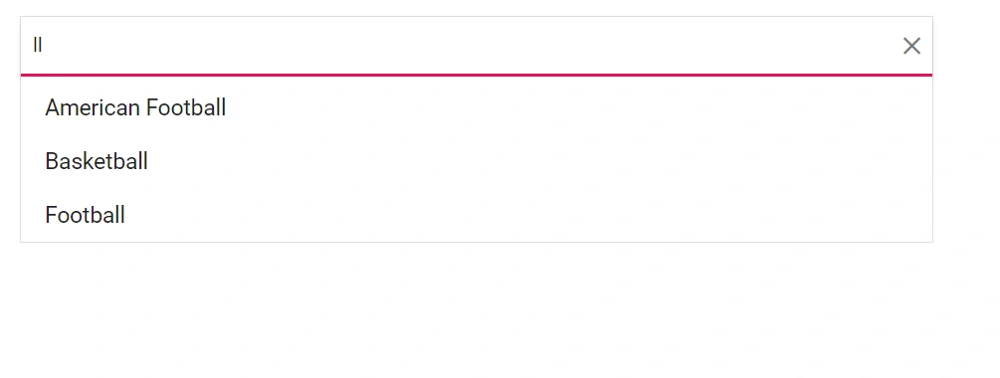
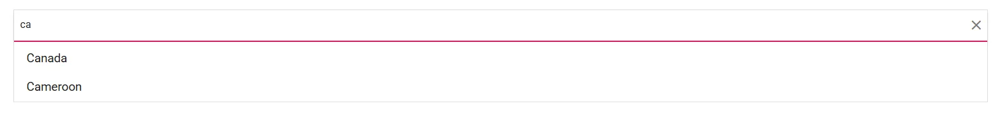

# Filtering in ListBox

The Blazor ListBox provides built-in filtering when the [AllowFiltering](https://help.syncfusion.com/cr/blazor/Syncfusion.Blazor.DropDowns.SfListBox-2.html#Syncfusion_Blazor_DropDowns_SfListBox_2_AllowFiltering) property is set to `true`. A search box is rendered automatically, and filtering begins as the user types. The default value of `AllowFiltering` is `false`. Filtering is case-insensitive by default and affects only the visible items; existing selections remain unchanged.

The following example demonstrates the built-in filtering functionality. Set `AllowFiltering="true"` to render the search box.

```cshtml
@using Syncfusion.Blazor.DropDowns

<SfListBox TValue="string[]" DataSource="@CountryData" TItem="CountryCode" AllowFiltering=true>
  <ListBoxFieldSettings Text="Name" Value="Code" />
</SfListBox>

@code {
    public List<CountryCode> CountryData = new List<CountryCode> {
        new CountryCode{ Name = "Australia", Code = "AU" },
        new CountryCode{ Name = "Bermuda", Code = "BM" },
        new CountryCode{ Name = "Canada", Code = "CA" },
        new CountryCode{ Name = "Cameroon", Code = "CM" },
        new CountryCode{ Name = "Denmark", Code = "DK" },
        new CountryCode{ Name = "France", Code = "FR" },
        new CountryCode{ Name = "Finland", Code = "FI" },
        new CountryCode{ Name = "Germany", Code = "DE" },
        new CountryCode{ Name = "Hong Kong", Code = "HK" }
    };
    public class CountryCode {
      public string Name { get; set; }
      public string Code { get; set; }
    }
}
```




## Filter type

Use the [FilterType](https://help.syncfusion.com/cr/blazor/Syncfusion.Blazor.DropDowns.SfDropDownBase-1.html#Syncfusion_Blazor_DropDowns_SfDropDownBase_1_FilterType) property to specify the matching behavior used during search. The default value is `StartsWith`. The available options are:

| FilterType | Description |
|------------|-------------|
| [StartsWith](https://help.syncfusion.com/cr/blazor/Syncfusion.Blazor.DropDowns.FilterType.html#Syncfusion_Blazor_DropDowns_FilterType_StartsWith) | Checks whether the item text begins with the specified value. |
| [EndsWith](https://help.syncfusion.com/cr/blazor/Syncfusion.Blazor.DropDowns.FilterType.html#Syncfusion_Blazor_DropDowns_FilterType_EndsWith) | Checks whether the item text ends with the specified value. |
| [Contains](https://help.syncfusion.com/cr/blazor/Syncfusion.Blazor.DropDowns.FilterType.html#Syncfusion_Blazor_DropDowns_FilterType_Contains) | Checks whether the item text contains the specified value. |

In the following example, the `EndsWith` filter type is assigned to the `FilterType` property.

```cshtml
@using Syncfusion.Blazor.DropDowns

<SfListBox TValue="string" TItem="Games" FilterType="FilterType.EndsWith" AllowFiltering=true DataSource="@LocalData">
  <ListBoxFieldSettings Value="ID" Text="Game"></ListBoxFieldSettings>
</SfListBox>

@code {
    public class Games {  
      public string ID { get; set; }
      public string Game { get; set; }
    }

    public List<Games> LocalData = new List<Games> {
      new Games() { ID= "Game1", Game= "American Football" },
      new Games() { ID= "Game2", Game= "Badminton" },
      new Games() { ID= "Game3", Game= "Basketball" },
      new Games() { ID= "Game4", Game= "Cricket" },
      new Games() { ID= "Game5", Game= "Football" },
      new Games() { ID= "Game6", Game= "Golf" },
      new Games() { ID= "Game7", Game= "Hockey" },
      new Games() { ID= "Game8", Game= "Rugby"},
      new Games() { ID= "Game9", Game= "Snooker" },
    };
}

```



## Custom filtering

Customize filter queries using the [`Filtering`](https://help.syncfusion.com/cr/blazor/Syncfusion.Blazor.DropDowns.ListBoxEvents-2.html#Syncfusion_Blazor_DropDowns_ListBoxEvents_2_Filtering) event. This event is triggered when a user types a character in the filter input, and it is available when the [`AllowFiltering`](https://help.syncfusion.com/cr/blazor/Syncfusion.Blazor.DropDowns.SfListBox-2.html#Syncfusion_Blazor_DropDowns_SfListBox_2_AllowFiltering) property is enabled.

In the following example, the filtering action is customized by using the [`FilteringEventArgs`](https://help.syncfusion.com/cr/blazor/Syncfusion.Blazor.DropDowns.FilteringEventArgs.html). The default filtering action is prevented by setting the [`PreventDefaultAction`](https://help.syncfusion.com/cr/blazor/Syncfusion.Blazor.DropDowns.FilteringEventArgs.html#Syncfusion_Blazor_DropDowns_FilteringEventArgs_PreventDefaultAction) property to `true`, and the filtered data is updated using the [`FilterAsync`](https://help.syncfusion.com/cr/blazor/Syncfusion.Blazor.DropDowns.SfListBox-2.html#Syncfusion_Blazor_DropDowns_SfListBox_2_FilterAsync_System_Collections_Generic_IEnumerable__1__Syncfusion_Blazor_Data_Query_Syncfusion_Blazor_DropDowns_FieldSettingsModel_) method.

```cshtml
@using Syncfusion.Blazor.Data
@using Syncfusion.Blazor.DropDowns

<SfListBox @ref="ListBoxObj" TValue="string[]" TItem="CountryCode" DataSource="@CountryData" AllowFiltering="true">
    <ListBoxFieldSettings Text="Name" Value="Code"></ListBoxFieldSettings>
    <ListBoxEvents TValue="string[]" TItem="CountryCode" Filtering="OnFiltering"></ListBoxEvents>
</SfListBox>

@code {
    private SfListBox<string[], CountryCode> ListBoxObj;

    public List<CountryCode> CountryData = new List<CountryCode>
    {
        new CountryCode { Name = "Australia", Code = "AU" },
        new CountryCode { Name = "Bermuda", Code = "BM" },
        new CountryCode { Name = "Canada", Code = "CA" },
        new CountryCode { Name = "Cameroon", Code = "CM" },
        new CountryCode { Name = "Denmark", Code = "DK" },
        new CountryCode { Name = "France", Code = "FR" },
        new CountryCode { Name = "Finland", Code = "FI" },
        new CountryCode { Name = "Germany", Code = "DE" },
        new CountryCode { Name = "Hong Kong", Code = "HK" }
    };

    private async Task OnFiltering(FilteringEventArgs args)
    {
        args.PreventDefaultAction = true;

        var query = new Query().Where(new WhereFilter
        {
            Field = "Name",
            Operator = "contains",
            value = args.Text,
            IgnoreCase = true
        });

        query = !string.IsNullOrEmpty(args.Text) ? query : new Query();

        await ListBoxObj.FilterAsync(CountryData, query);
    }

    public class CountryCode
    {
        public string Name { get; set; }

        public string Code { get; set; }
    }
}
```


## See also

* [Filter ListBox Data Using HTML Input Element](./how-to/filter-listbox.md)
* [Data Binding in Blazor ListBox](./data-binding.md)
* [Selection in Blazor ListBox](./selection.md)
* [Getting Started with Blazor ListBox](./getting-started.md)
