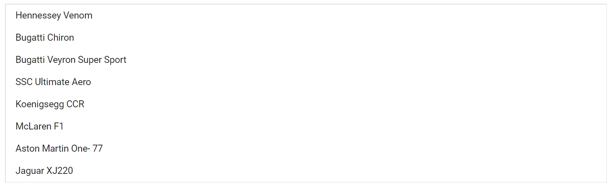

# Getting Started with Blazor ListBox Component

This section briefly explains about how to include ListBox Component in your Blazor server-side  application.

To get start quickly with ListBox Component using Blazor, you can check on this video:



You can refer [Getting Started with Syncfusion Blazor for Server-side in Visual Studio 2019 page](https://blazor.syncfusion.com/documentation/getting-started/blazor-server-side-visual-studio-2019/) page for the introduction and configuring the common specifications.

## Importing Syncfusion Blazor component in the application

1. Install the **Syncfusion.Blazor** NuGet package to the application by using the `NuGet Package Manager`.

2. You can add the client-side style resources through CDN or from NuGet package in the `<head>` element of the `~/Pages/_Host.cshtml` page.

> Please ensure to check the **Include prerelease** option.

```csharp
<head>
        <link href="_content/Syncfusion.Blazor/styles/bootstrap4.css" rel="stylesheet" />
        @*<link href="https://cdn.syncfusion.com/blazor/{:version:}/styles/bootstrap4.css" rel="stylesheet" />*@
</head>
```

For Internet Explorer 11 kindly refer the polyfills. Refer the [documentation](https://blazor.syncfusion.com/documentation/common/how-to/render-blazor-server-app-in-ie/) for more information.

```csharp
<head>
        <link href="_content/Syncfusion.Blazor/styles/bootstrap4.css" rel="stylesheet" />
        <script src="https://github.com/Daddoon/Blazor.Polyfill/releases/download/3.0.1/blazor.polyfill.min.js"></script>
</head>
```

## Adding component package to the application

Open `/_Imports.razor file` and import the **Syncfusion.Blazor.DropDowns** package.

```csharp

@using Syncfusion.Blazor.DropDowns

```

## Add SyncfusionBlazor service in Startup.cs

Open the **Startup.cs** file and add services required by Syncfusion components.
Add **services.AddSyncfusionBlazor()** method in the ConfigureServices function as follows.

```csharp
namespace BlazorApplication
{
    public class Startup
    {
        ....
        ....
        public void ConfigureServices(IServiceCollection services)
        {
            ....
            ....
            services.AddSyncfusionBlazor();
        }
    }
}
```

> To enable custom client side resource loading from CRG or CDN. You need to disable resource loading by **AddSyncfusionBlazor(true)** and load the scripts in the HEAD element of the **~/Pages/_Host.cshtml** page.

```csharp
<head>
    <environment include="Development">
        <script src="https://cdn.syncfusion.com/blazor/{:version:}/syncfusion-blazor.min.js">
        </script>
    </environment>
</head>
```

## Adding ListBox component to the application

To initialize the ListBox component add the below code to your `Index.razor` view page which is present under ~/Pages folder. For example, the ListBox component is added in the `~/Pages/Index.razor` page.

```csharp
@using Syncfusion.Blazor

<SfListBox TValue="string[]"></SfListBox>

```

## Binding data source

After initializing, populate the ListBox with data using the `DataSource` property. Here, an array of object values is passed to the ListBox component.

The following example illustrates the output in your browser.

```csharp
@using Syncfusion.Blazor.DropDowns

<SfListBox TValue="string[]" DataSource="@Vehicles" TItem="VehicleData">
    <ListBoxFieldSettings Text="Text" Value="Id" />
</SfListBox>
@code {
    public List<VehicleData> Vehicles = new List<VehicleData> {
        new VehicleData { Text = "Hennessey Venom", Id = "Vehicle-01" },
        new VehicleData { Text = "Bugatti Chiron", Id = "Vehicle-02" },
        new VehicleData { Text = "Bugatti Veyron Super Sport", Id = "Vehicle-03" },
        new VehicleData { Text = "SSC Ultimate Aero", Id = "Vehicle-04" },
        new VehicleData { Text = "Koenigsegg CCR", Id = "Vehicle-05" },
        new VehicleData { Text = "McLaren F1", Id = "Vehicle-06" },
        new VehicleData { Text = "Aston Martin One- 77", Id = "Vehicle-07" },
        new VehicleData { Text = "Jaguar XJ220", Id = "Vehicle-08" }
    };

    public class VehicleData {
      public string Text  { get; set; }
      public string Id  { get; set; }
    }
}

```

> `TValue` is type of value in the datasource to resolve type inference. It is generic type and can be given as string[], int[].

## Run the application

After successful compilation of your application, simply press F5 to run the application. The Blazor ListBox component will render in the web browser as shown below.



## See Also

* [Getting Started with Syncfusion Blazor for Client-Side in .NET Core CLI](https://blazor.syncfusion.com/documentation/getting-started/blazor-webassembly-dotnet-cli/)
* [Getting Started with Syncfusion Blazor for Server-Side in Visual Studio 2019 Preview](https://blazor.syncfusion.com/documentation/getting-started/blazor-server-side-visual-studio-2019/)
* [Getting Started with Syncfusion Blazor for Server-Side in .NET Core CLI](https://blazor.syncfusion.com/documentation/getting-started/blazor-server-side-dotnet-cli/)