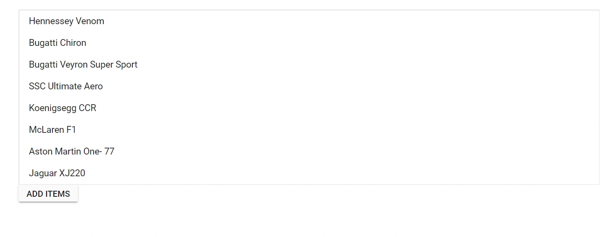
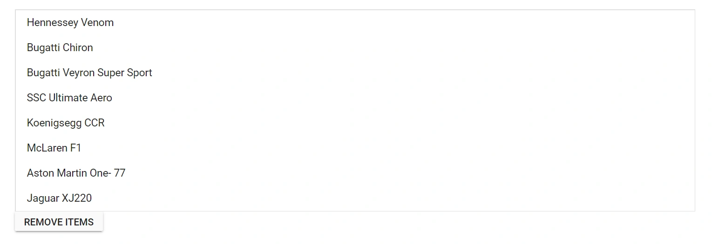

# How to add/remove items in Blazor ListBox

This section explains how to programmatically add and remove items in the Syncfusion Blazor ListBox component using the [AddItemsAsync](https://help.syncfusion.com/cr/blazor/Syncfusion.Blazor.DropDowns.SfDropDownBase-1.html#Syncfusion_Blazor_DropDowns_SfDropDownBase_1_AddItemsAsync_System_Collections_Generic_IEnumerable__0__System_Nullable_System_Int32__) and [RemoveItemAsync](https://help.syncfusion.com/cr/blazor/Syncfusion.Blazor.DropDowns.SfListBox-2.html#Syncfusion_Blazor_DropDowns_SfListBox_2_RemoveItemAsync_System_Collections_Generic_IEnumerable__1__System_Nullable_System_Int32__) methods.

```cshtml
@using Syncfusion.Blazor.DropDowns
@using Syncfusion.Blazor.Buttons

<SfListBox TValue="string[]" TItem="VehicleData" DataSource="@Vehicles" @ref="ListBoxObj">
  <ListBoxFieldSettings Text="Text" Value="Id" />
</SfListBox>
<SfButton @onclick="addData">ADD ITEMS</SfButton>

@code {
      SfListBox<string[],VehicleData> ListBoxObj;
      public List<VehicleData> Vehicles = new List<VehicleData> {
        new VehicleData { Text = "Hennessey Venom", Id = "Vehicle-01" },
        new VehicleData { Text = "Bugatti Chiron", Id = "Vehicle-02" },
        new VehicleData { Text = "Bugatti Veyron Super Sport", Id = "Vehicle-03" },
        new VehicleData { Text = "SSC Ultimate Aero", Id = "Vehicle-04" },
        new VehicleData { Text = "Koenigsegg CCR", Id = "Vehicle-05" },
        new VehicleData { Text = "McLaren F1", Id = "Vehicle-06" },
        new VehicleData { Text = "Aston Martin One-77", Id = "Vehicle-07" },
        new VehicleData { Text = "Jaguar XJ220", Id = "Vehicle-08" }
    };

    public class VehicleData {
      public string Text { get; set; }
      public string Id { get; set; }
    }

      public List<VehicleData> Item = new List<VehicleData>{
        new VehicleData{ Text = "Ferrari LaFerrari", Id = "Vehicle-09"},
        new VehicleData{ Text = "McLaren P1", Id = "Vehicle-10"}
      };

      private async Task addData() {
        await ListBoxObj.AddItemsAsync(Item);
      }
}
```



## Remove items from the listbox

Use the [RemoveItemAsync](https://help.syncfusion.com/cr/blazor/Syncfusion.Blazor.DropDowns.SfListBox-2.html#Syncfusion_Blazor_DropDowns_SfListBox_2_RemoveItemAsync_System_Collections_Generic_IEnumerable__1__System_Nullable_System_Int32__) method to remove items from the ListBox. In the following example, the `Ferrari LaFerrari` and `McLaren P1` items are removed when clicking the **REMOVE ITEMS** button.

```cshtml
@using Syncfusion.Blazor.DropDowns
@using Syncfusion.Blazor.Buttons

<SfListBox TValue="string[]" TItem="VehicleData" DataSource="@Vehicles" @ref="ListBoxObj">
  <ListBoxFieldSettings Text="Text" Value="Id" />
</SfListBox>
<SfButton @onclick="removeData">REMOVE ITEMS</SfButton>

@code {
      SfListBox<string[],VehicleData> ListBoxObj;
      public List<VehicleData> Vehicles = new List<VehicleData> {
        new VehicleData { Text = "Hennessey Venom", Id = "Vehicle-01" },
        new VehicleData { Text = "Bugatti Chiron", Id = "Vehicle-02" },
        new VehicleData { Text = "Bugatti Veyron Super Sport", Id = "Vehicle-03" },
        new VehicleData { Text = "SSC Ultimate Aero", Id = "Vehicle-04" },
        new VehicleData { Text = "Koenigsegg CCR", Id = "Vehicle-05" },
        new VehicleData { Text = "McLaren F1", Id = "Vehicle-06" },
        new VehicleData { Text = "Aston Martin One-77", Id = "Vehicle-07" },
        new VehicleData { Text = "Jaguar XJ220", Id = "Vehicle-08" },
        new VehicleData{ Text = "Ferrari LaFerrari", Id = "Vehicle-09"},
        new VehicleData{ Text = "McLaren P1", Id = "Vehicle-10"}
    };

    public class VehicleData {
      public string Text { get; set; }
      public string Id { get; set; }
    }

    public List<VehicleData> Item = new List<VehicleData>{
        new VehicleData{ Text = "Ferrari LaFerrari", Id = "Vehicle-09"},
        new VehicleData{ Text = "McLaren P1", Id = "Vehicle-10"}
    };

    private async Task removeData() {
      await ListBoxObj.RemoveItemAsync(Item);
    }
}
```



## See also

* [Get Items in Blazor ListBox](./get-items.md)
* [Select Items in Blazor ListBox](./select-items.md)
* [Data Binding in Blazor ListBox](./../data-binding.md)