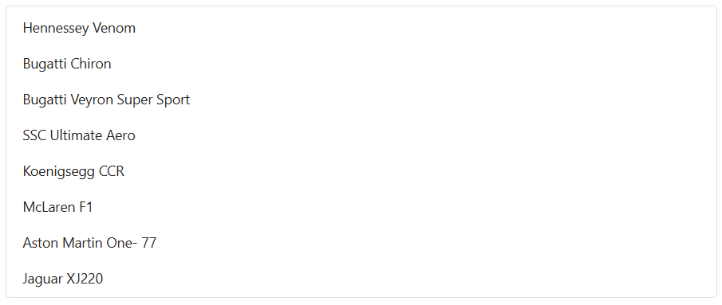

# Bind Change Events in Blazor ListBox Component

The [ValueChange](https://help.syncfusion.com/cr/blazor/Syncfusion.Blazor.DropDowns.ListBoxEvents-2.html#Syncfusion_Blazor_DropDowns_ListBoxEvents_2_ValueChange) event of the Blazor ListBox is triggered whenever the selected value changes because of a user interaction, such as selecting or deselecting an item. The event is exposed through the [ListBoxEvents](https://help.syncfusion.com/cr/blazor/Syncfusion.Blazor.DropDowns.ListBoxEvents-2.html) child component and delivers a [ListBoxChangeEventArgs](https://help.syncfusion.com/cr/blazor/Syncfusion.Blazor.DropDowns.ListBoxChangeEventArgs-2.html) payload to the handler.

```cshtml

@using Syncfusion.Blazor.DropDowns

<SfListBox TValue="string[]" TItem="VehicleData" DataSource="@Vehicles">
    <ListBoxEvents TValue="string[]" ValueChange="change" TItem="VehicleData"></ListBoxEvents>
    <ListBoxFieldSettings Text="Text" Value="Id" />
</SfListBox>

@code {
    public List<VehicleData> Vehicles = new List<VehicleData>
        {
        new VehicleData { Text = "Hennessey Venom", Id = "Vehicle-01" },
        new VehicleData { Text = "Bugatti Chiron", Id = "Vehicle-02" },
        new VehicleData { Text = "Bugatti Veyron Super Sport", Id = "Vehicle-03" },
        new VehicleData { Text = "SSC Ultimate Aero", Id = "Vehicle-04" },
        new VehicleData { Text = "Koenigsegg CCR", Id = "Vehicle-05" },
        new VehicleData { Text = "McLaren F1", Id = "Vehicle-06" },
        new VehicleData { Text = "Aston Martin One-77", Id = "Vehicle-07" },
        new VehicleData { Text = "Jaguar XJ220", Id = "Vehicle-08" }
        };

    public class VehicleData {
        public string Text { get; set; }
        public string Id { get; set; }
    }

    private void change(ListBoxChangeEventArgs<string[], VehicleData> args)
    {
        //Triggers when value changed
    }
}

```



## See also

* [Select Items in Blazor ListBox](./select-items.md)
* [Get Items in Blazor ListBox](./get-items.md)
* [Data Binding in Blazor ListBox](./../data-binding.md)
* [Selection in Blazor ListBox](./../selection.md)