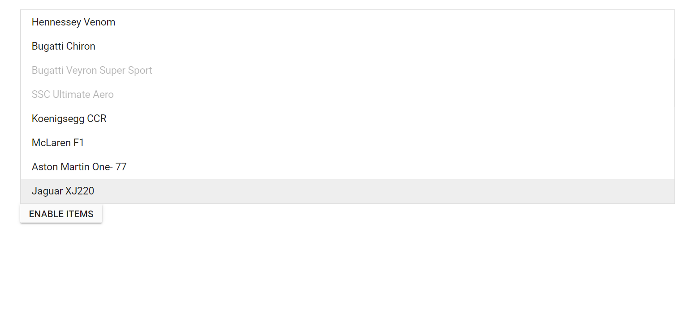

# Enable/Disable ListBox in Blazor ListBox Component

To enable or disable items in the listbox, [EnableItems](https://help.syncfusion.com/cr/blazor/Syncfusion.Blazor.DropDowns.SfListBox-2.html#Syncfusion_Blazor_DropDowns_SfListBox_2_EnableItems_System_Object_System_Boolean_) method can be used. In the following example, the `Bugatti Veyron Super Sport` and `SSC Ultimate Aero` items are disabled by default and by clicking `Enable Items` buttons, the disabled items will be enabled.

```cshtml
@using Syncfusion.Blazor.DropDowns
@using Syncfusion.Blazor.Buttons

<SfListBox TValue="string[]" TItem="VehicleData" DataSource="@Vehicles" @ref="ListBoxObj">
    <ListBoxFieldSettings Text="Text" Value="Text" />
    <ListBoxEvents TValue="string[]" Created="created" TItem="VehicleData"></ListBoxEvents>
</SfListBox>
<SfButton @onclick="enableData" Content="Enable Items"></SfButton>

@code {
    SfListBox<string[],VehicleData> ListBoxObj;
    public List<VehicleData> Vehicles = new List<VehicleData> {
        new VehicleData { Text = "Hennessey Venom", Id = "Vehicle-01" },
        new VehicleData { Text = "Bugatti Chiron", Id = "Vehicle-02" },
        new VehicleData { Text = "Bugatti Veyron Super Sport", Id = "Vehicle-03" },
        new VehicleData { Text = "SSC Ultimate Aero", Id = "Vehicle-04" },
        new VehicleData { Text = "Koenigsegg CCR", Id = "Vehicle-05" },
        new VehicleData { Text = "McLaren F1", Id = "Vehicle-06" },
        new VehicleData { Text = "Aston Martin One- 77", Id = "Vehicle-07" },
        new VehicleData { Text = "Jaguar XJ220", Id = "Vehicle-08" }
    };

    public class VehicleData {
      public string Text  { get; set; }
      public string Id  { get; set; }
    }
    public string[] Value = new string[] { "Bugatti Veyron Super Sport", "SSC Ultimate Aero" };
    private void created(object args)
    {
        ListBoxObj.EnableItems(this.Value, false);
    }

    private void enableData()
    {
        ListBoxObj.EnableItems(this.Value, true);
    }
}

```

