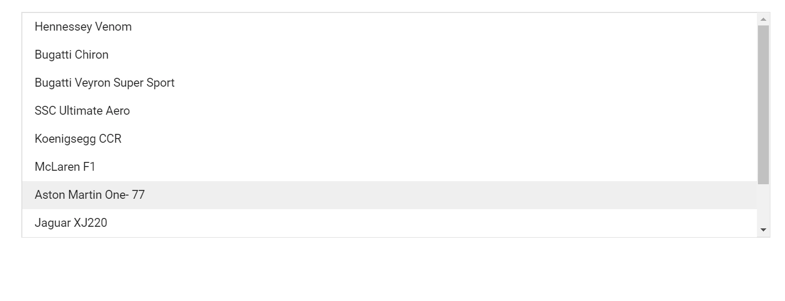

# Enable Scroller in Blazor ListBox Component

The Blazor ListBox supports scrolling when its visible height is restricted. By default, the ListBox auto-calculates its height to fit all items, so the scroller does not appear. Use the [Height](https://help.syncfusion.com/cr/blazor/Syncfusion.Blazor.DropDowns.SfListBox-2.html#Syncfusion_Blazor_DropDowns_SfListBox_2_Height) property to set a fixed height and enable the scroller. In the following example, the `Height` of the ListBox is set to `250px`, which is smaller than the combined height of the eight items and causes the scrollbar to appear.

```cshtml
@using Syncfusion.Blazor.DropDowns

<SfListBox TValue="string[]" DataSource="@Vehicles" Height="250px" TItem="VehicleData">
   <ListBoxFieldSettings Text="Text" Value="Id" />
</SfListBox>

@code {
   public List<VehicleData> Vehicles = new List<VehicleData> {
        new VehicleData { Text = "Hennessey Venom", Id = "Vehicle-01" },
        new VehicleData { Text = "Bugatti Chiron", Id = "Vehicle-02" },
        new VehicleData { Text = "Bugatti Veyron Super Sport", Id = "Vehicle-03" },
        new VehicleData { Text = "SSC Ultimate Aero", Id = "Vehicle-04" },
        new VehicleData { Text = "Koenigsegg CCR", Id = "Vehicle-05" },
        new VehicleData { Text = "McLaren F1", Id = "Vehicle-06" },
        new VehicleData { Text = "Aston Martin One-77", Id = "Vehicle-07" },
        new VehicleData { Text = "Jaguar XJ220", Id = "Vehicle-08" }
    };

    public class VehicleData {
      public string Text { get; set; }
      public string Id { get; set; }
    }
}

```



## See also

* [Data Binding in Blazor ListBox](./../data-binding.md)
* [Filtering in Blazor ListBox](./../filtering.md)
* [Sorting and Grouping in Blazor ListBox](./../sorting-grouping.md)
* [Style and Appearance in Blazor ListBox](./../style-and-appearance.md)