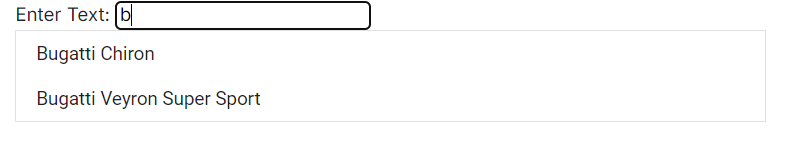

# How to Filter Blazor ListBox Data Using TextBox Component

This example demonstrates how to filter Syncfusion<sup style="font-size:70%">&reg;</sup> ListBox data based on input from a TextBox. Bind an input event listener to the TextBox to capture user input and filter the items in the ListBox. Within the event handler, use the [`FilterAsync`](https://help.syncfusion.com/cr/blazor/Syncfusion.Blazor.DropDowns.SfListBox-2.html#Syncfusion_Blazor_DropDowns_SfListBox_2_FilterAsync_System_Collections_Generic_IEnumerable__1__Syncfusion_Blazor_Data_Query_Syncfusion_Blazor_DropDowns_FieldSettingsModel_) method to update the ListBox items, ensuring that only those matching the input text are included.

```cshtml
@using Syncfusion.Blazor
@using Syncfusion.Blazor.DropDowns
@using Syncfusion.Blazor.Data

<label for="filter">Enter Text: </label>
<input type="text" id="filterTextBox" id="filter" @oninput="FilterList" placeholder="Enter text to filter"/>
<SfListBox @ref="ListBoxRef" TValue="string[]" DataSource="@Vehicles" TItem="VehicleData">
    <ListBoxFieldSettings Text="Text" Value="Id" />
</SfListBox>

@code {
    private SfListBox<string[], VehicleData> ListBoxRef;

    public List<VehicleData> Vehicles = new List<VehicleData> {
        new VehicleData { Text = "Hennessey Venom", Id = "Vehicle-01" },
        new VehicleData { Text = "Bugatti Chiron", Id = "Vehicle-02" },
        new VehicleData { Text = "Bugatti Veyron Super Sport", Id = "Vehicle-03" },
        new VehicleData { Text = "SSC Ultimate Aero", Id = "Vehicle-04" },
        new VehicleData { Text = "Koenigsegg CCR", Id = "Vehicle-05" },
        new VehicleData { Text = "McLaren F1", Id = "Vehicle-06" },
        new VehicleData { Text = "Aston Martin One-77", Id = "Vehicle-07" },
        new VehicleData { Text = "Jaguar XJ220", Id = "Vehicle-08" }
    };

    public class VehicleData {
        public string Text { get; set; }
        public string Id { get; set; }
    }

    private async Task FilterList(Microsoft.AspNetCore.Components.ChangeEventArgs e)
    {
        var inputValue = e.Value?.ToString() ?? string.Empty;
        var query = new Query().Where("Text", "contains", inputValue, true);
        await ListBoxRef.FilterAsync(Vehicles, query);
    }
    
}
```




