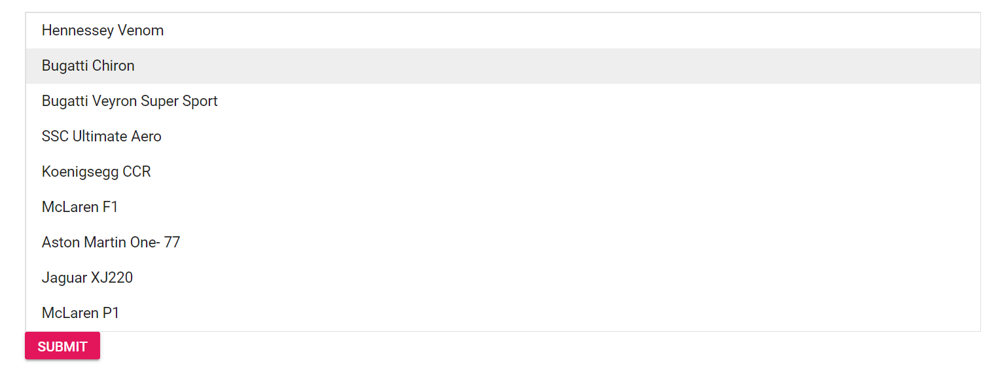

# Form submit to the listbox

In the following code snippet, the value that is in selected state will be sent on form submit.

```csharp
@using Syncfusion.Blazor.DropDowns
@using Syncfusion.Blazor.Buttons

<form>
    <SfListBox DataSource="@Data" TItem="VehicleData" TValue="string[]">
        <ListBoxFieldSettings Text="Text" Value="Id" />
    </SfListBox>
    <SfButton IsPrimary=true>SUBMIT</SfButton>
</form>

@code {
    public List<VehicleData> Data = new List<VehicleData> {
        new VehicleData { Text = "Hennessey Venom", Id = "list-01" },
        new VehicleData { Text = "Bugatti Chiron", Id = "list-02" },
        new VehicleData { Text = "Bugatti Veyron Super Sport", Id = "list-03" },
        new VehicleData { Text = "SSC Ultimate Aero", Id = "list-04" },
        new VehicleData { Text = "Koenigsegg CCR", Id = "list-05" },
        new VehicleData { Text = "McLaren F1", Id = "list-06" },
        new VehicleData { Text = "Aston Martin One- 77", Id = "list-07" },
        new VehicleData { Text = "Jaguar XJ220", Id = "list-08" }
    };
    public class VehicleData {
      public string Text  { get; set; }
      public string Id  { get; set; }
    }
}

```

Output will be shown as

