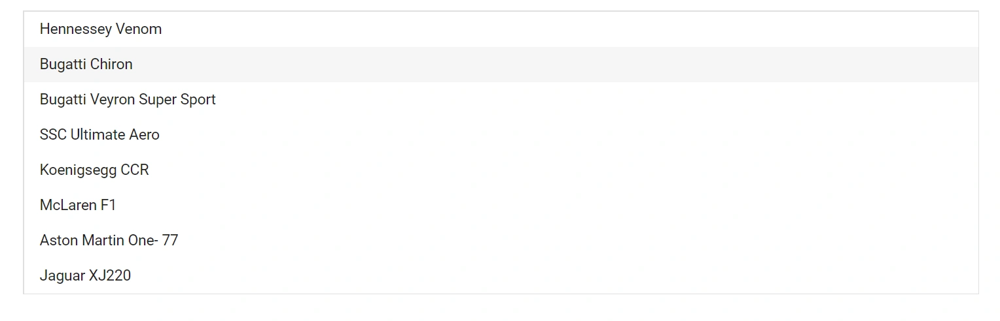

# How to get items in Blazor ListBox

The [GetDataByValue](https://help.syncfusion.com/cr/blazor/Syncfusion.Blazor.DropDowns.SfListBox-2.html#Syncfusion_Blazor_DropDowns_SfListBox_2_GetDataByValue__0_) method returns the data item or items corresponding to the value or values provided, based on the field mapped to `Value` in `ListBoxFieldSettings`. If a provided value does not match any item, that value is ignored and is not included in the result.

**Signature:**

```csharp
// For single value
TValue GetDataByValue(TValue value)

// For array of values
TValue[] GetDataByValue(TValue[] value)
```

**Parameters:**
- `value` (`TValue` or `TValue[]`) — The value or array of values to look up in the data source.

**Returns:**
- Single value form: `TValue` — the matching data item, or `default` if no match is found.
- Array form: `TValue[]` — the matching data items. Values that do not match any item are ignored and excluded from the result.

In the following example, the `Value` field in `ListBoxFieldSettings` is mapped to `Text`, so the input array must contain the item `Text` values. The `TValue` is `string[]`, which enables multiple selection.

```cshtml
@using Syncfusion.Blazor.Buttons
@using Syncfusion.Blazor.DropDowns

<SfListBox @ref="ListBoxObj" DataSource="@Vehicles" TValue="string[]" TItem="VehicleData" @bind-Value="@Value">
    <ListBoxFieldSettings Text="Text" Value="Text" />
</SfListBox>

<button @onclick="click">Click</button>

@code {
    SfListBox<string[], VehicleData> ListBoxObj;
    public List<VehicleData> Vehicles = new List<VehicleData> {
        new VehicleData { Text = "Hennessey Venom", Id = "Vehicle-01" },
        new VehicleData { Text = "Bugatti Chiron", Id = "Vehicle-02" },
        new VehicleData { Text = "Bugatti Veyron Super Sport", Id = "Vehicle-03" },
        new VehicleData { Text = "SSC Ultimate Aero", Id = "Vehicle-04" },
        new VehicleData { Text = "Koenigsegg CCR", Id = "Vehicle-05" },
        new VehicleData { Text = "McLaren F1", Id = "Vehicle-06" },
        new VehicleData { Text = "Aston Martin One-77", Id = "Vehicle-07" },
        new VehicleData { Text = "Jaguar XJ220", Id = "Vehicle-08" }
    };

    public class VehicleData
    {
        public string Text { get; set; }
        public string Id { get; set; }
    }
    public string[] Value = new string[] { "Bugatti Chiron" };
    private void click()
    {
        var Values = ListBoxObj.GetDataByValue(Value);
    }

}

```



## See also

* [Select Items in Blazor ListBox](./select-items.md)
* [Add or Remove Items in Blazor ListBox](./add-items.md)
* [Enable or Disable Items in Blazor ListBox](./enable-or-disable-items.md)
* [Data Binding in Blazor ListBox](./../data-binding.md)