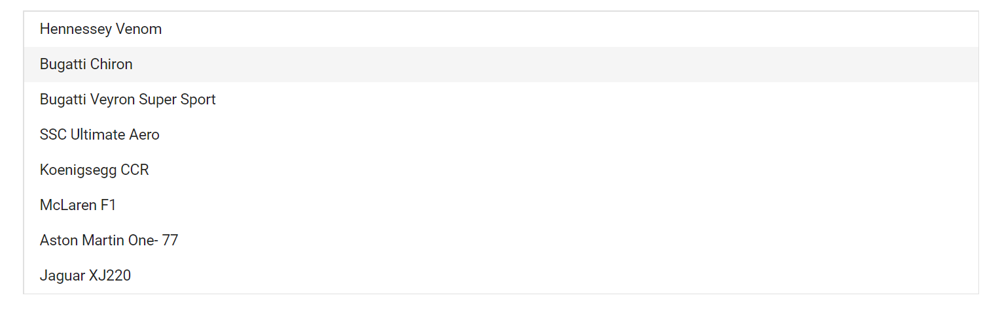

# Select Items in Blazor ListBox Component

In the following example, `Bugatti Chiron` is selected using [SelectItemsAsync](https://help.syncfusion.com/cr/blazor/Syncfusion.Blazor.DropDowns.SfListBox-2.html#Syncfusion_Blazor_DropDowns_SfListBox_2_SelectItemsAsync__1___0_System_Boolean_) method.

```cshtml
@using Syncfusion.Blazor.DropDowns

<SfListBox TValue="string[]" TItem="VehicleData" DataSource="@Vehicles" @ref="ListBoxObj">
    <ListBoxEvents TValue="string[]" Created="created" TItem="VehicleData"></ListBoxEvents>
    <ListBoxFieldSettings Text="Text" Value="Text" />
</SfListBox>

@code {
    SfListBox<string[],VehicleData> ListBoxObj;
    public List<VehicleData> Vehicles = new List<VehicleData> {
        new VehicleData { Text = "Hennessey Venom", Id = "Vehicle-01" },
        new VehicleData { Text = "Bugatti Chiron", Id = "Vehicle-02" },
        new VehicleData { Text = "Bugatti Veyron Super Sport", Id = "Vehicle-03" },
        new VehicleData { Text = "SSC Ultimate Aero", Id = "Vehicle-04" },
        new VehicleData { Text = "Koenigsegg CCR", Id = "Vehicle-05" },
        new VehicleData { Text = "McLaren F1", Id = "Vehicle-06" },
        new VehicleData { Text = "Aston Martin One- 77", Id = "Vehicle-07" },
        new VehicleData { Text = "Jaguar XJ220", Id = "Vehicle-08" }
    };

    public class VehicleData {
      public string Text  { get; set; }
      public string Id  { get; set; }
    }
    public string[] Value = new string[] { "Bugatti Chiron" };
    private async Task created(object args)
    {
        await ListBoxObj.SelectItemsAsync(this.Value, true);
    }
}

```

