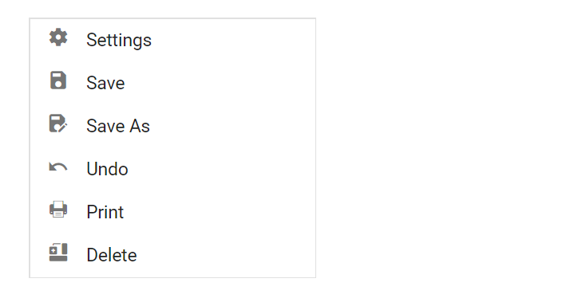

# Icons and Templates in Blazor ListBox Component

## Icons

To display an icon for each ListBox item, map the [IconCss field](https://help.syncfusion.com/cr/blazor/Syncfusion.Blazor.DropDowns.ListBoxFieldSettings.html#Syncfusion_Blazor_DropDowns_ListBoxFieldSettings_IconCss) to a CSS class name. By default, the icon is positioned on the left side of the item text. Icon glyphs are provided by the Syncfusion theme CSS; custom icons can also be supplied via user-defined CSS classes.

In the following example, icon classes are mapped to the `IconCss` field.

```cshtml
@using Syncfusion.Blazor.DropDowns

<SfListBox TValue="string[]" DataSource="@SettingsData" TItem="SettingItems">
    <ListBoxFieldSettings Text="Text" IconCss="IconCss" />
</SfListBox>

@code {
     public List<SettingItems> SettingsData = new List<SettingItems> {
        new SettingItems{ Text = "Settings", IconCss = "e-icons e-list-settings" },
        new SettingItems{ Text = "Save", IconCss = "e-icons e-list-save" },
        new SettingItems{ Text = "Save As", IconCss = "e-icons e-list-saveas" },
        new SettingItems{ Text = "Undo", IconCss = "e-icons e-list-undo" },
        new SettingItems{ Text = "Print", IconCss = "e-icons e-list-print" },
        new SettingItems{ Text = "Delete", IconCss = "e-icons e-list-delete" }
    };

    public class SettingItems {
        public string Text  { get; set; }
        public string IconCss  { get; set; }
    }

}
<style>
    .e-list-settings:before {
        content: "\e679";
    }

    .e-list-print:before {
        content: "\e743";
    }

    .e-list-save:before {
        content: "\e74d";
    }

    .e-list-saveas:before {
        content: "\e72b";
    }

    .e-list-delete:before {
        content: "\e773";
    }

    .e-list-undo:before {
        content: "\e752";
    }

</style>
```



## Templates

ListBox items can be customized according to the requirement using [ItemTemplate](https://help.syncfusion.com/cr/blazor/Syncfusion.Blazor.DropDowns.SfListBox-2.html) property.

```cshtml
@using Syncfusion.Blazor.DropDowns

<SfListBox TValue="string[]" DataSource="@Data" TItem="ListData">
<ListBoxFieldSettings Text="Text"></ListBoxFieldSettings>
    <ListBoxTemplates TItem="ListData">
        <ItemTemplate>
            <div class="list-wrapper">
                <span class="@((context as ListData).Pic) e-avatar e-avatar-xlarge e-avatar-circle"></span>
                <span class="text">@((context as ListData).Text)</span><span class="description">@((context as ListData).Description)</span>
            </div>
        </ItemTemplate>
    </ListBoxTemplates>
</SfListBox>

@code {
    public ListData Model = new ListData();
    public List<ListData> Data = new List<ListData>
    {
        new ListData { Text = "Javascript", Pic = "javascript", Description = "It is a lightweight interpreted or JIT-compiled programming language." },
        new ListData { Text = "Typescript", Pic = "typescript", Description = "It is a typed superset of Javascript that compiles to plain JavaScript." },
        new ListData { Text = "Angular", Pic = "angular", Description = "It is a TypeScript-based open-source web application framework." },
        new ListData { Text = "React", Pic = "react", Description = "A JavaScript library for building user interfaces. It can also render on the server using Node." },
        new ListData { Text = "Vue", Pic = "vue", Description = "A progressive framework for building user interfaces. it is incrementally adoptable." }
    };

    public class ListData
    {
        public string Text { get; set; }
        public string Pic { get; set; }
        public string Description { get; set; }
    }
}

<style>
    .e-listbox-container {
        margin: auto;
        max-width: 400px;
        box-sizing: border-box;
    }

    .list-wrapper {
        height: inherit;
        position: relative;
        padding: 14px 12px 14px 78px;
    }

    .list-wrapper .text,
    .list-wrapper .description {
        display: block;
        margin: 0;
        padding-bottom: 3px;
        white-space: normal;
    }

    .list-wrapper .description {
        font-size: 12px;
        font-weight: 500;
    }

    .e-listbox-container .list-wrapper .text {
        font-weight: bold;
        font-size: 13px;
    }

    .list-wrapper .e-avatar {
        position: absolute;
        left: 5px;
        background-color: transparent;
        font-size: 22px;
        top: calc(50% - 33px);
    }

    .e-listbox-container .e-list-item {
        height: auto !important;
    }

    .javascript {
        background-image: url('./images/javascript.svg');
    }

    .typescript {
        background-image: url('./images/typescript.svg')
    }

    .angular {
        background-image: url('./images/angular.svg');
    }

    .vue {
        background-image: url('./images/vue.svg');
    }

    .react {
        background-image: url('./images/react.svg');
    }
</style>

```

