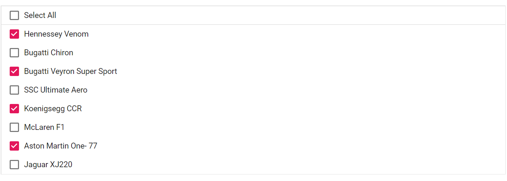

# Selection in Blazor ListBox Component

The ListBox provides support to select an item or a group of item by mouse or keyboard action. There are two selection modes available in ListBox,

* Single -  To select single item in the ListBox.
* Multiple -  To select multiple items in the ListBox.

## Single selection

To enable single selection in the ListBox, [Mode](https://help.syncfusion.com/cr/blazor/Syncfusion.Blazor.DropDowns.ListBoxSelectionSettings.html#Syncfusion_Blazor_DropDowns_ListBoxSelectionSettings_Mode) should be set as `Single` in [SelectionSettings](https://help.syncfusion.com/cr/blazor/Syncfusion.Blazor.DropDowns.ListBoxSelectionSettings.html) property.

```cshtml
@using Syncfusion.Blazor.DropDowns

<SfListBox TValue="string[]" DataSource="@Vehicles" TItem="VehicleData">
    <ListBoxFieldSettings Text="Text" Value="Id" />
    <ListBoxSelectionSettings Mode="Syncfusion.Blazor.DropDowns.SelectionMode.Single"></ListBoxSelectionSettings>
</SfListBox>

@code {
    public List<VehicleData> Vehicles = new List<VehicleData> {
        new VehicleData { Text = "Hennessey Venom", Id = "Vehicle-01" },
        new VehicleData { Text = "Bugatti Chiron", Id = "Vehicle-02" },
        new VehicleData { Text = "Bugatti Veyron Super Sport", Id = "Vehicle-03" },
        new VehicleData { Text = "SSC Ultimate Aero", Id = "Vehicle-04" },
        new VehicleData { Text = "Koenigsegg CCR", Id = "Vehicle-05" },
        new VehicleData { Text = "McLaren F1", Id = "Vehicle-06" },
        new VehicleData { Text = "Aston Martin One- 77", Id = "Vehicle-07" },
        new VehicleData { Text = "Jaguar XJ220", Id = "Vehicle-08" }
    };

    public class VehicleData {
      public string Text  { get; set; }
      public string Id  { get; set; }
    }
}

```


## Multiple selection

To enable multiple selection in the ListBox, [Mode](https://help.syncfusion.com/cr/blazor/Syncfusion.Blazor.DropDowns.ListBoxSelectionSettings.html#Syncfusion_Blazor_DropDowns_ListBoxSelectionSettings_Mode) should be set as `Multiple` in [SelectionSettings](https://help.syncfusion.com/cr/blazor/Syncfusion.Blazor.DropDowns.ListBoxSelectionSettings.html) property. To select multiple items, use the SHIFT, CTRL, and arrow keys to make selections.

N> By default, the selection mode is set as `Multiple`.

```cshtml
@using Syncfusion.Blazor.DropDowns

<SfListBox TValue="string[]" DataSource="@Vehicles" TItem="VehicleData">
    <ListBoxSelectionSettings Mode="Syncfusion.Blazor.DropDowns.SelectionMode.Multiple"></ListBoxSelectionSettings>
    <ListBoxFieldSettings Text="Text" Value="Id" />
</SfListBox>

@code {
    public List<VehicleData> Vehicles = new List<VehicleData> {
        new VehicleData { Text = "Hennessey Venom", Id = "Vehicle-01" },
        new VehicleData { Text = "Bugatti Chiron", Id = "Vehicle-02" },
        new VehicleData { Text = "Bugatti Veyron Super Sport", Id = "Vehicle-03" },
        new VehicleData { Text = "SSC Ultimate Aero", Id = "Vehicle-04" },
        new VehicleData { Text = "Koenigsegg CCR", Id = "Vehicle-05" },
        new VehicleData { Text = "McLaren F1", Id = "Vehicle-06" },
        new VehicleData { Text = "Aston Martin One- 77", Id = "Vehicle-07" },
        new VehicleData { Text = "Jaguar XJ220", Id = "Vehicle-08" }
    };

    public class VehicleData {
      public string Text  { get; set; }
      public string Id  { get; set; }
    }
}

```


## CheckBox Selection

ListBox supports checkbox selection which is used to select multiple items. To enable the checkbox selection, set the [ShowCheckbox](https://help.syncfusion.com/cr/blazor/Syncfusion.Blazor.DropDowns.ListBoxSelectionSettings.html#Syncfusion_Blazor_DropDowns_ListBoxSelectionSettings_ShowCheckbox) property to `true`.

### Select All

To select all the items in the ListBox, enable the [ShowSelectAll](https://help.syncfusion.com/cr/blazor/Syncfusion.Blazor.DropDowns.ListBoxSelectionSettings.html#Syncfusion_Blazor_DropDowns_ListBoxSelectionSettings_ShowSelectAll) property to `true`.

```cshtml

@using Syncfusion.Blazor.DropDowns

<SfListBox TValue="string[]" DataSource="@Vehicles" TItem="VehicleData">
    <ListBoxFieldSettings Text="Text" Value="Id" />
    <ListBoxSelectionSettings ShowCheckbox="true" ShowSelectAll="true"></ListBoxSelectionSettings>
</SfListBox>

@code {
    public List<VehicleData> Vehicles = new List<VehicleData>
    {
        new VehicleData { Text = "Hennessey Venom", Id = "Vehicle-01" },
        new VehicleData { Text = "Bugatti Chiron", Id = "Vehicle-02" },
        new VehicleData { Text = "Bugatti Veyron Super Sport", Id = "Vehicle-03" },
        new VehicleData { Text = "SSC Ultimate Aero", Id = "Vehicle-04" },
        new VehicleData { Text = "Koenigsegg CCR", Id = "Vehicle-05" },
        new VehicleData { Text = "McLaren F1", Id = "Vehicle-06" },
        new VehicleData { Text = "Aston Martin One- 77", Id = "Vehicle-07" },
        new VehicleData { Text = "Jaguar XJ220", Id = "Vehicle-08" }
    };
        public class VehicleData {
        public string Text  { get; set; }
        public string Id  { get; set; }
        }
    }

```



### Maximum Selection Length

The [MaximumSelectionLength](https://help.syncfusion.com/cr/blazor/Syncfusion.Blazor.DropDowns.SfListBox-2.html#Syncfusion_Blazor_DropDowns_SfListBox_2_MaximumSelectionLength) property gets or sets the maximum length of items that can be selected in the ListBox. This property should be set based on the length of your data source. By setting this limitation, the selection of items in the list will be prevented.

N> The default value of MaximumSelectionLength property is `500`.