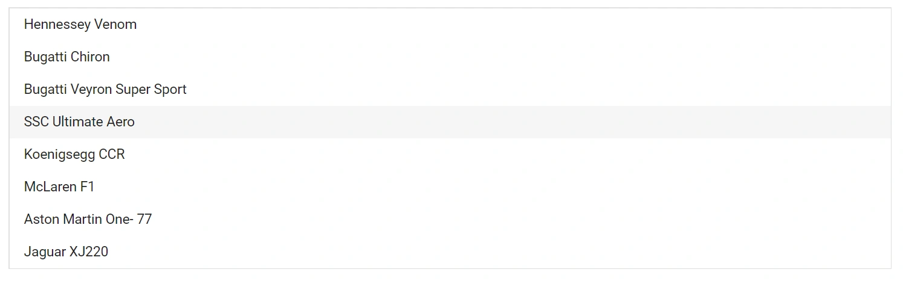
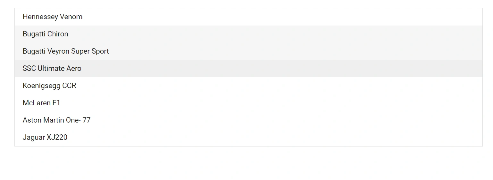
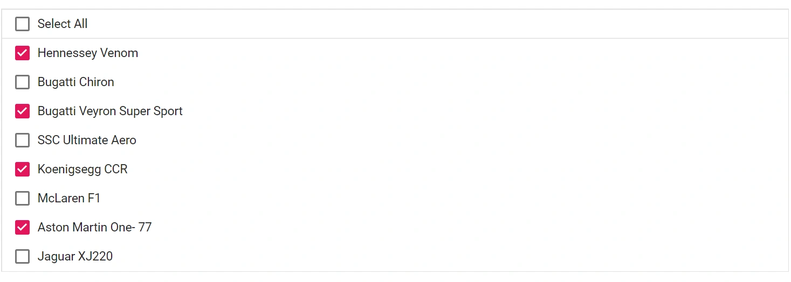

# Selection in Blazor ListBox Component

The Blazor ListBox supports selecting a single item or multiple items using the mouse or the keyboard. There are two selection modes available in the ListBox:

* **Single** – Select a single item in the ListBox.
* **Multiple** – Select multiple items in the ListBox.

## Single selection

To enable single selection, set the [Mode](https://help.syncfusion.com/cr/blazor/Syncfusion.Blazor.DropDowns.ListBoxSelectionSettings.html#Syncfusion_Blazor_DropDowns_ListBoxSelectionSettings_Mode) to `Single` in the [ListBoxSelectionSettings](https://help.syncfusion.com/cr/blazor/Syncfusion.Blazor.DropDowns.ListBoxSelectionSettings.html) child component.

```cshtml
@using Syncfusion.Blazor.DropDowns

<SfListBox TValue="string[]" DataSource="@Vehicles" TItem="VehicleData">
    <ListBoxFieldSettings Text="Text" Value="Id" />
    <ListBoxSelectionSettings Mode="Syncfusion.Blazor.DropDowns.SelectionMode.Single"></ListBoxSelectionSettings>
</SfListBox>

@code {
    public List<VehicleData> Vehicles = new List<VehicleData> {
        new VehicleData { Text = "Hennessey Venom", Id = "Vehicle-01" },
        new VehicleData { Text = "Bugatti Chiron", Id = "Vehicle-02" },
        new VehicleData { Text = "Bugatti Veyron Super Sport", Id = "Vehicle-03" },
        new VehicleData { Text = "SSC Ultimate Aero", Id = "Vehicle-04" },
        new VehicleData { Text = "Koenigsegg CCR", Id = "Vehicle-05" },
        new VehicleData { Text = "McLaren F1", Id = "Vehicle-06" },
        new VehicleData { Text = "Aston Martin One- 77", Id = "Vehicle-07" },
        new VehicleData { Text = "Jaguar XJ220", Id = "Vehicle-08" }
    };

    public class VehicleData {
      public string Text  { get; set; }
      public string Id  { get; set; }
    }
}

```



## Multiple selection

To enable multiple selection, set the [Mode](https://help.syncfusion.com/cr/blazor/Syncfusion.Blazor.DropDowns.ListBoxSelectionSettings.html#Syncfusion_Blazor_DropDowns_ListBoxSelectionSettings_Mode) to `Multiple` in the [ListBoxSelectionSettings](https://help.syncfusion.com/cr/blazor/Syncfusion.Blazor.DropDowns.ListBoxSelectionSettings.html) child component. Use the **Shift**, **Ctrl**, and arrow keys to select multiple items with the keyboard.

N> By default, the selection mode is `Multiple`.

```cshtml
@using Syncfusion.Blazor.DropDowns

<SfListBox TValue="string[]" DataSource="@Vehicles" TItem="VehicleData">
    <ListBoxSelectionSettings Mode="Syncfusion.Blazor.DropDowns.SelectionMode.Multiple"></ListBoxSelectionSettings>
    <ListBoxFieldSettings Text="Text" Value="Id" />
</SfListBox>

@code {
    public List<VehicleData> Vehicles = new List<VehicleData> {
        new VehicleData { Text = "Hennessey Venom", Id = "Vehicle-01" },
        new VehicleData { Text = "Bugatti Chiron", Id = "Vehicle-02" },
        new VehicleData { Text = "Bugatti Veyron Super Sport", Id = "Vehicle-03" },
        new VehicleData { Text = "SSC Ultimate Aero", Id = "Vehicle-04" },
        new VehicleData { Text = "Koenigsegg CCR", Id = "Vehicle-05" },
        new VehicleData { Text = "McLaren F1", Id = "Vehicle-06" },
        new VehicleData { Text = "Aston Martin One- 77", Id = "Vehicle-07" },
        new VehicleData { Text = "Jaguar XJ220", Id = "Vehicle-08" }
    };

    public class VehicleData {
      public string Text  { get; set; }
      public string Id  { get; set; }
    }
}

```



## CheckBox Selection

The ListBox supports checkbox selection for choosing multiple items. To enable checkbox selection, set the [ShowCheckbox](https://help.syncfusion.com/cr/blazor/Syncfusion.Blazor.DropDowns.ListBoxSelectionSettings.html#Syncfusion_Blazor_DropDowns_ListBoxSelectionSettings_ShowCheckbox) property to `true`.

### Select All

To select all items in the ListBox at once, set the [ShowSelectAll](https://help.syncfusion.com/cr/blazor/Syncfusion.Blazor.DropDowns.ListBoxSelectionSettings.html#Syncfusion_Blazor_DropDowns_ListBoxSelectionSettings_ShowSelectAll) property to `true`.

```cshtml

@using Syncfusion.Blazor.DropDowns

<SfListBox TValue="string[]" DataSource="@Vehicles" TItem="VehicleData">
    <ListBoxFieldSettings Text="Text" Value="Id" />
    <ListBoxSelectionSettings ShowCheckbox="true" ShowSelectAll="true"></ListBoxSelectionSettings>
</SfListBox>

@code {
    public List<VehicleData> Vehicles = new List<VehicleData>
    {
        new VehicleData { Text = "Hennessey Venom", Id = "Vehicle-01" },
        new VehicleData { Text = "Bugatti Chiron", Id = "Vehicle-02" },
        new VehicleData { Text = "Bugatti Veyron Super Sport", Id = "Vehicle-03" },
        new VehicleData { Text = "SSC Ultimate Aero", Id = "Vehicle-04" },
        new VehicleData { Text = "Koenigsegg CCR", Id = "Vehicle-05" },
        new VehicleData { Text = "McLaren F1", Id = "Vehicle-06" },
        new VehicleData { Text = "Aston Martin One- 77", Id = "Vehicle-07" },
        new VehicleData { Text = "Jaguar XJ220", Id = "Vehicle-08" }
    };
        public class VehicleData {
        public string Text  { get; set; }
        public string Id  { get; set; }
        }
    }

```



### Maximum Selection Length

The [MaximumSelectionLength](https://help.syncfusion.com/cr/blazor/Syncfusion.Blazor.DropDowns.SfListBox-2.html#Syncfusion_Blazor_DropDowns_SfListBox_2_MaximumSelectionLength) property limits the number of items that can be selected at one time. When the limit is reached, additional selection is prevented. Set this based on the size of your data source.

N> The default value of the `MaximumSelectionLength` property is `500`.

## See also

* [Bind Change Events in Blazor ListBox](./how-to/bind-change-event.md)
* [Get Items in Blazor ListBox](./how-to/get-items.md)
* [Select Items in Blazor ListBox](./how-to/select-items.md)
* [Data Binding in Blazor ListBox](./data-binding.md)