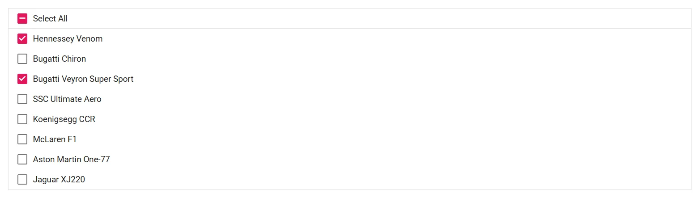
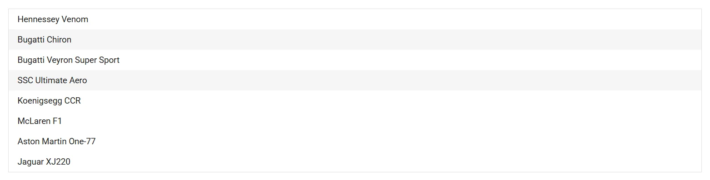
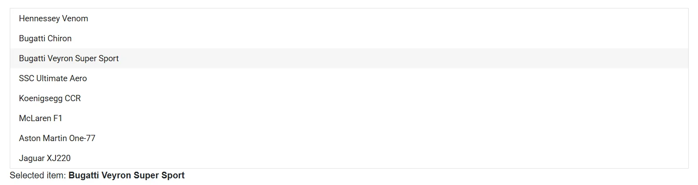

# Selection in Blazor ListBox Component

The Blazor ListBox supports selecting a single item or multiple items using the mouse or the keyboard. There are two selection modes available in the ListBox:

* **Single** – Select a single item in the ListBox.
* **Multiple** – Select multiple items in the ListBox.

## Single selection

To enable single selection, set the [Mode](https://help.syncfusion.com/cr/blazor/Syncfusion.Blazor.DropDowns.ListBoxSelectionSettings.html#Syncfusion_Blazor_DropDowns_ListBoxSelectionSettings_Mode) to `Single` in the [ListBoxSelectionSettings](https://help.syncfusion.com/cr/blazor/Syncfusion.Blazor.DropDowns.ListBoxSelectionSettings.html) child component.

```cshtml
@using Syncfusion.Blazor.DropDowns

<SfListBox TValue="string[]" DataSource="@Vehicles" TItem="VehicleData">
    <ListBoxFieldSettings Text="Text" Value="Id" />
    <ListBoxSelectionSettings Mode="Syncfusion.Blazor.DropDowns.SelectionMode.Single"></ListBoxSelectionSettings>
</SfListBox>

@code {
    public List<VehicleData> Vehicles = new List<VehicleData> {
        new VehicleData { Text = "Hennessey Venom", Id = "Vehicle-01" },
        new VehicleData { Text = "Bugatti Chiron", Id = "Vehicle-02" },
        new VehicleData { Text = "Bugatti Veyron Super Sport", Id = "Vehicle-03" },
        new VehicleData { Text = "SSC Ultimate Aero", Id = "Vehicle-04" },
        new VehicleData { Text = "Koenigsegg CCR", Id = "Vehicle-05" },
        new VehicleData { Text = "McLaren F1", Id = "Vehicle-06" },
        new VehicleData { Text = "Aston Martin One-77", Id = "Vehicle-07" },
        new VehicleData { Text = "Jaguar XJ220", Id = "Vehicle-08" }
    };

    public class VehicleData {
        public string Text { get; set; }
        public string Id { get; set; }
    }
}

```


## Multiple selection

To enable multiple selection, set the [Mode](https://help.syncfusion.com/cr/blazor/Syncfusion.Blazor.DropDowns.ListBoxSelectionSettings.html#Syncfusion_Blazor_DropDowns_ListBoxSelectionSettings_Mode) to `Multiple` in the [ListBoxSelectionSettings](https://help.syncfusion.com/cr/blazor/Syncfusion.Blazor.DropDowns.ListBoxSelectionSettings.html) child component. Use the **Shift**, **Ctrl**, and arrow keys to select multiple items with the keyboard.

N> By default, the selection mode is `Multiple`.

```cshtml
@using Syncfusion.Blazor.DropDowns

<SfListBox TValue="string[]" DataSource="@Vehicles" TItem="VehicleData">
    <ListBoxSelectionSettings Mode="Syncfusion.Blazor.DropDowns.SelectionMode.Multiple"></ListBoxSelectionSettings>
    <ListBoxFieldSettings Text="Text" Value="Id" />
</SfListBox>

@code {
    public List<VehicleData> Vehicles = new List<VehicleData> {
        new VehicleData { Text = "Hennessey Venom", Id = "Vehicle-01" },
        new VehicleData { Text = "Bugatti Chiron", Id = "Vehicle-02" },
        new VehicleData { Text = "Bugatti Veyron Super Sport", Id = "Vehicle-03" },
        new VehicleData { Text = "SSC Ultimate Aero", Id = "Vehicle-04" },
        new VehicleData { Text = "Koenigsegg CCR", Id = "Vehicle-05" },
        new VehicleData { Text = "McLaren F1", Id = "Vehicle-06" },
        new VehicleData { Text = "Aston Martin One-77", Id = "Vehicle-07" },
        new VehicleData { Text = "Jaguar XJ220", Id = "Vehicle-08" }
    };

    public class VehicleData {
        public string Text { get; set; }
        public string Id { get; set; }
    }
}

```


## CheckBox Selection

The ListBox supports checkbox selection for choosing multiple items. To enable checkbox selection, set the [ShowCheckbox](https://help.syncfusion.com/cr/blazor/Syncfusion.Blazor.DropDowns.ListBoxSelectionSettings.html#Syncfusion_Blazor_DropDowns_ListBoxSelectionSettings_ShowCheckbox) property to `true`.

### Select All

To select all items in the ListBox at once, set the [ShowSelectAll](https://help.syncfusion.com/cr/blazor/Syncfusion.Blazor.DropDowns.ListBoxSelectionSettings.html#Syncfusion_Blazor_DropDowns_ListBoxSelectionSettings_ShowSelectAll) property to `true`.

```cshtml

@using Syncfusion.Blazor.DropDowns

<SfListBox TValue="string[]" DataSource="@Vehicles" TItem="VehicleData">
    <ListBoxFieldSettings Text="Text" Value="Id" />
    <ListBoxSelectionSettings ShowCheckbox="true" ShowSelectAll="true"></ListBoxSelectionSettings>
</SfListBox>

@code {
    public List<VehicleData> Vehicles = new List<VehicleData>
    {
        new VehicleData { Text = "Hennessey Venom", Id = "Vehicle-01" },
        new VehicleData { Text = "Bugatti Chiron", Id = "Vehicle-02" },
        new VehicleData { Text = "Bugatti Veyron Super Sport", Id = "Vehicle-03" },
        new VehicleData { Text = "SSC Ultimate Aero", Id = "Vehicle-04" },
        new VehicleData { Text = "Koenigsegg CCR", Id = "Vehicle-05" },
        new VehicleData { Text = "McLaren F1", Id = "Vehicle-06" },
        new VehicleData { Text = "Aston Martin One-77", Id = "Vehicle-07" },
        new VehicleData { Text = "Jaguar XJ220", Id = "Vehicle-08" }
    };

    public class VehicleData {
        public string Text { get; set; }
        public string Id { get; set; }
    }
}

```


### Maximum Selection Length

The [MaximumSelectionLength](https://help.syncfusion.com/cr/blazor/Syncfusion.Blazor.DropDowns.SfListBox-2.html#Syncfusion_Blazor_DropDowns_SfListBox_2_MaximumSelectionLength) property limits the number of items that can be selected at one time. Once the limit is reached, additional items cannot be selected. Set this based on the size of your data source.

N> The default value of the `MaximumSelectionLength` property is `500`.

In the following example, the `MaximumSelectionLength` is set to `2`, so the user can select no more than two items at a time.

```cshtml

@using Syncfusion.Blazor.DropDowns

<SfListBox TValue="string[]" DataSource="@Vehicles" TItem="VehicleData" MaximumSelectionLength="2">
    <ListBoxFieldSettings Text="Text" Value="Id" />
    <ListBoxSelectionSettings ShowCheckbox="true" ShowSelectAll="true"></ListBoxSelectionSettings>
</SfListBox>

@code {
    public List<VehicleData> Vehicles = new List<VehicleData>
    {
        new VehicleData { Text = "Hennessey Venom", Id = "Vehicle-01" },
        new VehicleData { Text = "Bugatti Chiron", Id = "Vehicle-02" },
        new VehicleData { Text = "Bugatti Veyron Super Sport", Id = "Vehicle-03" },
        new VehicleData { Text = "SSC Ultimate Aero", Id = "Vehicle-04" },
        new VehicleData { Text = "Koenigsegg CCR", Id = "Vehicle-05" },
        new VehicleData { Text = "McLaren F1", Id = "Vehicle-06" },
        new VehicleData { Text = "Aston Martin One-77", Id = "Vehicle-07" },
        new VehicleData { Text = "Jaguar XJ220", Id = "Vehicle-08" }
    };

    public class VehicleData {
        public string Text { get; set; }
        public string Id { get; set; }
    }
}

```



## Pre-select items

Items can be pre-selected when the component is rendered by binding the [Value](https://help.syncfusion.com/cr/blazor/Syncfusion.Blazor.DropDowns.SfListBox-2.html#Syncfusion_Blazor_DropDowns_SfListBox_2_Value) parameter to an array that contains the values to be selected. The values must match the field configured in the [ListBoxFieldSettings](https://help.syncfusion.com/cr/blazor/Syncfusion.Blazor.DropDowns.ListBoxFieldSettings.html) child component.

In the following example, the values `Vehicle-02` and `Vehicle-04` are pre-selected by binding the `Value` parameter.

```cshtml

@using Syncfusion.Blazor.DropDowns

<SfListBox TValue="string[]" DataSource="@Vehicles" TItem="VehicleData" Value="@SelectedItems">
    <ListBoxFieldSettings Text="Text" Value="Id" />
    <ListBoxSelectionSettings Mode="Syncfusion.Blazor.DropDowns.SelectionMode.Multiple"></ListBoxSelectionSettings>
</SfListBox>

@code {
    public List<VehicleData> Vehicles = new List<VehicleData>
    {
        new VehicleData { Text = "Hennessey Venom", Id = "Vehicle-01" },
        new VehicleData { Text = "Bugatti Chiron", Id = "Vehicle-02" },
        new VehicleData { Text = "Bugatti Veyron Super Sport", Id = "Vehicle-03" },
        new VehicleData { Text = "SSC Ultimate Aero", Id = "Vehicle-04" },
        new VehicleData { Text = "Koenigsegg CCR", Id = "Vehicle-05" },
        new VehicleData { Text = "McLaren F1", Id = "Vehicle-06" },
        new VehicleData { Text = "Aston Martin One-77", Id = "Vehicle-07" },
        new VehicleData { Text = "Jaguar XJ220", Id = "Vehicle-08" }
    };

    public string[] SelectedItems = new string[] { "Vehicle-02", "Vehicle-04" };

    public class VehicleData {
        public string Text { get; set; }
        public string Id { get; set; }
    }
}

```



## Selection change event

The [ValueChange](https://help.syncfusion.com/cr/blazor/Syncfusion.Blazor.DropDowns.ListBoxEvents-2.html#Syncfusion_Blazor_DropDowns_ListBoxEvents_2_ValueChange) event fires whenever the selection changes. It is configured through the [ListBoxEvents](https://help.syncfusion.com/cr/blazor/Syncfusion.Blazor.DropDowns.ListBoxEvents-2.html) child component and passes a [ListBoxChangeEventArgs](https://help.syncfusion.com/cr/blazor/Syncfusion.Blazor.DropDowns.ListBoxChangeEventArgs-2.html) argument to the handler that contains the added, removed, and current values.

In the following example, the `ValueChange` event handler updates a label with the display text of the currently selected item whenever the selection changes.

```cshtml

@using Syncfusion.Blazor.DropDowns

<SfListBox TValue="string[]" DataSource="@Vehicles" TItem="VehicleData">
    <ListBoxEvents TValue="string[]" ValueChange="OnValueChange" TItem="VehicleData"></ListBoxEvents>
    <ListBoxFieldSettings Text="Text" Value="Id" />
    <ListBoxSelectionSettings Mode="Syncfusion.Blazor.DropDowns.SelectionMode.Single"></ListBoxSelectionSettings>
</SfListBox>

<p>Selected item: <strong>@SelectedText</strong></p>

@code {
    public List<VehicleData> Vehicles = new List<VehicleData>
    {
        new VehicleData { Text = "Hennessey Venom", Id = "Vehicle-01" },
        new VehicleData { Text = "Bugatti Chiron", Id = "Vehicle-02" },
        new VehicleData { Text = "Bugatti Veyron Super Sport", Id = "Vehicle-03" },
        new VehicleData { Text = "SSC Ultimate Aero", Id = "Vehicle-04" },
        new VehicleData { Text = "Koenigsegg CCR", Id = "Vehicle-05" },
        new VehicleData { Text = "McLaren F1", Id = "Vehicle-06" },
        new VehicleData { Text = "Aston Martin One-77", Id = "Vehicle-07" },
        new VehicleData { Text = "Jaguar XJ220", Id = "Vehicle-08" }
    };

    public string SelectedText { get; set; } = "None";

    public class VehicleData {
        public string Text { get; set; }
        public string Id { get; set; }
    }

    private void OnValueChange(ListBoxChangeEventArgs<string[], VehicleData> args)
    {
        if (args.Value != null && args.Value.Length > 0)
        {
            var selected = Vehicles.FirstOrDefault(v => v.Id == args.Value[0]);
            SelectedText = selected?.Text ?? "None";
        }
        else
        {
            SelectedText = "None";
        }
    }
}

```



N> As an alternative to the `ValueChange` event, the [Value](https://help.syncfusion.com/cr/blazor/Syncfusion.Blazor.DropDowns.SfListBox-2.html#Syncfusion_Blazor_DropDowns_SfListBox_2_Value) parameter can be two-way bound with `@bind-Value`. The two-way binding keeps the selected values in a single C# property and reflects every change in the ListBox automatically.

## Keyboard navigation

The Blazor ListBox supports keyboard-based selection. The following table summarizes the keyboard shortcuts available for each selection mode.

| Windows | Mac | Selection Mode | Action |
| --- | --- | --- | --- |
| <kbd>↑</kbd> / <kbd>↓</kbd> | <kbd>↑</kbd> / <kbd>↓</kbd> | Single, Multiple | Moves focus to the previous or next option. |
| <kbd>Home</kbd> / <kbd>End</kbd> | <kbd>Home</kbd> / <kbd>End</kbd> | Single, Multiple | Moves focus to the first or last option. |
| <kbd>Space</kbd> | <kbd>Space</kbd> | Single, Multiple | Toggles the selection state of the focused option. |
| <kbd>Ctrl</kbd> + <kbd>↑</kbd> / <kbd>↓</kbd> | <kbd>⌘</kbd> + <kbd>↑</kbd> / <kbd>↓</kbd> | Multiple | Moves focus without changing the current selection. |
| <kbd>Ctrl</kbd> + <kbd>A</kbd> | <kbd>⌘</kbd> + <kbd>A</kbd> | Multiple | Selects all options in the list. |
| <kbd>Ctrl</kbd> + <kbd>Shift</kbd> + <kbd>Home</kbd> | <kbd>⌘</kbd> + <kbd>⇧</kbd> + <kbd>Home</kbd> | Multiple | Selects the focused option and all options up to the first option. |
| <kbd>Ctrl</kbd> + <kbd>Shift</kbd> + <kbd>End</kbd> | <kbd>⌘</kbd> + <kbd>⇧</kbd> + <kbd>End</kbd> | Multiple | Selects the focused option and all options down to the last option. |

N> When checkbox selection is enabled (`ShowCheckbox="true"`), the <kbd>Space</kbd> key toggles the checkbox state of the focused option.

## See also

* [Bind Change Events in Blazor ListBox](./how-to/bind-change-event.md)
* [Get Items in Blazor ListBox](./how-to/get-items.md)
* [Select Items in Blazor ListBox](./how-to/select-items.md)
* [Data Binding in Blazor ListBox](./data-binding.md)
* [Accessibility in Blazor ListBox](./accessibility.md)