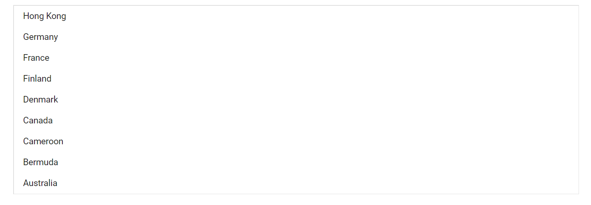
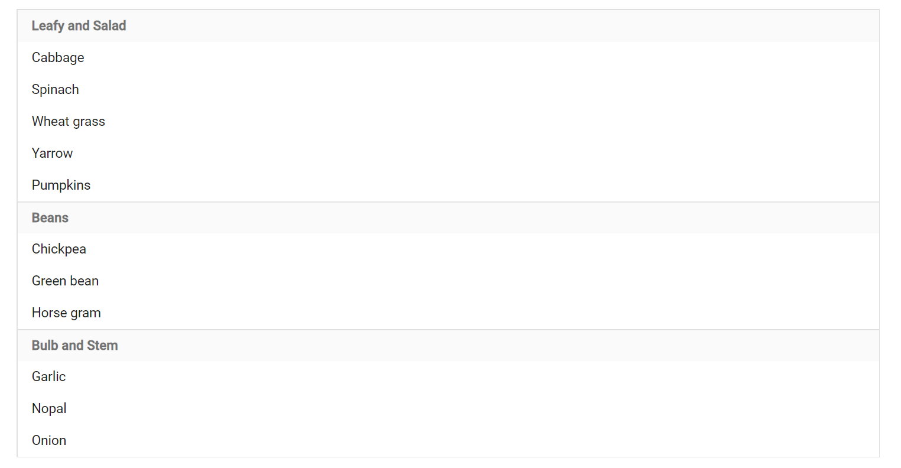

# Sorting and Grouping in Blazor ListBox Component

## Sorting

The ListBox can sort items alphabetically in ascending or descending order by using the [SortOrder enum](https://help.syncfusion.com/cr/blazor/Syncfusion.Blazor.DropDowns.SortOrder.html). Sorting applies to the text mapped via the Text field in ListBoxFieldSettings. The default sort order is `None`.

In the following example, `SortOrder` is set to `Descending`.

```cshtml
@using Syncfusion.Blazor.DropDowns

<SfListBox TValue="string[]" DataSource="@CountryData" SortOrder="Syncfusion.Blazor.DropDowns.SortOrder.Descending" TItem="CountryCode">
  <ListBoxFieldSettings Text="Name" Value="Code" />
</SfListBox>

@code {
    public List<CountryCode> CountryData = new List<CountryCode> {
        new CountryCode{ Name = "Australia", Code = "AU" },
        new CountryCode{ Name = "Bermuda", Code = "BM" },
        new CountryCode{ Name = "Canada", Code = "CA" },
        new CountryCode{ Name = "Cameroon", Code = "CM" },
        new CountryCode{ Name = "Denmark", Code = "DK" },
        new CountryCode{ Name = "France", Code = "FR" },
        new CountryCode{ Name = "Finland", Code = "FI" },
        new CountryCode{ Name = "Germany", Code = "DE" },
        new CountryCode{ Name = "Hong Kong", Code = "HK" }
    };
    public class CountryCode {
      public string Name { get; set; }
      public string Code { get; set; }
    }
}

```




## Grouping

The ListBox can group items by a category using the [GroupBy field in ListBoxFieldSettings](https://help.syncfusion.com/cr/blazor/Syncfusion.Blazor.DropDowns.ListBoxFieldSettings.html#Syncfusion_Blazor_DropDowns_ListBoxFieldSettings_GroupBy). Each item is assigned to a group based on the value of the mapped field, and group headers act as visual categories (not selectable items).

To get started quickly with grouping in the Blazor ListBox component, you can check the video below.



```cshtml
@using Syncfusion.Blazor.DropDowns

<SfListBox TValue="string[]" DataSource="@VegetableData" TItem="VegetableDetail">
  <ListBoxFieldSettings GroupBy = "Category" Text="Vegetable" Value="Id" />
</SfListBox>

@code {
    public List<VegetableDetail> VegetableData = new List<VegetableDetail> {
       new VegetableDetail{ Vegetable = "Cabbage", Category = "Leafy and Salad", Id = "item1" },
       new VegetableDetail{ Vegetable = "Spinach", Category = "Leafy and Salad", Id = "item2" },
       new VegetableDetail{ Vegetable = "Wheat grass", Category = "Leafy and Salad", Id = "item3" },
       new VegetableDetail{ Vegetable = "Yarrow", Category = "Leafy and Salad", Id = "item4" },
       new VegetableDetail{ Vegetable = "Pumpkins", Category = "Leafy and Salad", Id = "item5" },
       new VegetableDetail{ Vegetable = "Chickpea", Category = "Beans", Id = "item6" },
       new VegetableDetail{ Vegetable = "Green bean", Category = "Beans", Id = "item7" },
       new VegetableDetail{ Vegetable = "Horse gram", Category = "Beans", Id = "item8" },
       new VegetableDetail{ Vegetable = "Garlic", Category = "Bulb and Stem", Id = "item9" },
       new VegetableDetail{ Vegetable = "Nopal", Category = "Bulb and Stem", Id = "item10" },
       new VegetableDetail{ Vegetable = "Onion", Category = "Bulb and Stem", Id = "item11" }
    };

    public class VegetableDetail {
      public string Vegetable { get; set; }
      public string Category { get; set; }
      public string Id { get; set; }
    }
}
```

