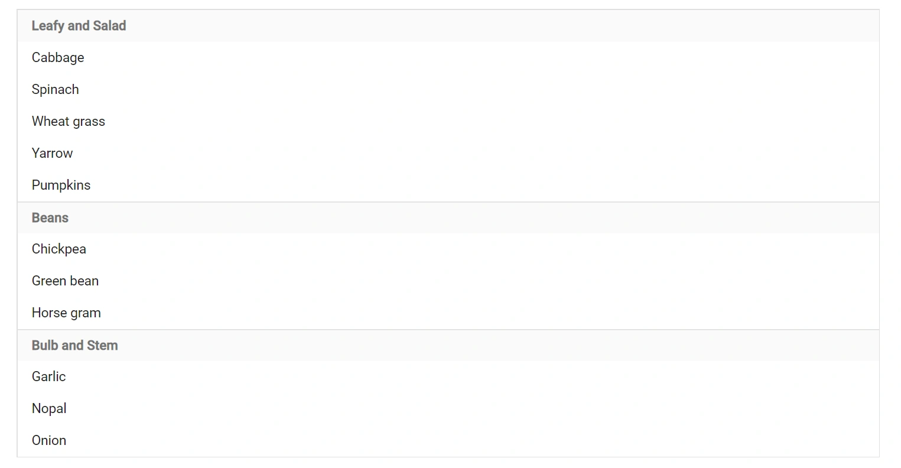

# Sorting and Grouping in Blazor ListBox

## Sorting

The ListBox can sort items alphabetically in ascending or descending order by using the [SortOrder](https://help.syncfusion.com/cr/blazor/Syncfusion.Blazor.DropDowns.SortOrder.html) property. Sorting applies to the text mapped via the `Text` field in `ListBoxFieldSettings`. The default sort order is `None`.

In the following example, `SortOrder` is set to `Descending`.

```cshtml
@using Syncfusion.Blazor.DropDowns

<SfListBox TValue="string[]" DataSource="@CountryData" SortOrder="Syncfusion.Blazor.DropDowns.SortOrder.Descending" TItem="CountryCode">
  <ListBoxFieldSettings Text="Name" Value="Code" />
</SfListBox>

@code {
    public List<CountryCode> CountryData = new List<CountryCode> {
        new CountryCode{ Name = "Australia", Code = "AU" },
        new CountryCode{ Name = "Bermuda", Code = "BM" },
        new CountryCode{ Name = "Canada", Code = "CA" },
        new CountryCode{ Name = "Cameroon", Code = "CM" },
        new CountryCode{ Name = "Denmark", Code = "DK" },
        new CountryCode{ Name = "France", Code = "FR" },
        new CountryCode{ Name = "Finland", Code = "FI" },
        new CountryCode{ Name = "Germany", Code = "DE" },
        new CountryCode{ Name = "Hong Kong", Code = "HK" }
    };

    public class CountryCode {
      public string Name { get; set; }
      public string Code { get; set; }
    }
}

```


## Grouping

The ListBox can group items by a category by mapping the [GroupBy](https://help.syncfusion.com/cr/blazor/Syncfusion.Blazor.DropDowns.ListBoxFieldSettings.html#Syncfusion_Blazor_DropDowns_ListBoxFieldSettings_GroupBy) field in `ListBoxFieldSettings`. Each item is assigned to a group based on the value of the mapped field, and group headers act as visual categories (they are not selectable items).

Watch the video below for a quick introduction to grouping in the Blazor ListBox component.



```cshtml
@using Syncfusion.Blazor.DropDowns

<SfListBox TValue="string[]" DataSource="@VegetableData" TItem="VegetableDetail">
  <ListBoxFieldSettings GroupBy = "Category" Text="Vegetable" Value="Id" />
</SfListBox>

@code {
    public List<VegetableDetail> VegetableData = new List<VegetableDetail> {
       new VegetableDetail{ Vegetable = "Cabbage", Category = "Leafy and Salad", Id = "item1" },
       new VegetableDetail{ Vegetable = "Spinach", Category = "Leafy and Salad", Id = "item2" },
       new VegetableDetail{ Vegetable = "Wheat grass", Category = "Leafy and Salad", Id = "item3" },
       new VegetableDetail{ Vegetable = "Yarrow", Category = "Leafy and Salad", Id = "item4" },
       new VegetableDetail{ Vegetable = "Pumpkins", Category = "Leafy and Salad", Id = "item5" },
       new VegetableDetail{ Vegetable = "Chickpea", Category = "Beans", Id = "item6" },
       new VegetableDetail{ Vegetable = "Green bean", Category = "Beans", Id = "item7" },
       new VegetableDetail{ Vegetable = "Horse gram", Category = "Beans", Id = "item8" },
       new VegetableDetail{ Vegetable = "Garlic", Category = "Bulb and Stem", Id = "item9" },
       new VegetableDetail{ Vegetable = "Nopal", Category = "Bulb and Stem", Id = "item10" },
       new VegetableDetail{ Vegetable = "Onion", Category = "Bulb and Stem", Id = "item11" }
    };

    public class VegetableDetail {
      public string Vegetable { get; set; }
      public string Category { get; set; }
      public string Id { get; set; }
    }
}
```



## See also

* [Data Binding in Blazor ListBox](./data-binding.md)
* [Filtering in Blazor ListBox](./filtering.md)
* [Icons and Templates in Blazor ListBox](./icons-and-templates.md)
* [Getting Started with Blazor ListBox](./getting-started.md)