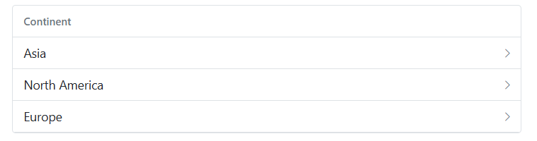

# Accessibility in Blazor ListView Component

The [Blazor ListView](https://www.syncfusion.com/blazor-components/blazor-listview) component adheres to established accessibility guidelines and standards, including [ADA](https://www.ada.gov/), [Section 508](https://www.section508.gov/), [WCAG 2.2](https://www.w3.org/TR/WCAG22/) standards, and [WCAG roles](https://www.w3.org/TR/wai-aria/#roles) that are commonly used to evaluate accessibility.

The accessibility compliance status for the Blazor ListView component is summarized below:

| Accessibility Criteria | Compatibility |
| -- | -- |
| [WCAG 2.2](https://www.w3.org/TR/WCAG22/) Support |  |
| [Section 508](https://www.section508.gov/) Support |  |
| Screen Reader Support |  |
| Right-To-Left Support |  |
| Color Contrast |  |
| Mobile Device Support |  |
| Keyboard Navigation Support |  |
| [Axe-core](https://www.nuget.org/packages/Deque.AxeCore.Playwright) Accessibility Validation |  |

<style>
    .post .post-content img {
        display: inline-block;
        margin: 0.5em 0;
    }
</style>

<div> - All features of the component meet the requirement.</div>

<div> - Some features of the component do not meet the requirement.</div>

<div> - The component does not meet the requirement.</div>

## WAI-ARIA Attributes

The Blazor ListView component incorporates [WAI-ARIA patterns](https://www.w3.org/WAI/ARIA/apg/patterns/) to enhance its accessibility. The following ARIA attributes are used in the ListView component:

| Attributes | Purpose |
| ------------ | ----------------------- |
| aria-selected | It indicates the selected list from the whole list. |
| aria-level | It defines the hierarchical structure of a list item. |

## Keyboard Interaction

The Blazor ListView component follows [keyboard interaction](https://www.w3.org/WAI/ARIA/apg/patterns/listbox/#keyboardinteraction), ensuring ease of use for individuals who rely on assistive technologies (AT) or prioritize keyboard navigation. The following keyboard shortcuts are supported:

| Windows | Mac | Actions |
|------------|------ | -------------|
| <kbd>↑</kbd> | <kbd>↑</kbd> | Move to the previous list item. |
| <kbd>↓</kbd> | <kbd>↓</kbd> | Move to the next list item. |
| <kbd>Space</kbd> | <kbd>Space</kbd> | Select the targeted list from the whole list. |
| <kbd>Back</kbd> | <kbd>Back</kbd> | Get back to the previous lists if it is in nested list. |

```cshtml
@using Syncfusion.Blazor.Lists
@using Syncfusion.Blazor.Data

<SfListView DataSource="@ListData" ShowHeader="true" HeaderTitle="Continent">
    <ListViewFieldSettings TValue="DataModel" Id="Id" Text="Text" Child="Child"></ListViewFieldSettings>
</SfListView>

@code {
    List<DataModel> ListData = new List<DataModel>();

    protected override void OnInitialized()
    {
        base.OnInitialized();

        ListData.Add(new DataModel
        {
            Text = "Asia",
            Id = "01",
            Category = "Continent",
            Child = new List<DataModel>() {
                new DataModel {
                    Text = "India",
                    Id = "1",
                    Category = "Asia",
                    Child = new List<DataModel> () {
                        new DataModel {
                            Id = "1001",
                            Text = "Delhi",
                            Category = "India"
                        },
                        new DataModel {
                            Text = "Kashmir",
                            Id = "1002",
                            Category = "India"
                        },
                        new DataModel {
                            Text = "Goa",
                            Id = "1003",
                            Category = "India"
                        }
                    }
                },
                new DataModel {
                    Text = "China",
                    Id = "2",
                    Category = "Asia",
                    Child = new List<DataModel> () {
                        new DataModel {
                            Text = "Zhejiang",
                            Id = "2001",
                            Category = "China"
                        },
                        new DataModel {
                            Text = "Hunan",
                            Id = "2002",
                            Category = "China"
                        },
                        new DataModel {
                            Text = "Shandong",
                            Id = "2003",
                            Category = "China"
                        }
                    }
                }
            }
        });

        ListData.Add(new DataModel
        {
            Text = "North America",
            Id = "02",
            Category = "Continent",
            Child = new List<DataModel>() {
                new DataModel {
                    Text = "USA",
                    Id = "3",
                    Category = "North America",
                    Child = new List<DataModel> () {
                        new DataModel {
                            Text = "California",
                            Id = "3001",
                            Category = "USA"
                        },
                        new DataModel {
                            Text = "New York",
                            Id = "3002",
                            Category = "USA"
                        },
                        new DataModel {
                            Text = "Florida",
                            Id = "3003",
                            Category = "USA"
                        }
                    }
                },
                new DataModel {
                    Text = "Canada",
                    Id = "4",
                    Category = "North America",
                    Child = new List<DataModel> () {
                        new DataModel {
                            Text = "Ontario",
                            Id = "4001",
                            Category = "Canada"
                        },
                        new DataModel {
                            Text = "Alberta",
                            Id = "4002",
                            Category = "Canada"
                        },
                        new DataModel {
                            Text = "Manitoba",
                            Id = "4003",
                            Category = "Canada"
                        }
                    }
                }
            }
        });

        ListData.Add(new DataModel
        {
            Text = "Europe",
            Id = "03",
            Category = "Continent",
            Child = new List<DataModel>() {
                new DataModel {
                    Text = "Germany",
                    Id = "5",
                    Category = "Europe",
                    Child = new List<DataModel> () {
                        new DataModel {
                            Text = "Berlin",
                            Id = "5001",
                            Category = "Germany"
                        },
                        new DataModel {
                            Text = "Bavaria",
                            Id = "5002",
                            Category = "Germany"
                        },
                        new DataModel {
                            Text = "Hesse",
                            Id = "5003",
                            Category = "Germany"
                        }
                    }
                },
                new DataModel {
                    Text = "France",
                    Id = "6",
                    Category = "Europe",
                    Child = new List<DataModel> () {
                        new DataModel {
                            Text = "Paris",
                            Id = "6001",
                            Category = "France"
                        },
                        new DataModel {
                            Text = "Lyon",
                            Id = "6002",
                            Category = "France"
                        },
                        new DataModel {
                            Text = "Marseille",
                            Id = "6003",
                            Category = "France"
                        }
                    }
                }
            }
        });
    }

    public class DataModel
    {
        public string Id { get; set; }
        public string Text { get; set; }
        public string Category { get; set; }
        public List<DataModel> Child { get; set; }
    }
}

```



## Ensuring Accessibility

The accessibility levels of the Blazor ListView component are verified through the [axe-core](https://www.nuget.org/packages/Deque.AxeCore.Playwright) software tool during automated testing.

The accessibility compliance of the ListView component is demonstrated in the following sample. Open the [sample](https://blazor.syncfusion.com/accessibility/listview) in a new window to evaluate the accessibility of the ListView component with accessibility tools.

## See Also

* [Accessibility in Syncfusion<sup style="font-size:70%">&reg;</sup> Blazor components](https://blazor.syncfusion.com/documentation/common/accessibility)