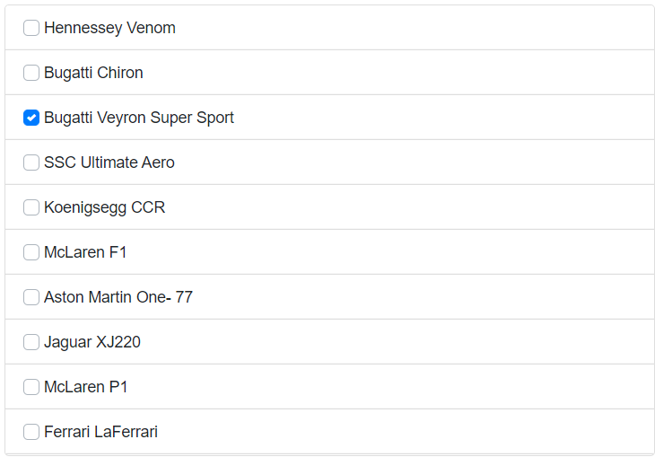

# Check list in Blazor ListView Component

The [Blazor ListView](https://www.syncfusion.com/blazor-components/blazor-listview) supports checkbox in default and group-lists which is used to select multiple items. The checkbox can be enabled by the [`ShowCheckBox`](https://help.syncfusion.com/cr/blazor/Syncfusion.Blazor.Lists.SfListView-1.html#Syncfusion_Blazor_Lists_SfListView_1_ShowCheckBox) property.

The Checkbox will be useful in the scenario where there is a need to select multiple options. For example, in shipping cart it is possible to select or unselect the desired items before checkout and also it will be useful in selecting multiple items that belongs to same category using the group list.

```cshtml
@using Syncfusion.Blazor.Lists
<SfListView DataSource="@Data" ShowCheckBox="true">
    <ListViewFieldSettings TValue="DataModel" Id="Id" Text="Text" IsChecked="IsChecked"></ListViewFieldSettings>
</SfListView>

@code {

private DataModel[] Data = {

        new DataModel { Text ="Hennessey Venom", Id = "list-01" },
        new DataModel { Text = "Bugatti Chiron", Id = "list-02" },
        new DataModel { Text = "Bugatti Veyron Super Sport", Id = "list-03", IsChecked = true },
        new DataModel { Text = "SSC Ultimate Aero", Id = "list-04" },
        new DataModel { Text = "Koenigsegg CCR", Id = "list-05" },
        new DataModel { Text = "McLaren F1", Id = "list-06" },
        new DataModel { Text = "Aston Martin One- 77", Id = "list-07" },
        new DataModel { Text = "Jaguar XJ220", Id = "list-08" },
        new DataModel { Text = "McLaren P1", Id = "list-09" },
        new DataModel { Text = "Ferrari LaFerrari", Id = "list-10" }

    };

    public class DataModel
    {
        public string Text { get; set; }
        public string Id { get; set; }
        public bool IsChecked { get; set; }

    }
}
```



## Checkbox Position

In ListView the checkbox can be positioned into either `Left` or `Right` side of the list-item text. This can be achieved by [`CheckBoxPosition`](https://help.syncfusion.com/cr/blazor/Syncfusion.Blazor.Lists.SfListView-1.html#Syncfusion_Blazor_Lists_SfListView_1_CheckBoxPosition) property. By default, checkbox will be positioned to `Left` of list-item text.

```cshtml
@using Syncfusion.Blazor.Lists
<SfListView DataSource="@Data" ShowCheckBox="true" CheckBoxPosition="CheckBoxPosition.Right">
    <ListViewFieldSettings TValue="DataModel" Id="Id" Text="Text"></ListViewFieldSettings>
</SfListView>

@code {

private DataModel[] Data = {

        new DataModel { Text ="Hennessey Venom", Id = "list-01" },
        new DataModel { Text = "Bugatti Chiron", Id = "list-02" },
        new DataModel { Text = "Bugatti Veyron Super Sport", Id = "list-03"},
        new DataModel { Text = "SSC Ultimate Aero", Id = "list-04" },
        new DataModel { Text = "Koenigsegg CCR", Id = "list-05" },
        new DataModel { Text = "McLaren F1", Id = "list-06" },
        new DataModel { Text = "Aston Martin One- 77", Id = "list-07" },
        new DataModel { Text = "Jaguar XJ220", Id = "list-08" },
        new DataModel { Text = "McLaren P1", Id = "list-09" },
        new DataModel { Text = "Ferrari LaFerrari", Id = "list-10" }

    };

    public class DataModel
    {
        public string Text { get; set; }
        public string Id { get; set; }
    }
}
```

