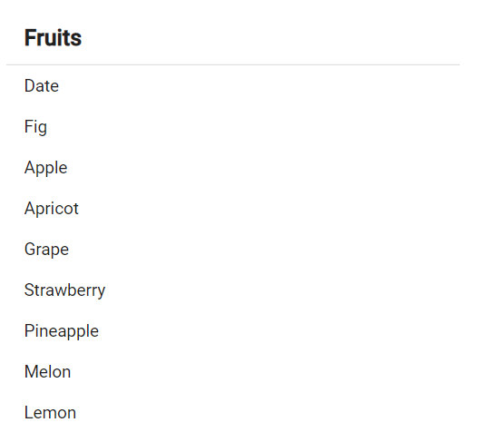

# Customizing templates

The ListView component is designed to customize each list items and group title. It uses Blazor `Template engine` to render the elements.

## Header Template

Listview header can be customized with the help of the `HeaderTemplate` property.

To customize header template in your application, set your customized template string to `HeaderTemplate` property along with `ShowHeader` property as `true` to display the Listview header.

In the following example, we have rendered Listview with customized header which contains search, add and sort buttons.

```cshtml
@using Syncfusion.Blazor.Lists
<SfListView DataSource="@FruitsData" ShowHeader="true">
    <ListViewFieldSettings TValue="DataModel" Id="Id" Text="Text"></ListViewFieldSettings>
    <ListViewTemplates TValue="DataModel">
        <HeaderTemplate>
            <div class="headerContainer">
                <span class="fruitHeader">Fruits</span>
            </div>
        </HeaderTemplate>
    </ListViewTemplates>
</SfListView>

@code{
    List<DataModel> FruitsData = new List<DataModel>();

    protected override void OnInitialized()
    {
        base.OnInitialized();

        FruitsData.Add(new DataModel { Text = "Date", Id = "1" });
        FruitsData.Add(new DataModel { Text = "Fig", Id = "2" });
        FruitsData.Add(new DataModel { Text = "Apple", Id = "3" });
        FruitsData.Add(new DataModel { Text = "Apricot", Id = "4" });
        FruitsData.Add(new DataModel { Text = "Grape", Id = "5" });
        FruitsData.Add(new DataModel { Text = "Strawberry", Id = "6" });
        FruitsData.Add(new DataModel { Text = "Pineapple", Id = "7" });
        FruitsData.Add(new DataModel { Text = "Melon", Id = "8" });
        FruitsData.Add(new DataModel { Text = "Lemon", Id = "9" });
        FruitsData.Add(new DataModel { Text = "Cherry", Id = "10" });

    }

    public class DataModel
    {
        public string Text { get; set; }
        public string Id { get; set; }
    }
}
```



## Template

ListView items can be customized with the help of the `Template` property.

To customize list items in your application, set your customized template string to `Template` property.

We provided the following built-in CSS classes to customize the list-items. Refer to the following table.

| CSS class        | Description           |
| ------------- |-------------|
| e-list-template, e-list-wrapper | These classes are used to differentiate normal and template rendering, which are mandatory for template rendering. The `e-list-template` class should be added to the root of the ListView element and `e-list-wrapper` class should be added to the template element wrapper.
| e-list-content | This class is used to align list content and it should be added to the content element <br/><br/> `<div class="e-list-wrapper">`<br/><b>`<span class="e-list-content">ListItem</span>`</b> <br/>`</div>`|
| e-list-avatar | This class is used for avatar customization. It should be added to the template element wrapper. After adding it, we can customize our element with **Avatar** classes <br/><br/> `<div class="e-list-wrapper`<b>`e-list-avatar`</b>`">` <br/> <b>`<span class="e-avatar e-avatar-circle">MR</span>`</b><br/>`<span class="e-list-content">ListItem</span>`<br/>`</div>`|
| e-list-avatar-right | This class is used to align avatar to right side of the list item. It should be added to the template element wrapper. After adding it, we can customize our element with **Avatar** classes <br/><br/> `<div class="e-list-wrapper`<b>`e-list-avatar-right`</b>`">` <br/> `<span class="e-list-content">ListItem</span>`<br/><b>`<span class="e-avatar e-avatar-circle">MR</span>`</b><br/> `</div>`|
| e-list-badge | This class is used for badge customization .It should be added to the template element wrapper. After adding it, we can customize our element with **Badge** classes <br/><br/> `<div class="e-list-wrapper`<b>`e-list-badge`</b>`">` <br/> `<span class="e-list-content">ListItem</span>`<br/><b>`<span class="e-badge e-badge-primary">MR</span>`</b><br/> `</div>`|
| e-list-multi-line | This class is used for multi-line customization. It should be added to the template element wrapper. After adding it, we can customize List item's header and description <br/><br/>`<div class="e-list-wrapper`<b>`e-list-multi-line`</b>`">` <br/> `<span class="e-list-content">ListItem</span>`<br/>`</div>`|
| e-list-item-header |This class is used to align a list header and it should be added to the header element along with the multi-line class <br/><br/> `<div class="e-list-wrapper`<b>`e-list-multi-line`</b>`">`<br/> <b>`<span class="e-list-item-header">ListItem Header</span>`</b><br/> `<span class="e-list-content">ListItem</span>`<br/>`</div>`|

In the following example, we have customized list items with built-in CSS classes.

```cshtml
@using Syncfusion.Blazor.Lists
<SfListView Id="List"
             DataSource="@ListData"
             HeaderTitle="Contacts"
             ShowHeader="true"
             CssClass="e-list-template"
             Width="350"
             SortOrder="Syncfusion.Blazor.Lists.SortOrder.Ascending">
    <ListViewFieldSettings TValue="DataModel" Id="Id" Text="Text"></ListViewFieldSettings>
    <ListViewTemplates TValue="DataModel">
        <Template>
            <div class="e-list-wrapper e-list-multi-line e-list-avatar">
                @if (((context as DataModel).Avatar) != "")
                {
                <span class="e-avatar e-avatar-circle">@((context as DataModel).Avatar)</span>
                }
                else
                {
                    <span class="@((context as DataModel).Pic) e-avatar e-avatar-circle"> </span>
                }
                    <span class="e-list-item-header">@((context as DataModel).Text)</span>
            <span class="e-list-content">@((context as DataModel).Contact)</span>
            </div>
        </Template>
    </ListViewTemplates>
</SfListView>

@code{

    List<DataModel> ListData = new List<DataModel>();

    protected override void OnInitialized()
    {
        base.OnInitialized();
        ListData.Add(new DataModel
        {
            Text = "Jenifer",
            Contact = "(206) 555-985774",
            Id = "1",
            Avatar = "J",
            Pic = "pic01"
        });
        ListData.Add(new DataModel
        {
            Text = "Amenda",
            Contact = "(206) 555-3412",
            Id = "2",
            Avatar = "A",
            Pic = ""
        });
        ListData.Add(new DataModel
        {
            Text = "Isabella",
            Contact = "(206) 555-8122",
            Id = "4",
            Avatar = "",
            Pic = "pic02"
        });
        ListData.Add(new DataModel
        {
            Text = "William ",
            Contact = "(206) 555-9482",
            Id = "5",
            Avatar = "W",
            Pic = ""
        });
        ListData.Add(new DataModel
        {
            Text = "Jacob",
            Contact = "(71) 555-4848",
            Id = "6",
            Avatar = "",
            Pic = "pic04"
        });
        ListData.Add(new DataModel
        {
            Text = "Matthew",
            Contact = "(71) 555-7773",
            Id = "7",
            Avatar = "M",
            Pic = ""
        });
        ListData.Add(new DataModel
        {
            Text = "Oliver",
            Contact = "(71) 555-5598",
            Id = "8",
            Avatar = "",
            Pic = "pic03"
        });
        ListData.Add(new DataModel
        {
            Text = "Charlotte",
            Contact = "(206) 555-1189",
            Id = "9",
            Avatar = "C",
            Pic = ""
        });

    }

   public class DataModel
    {
        public string Id { get; set; }
        public string Text { get; set; }
        public string Contact { get; set; }
        public string Avatar { get; set; }
        public string Pic { get; set; }
    }
}

<style>
    .e-listview.e-control {
        width: 400px;
    }

    .pic01 {
        background-image: url("https://ej2.syncfusion.com/demos/src/grid/images/1.png");
    }

    .pic02 {
        background-image: url("https://ej2.syncfusion.com/demos/src/grid/images/3.png");
    }

    .pic03 {
        background-image: url("https://ej2.syncfusion.com/demos/src/grid/images/5.png");
    }

    .pic04 {
        background-image: url("https://ej2.syncfusion.com/demos/src/grid/images/2.png");
    }

    #List .e-list-item:nth-child(1) .e-avatar {
        background-color: #039be5;
    }

    #List .e-list-item:nth-child(2) .e-avatar {
        background-color: #e91e63;
    }

    #List .e-list-item:nth-child(6) .e-avatar {
        background-color: #009688;
    }

    #List .e-list-item:nth-child(8) .e-avatar {
        background-color: #000088;
    }
</style>

```


## Group template

ListView group header can be customized with the help of the [`GroupTemplate`] property.

To customize the group template in your application, set your customized template string to `GroupTemplate` property.

In the following example, we have grouped Listview based on the category. The category of each list item should be mapped with `GroupBy` field of the data. We have also displayed grouped list items count in the group list header.

```cshtml
@using Syncfusion.Blazor.Lists
<SfListView ID="list" DataSource="@ListData" CssClass="e-list-template">
    <ListViewFieldSettings Id="Id" Text="Name" TValue="DataModel" GroupBy="Category"></ListViewFieldSettings>
    <ListViewTemplates TValue="DataModel">
        <Template>
            <div class="e-list-wrapper e-list-multi-line e-list-avatar">
                
                <span class="e-list-item-header">@context.Name</span>
                <span class="e-list-content">@context.Contact</span>
            </div>
        </Template>
        <GroupTemplate>
            <div>
                <span class="category">Type: @context.Text</span>
            </div>
        </GroupTemplate>
    </ListViewTemplates>
</SfListView>

@code{

    List<DataModel> ListData = new List<DataModel>();

    protected override void OnInitialized()
    {
        base.OnInitialized();

        ListData.Add(new DataModel { Name = "Nancy", Contact = "(206) 555-985774", Id = "1", Image = "https://ej2.syncfusion.com/demos/src/grid/images/1.png", Category = "Experience" });
        ListData.Add(new DataModel { Name = "Janet", Contact = "(206) 555-3412", Id = "2", Image = "https://ej2.syncfusion.com/demos/src/grid/images/3.png", Category = "Fresher" });
        ListData.Add(new DataModel { Name = "Margaret", Contact = "(206) 555-8122", Id = "4", Image = "https://ej2.syncfusion.com/demos/src/grid/images/4.png", Category = "Experience" });
        ListData.Add(new DataModel { Name = "Andrew ", Contact = "(206) 555-9482", Id = "5", Image = "https://ej2.syncfusion.com/demos/src/grid/images/2.png", Category = "Experience" });
        ListData.Add(new DataModel { Name = "Steven", Contact = "(71) 555-4848", Id = "6", Image = "https://ej2.syncfusion.com/demos/src/grid/images/5.png", Category = "Fresher" });
        ListData.Add(new DataModel { Name = "Michael", Contact = "(71) 555-7773", Id = "7", Image = "https://ej2.syncfusion.com/demos/src/grid/images/6.png", Category = "Experience" });
        ListData.Add(new DataModel { Name = "Robert", Contact = "(71) 555-5598", Id = "8", Image = "https://ej2.syncfusion.com/demos/src/grid/images/7.png", Category = "Fresher" });
        ListData.Add(new DataModel { Name = "Laura", Contact = "(206) 555-1189", Id = "9", Image = "https://ej2.syncfusion.com/demos/src/grid/images/8.png", Category = "Experience" });
    }

    public class DataModel
    {
        public string Name { get; set; }
        public string Contact { get; set; }
        public string Id { get; set; }
        public string Image { get; set; }
        public string Category { get; set; }
    }

}

<style>
    .e-listview.e-control {
        width: 400px;
    }

    #List .e-list-group-item {
        height: 56px;
        line-height: 56px;
    }

    #List .count {
        float: right;
    }
</style>

```

