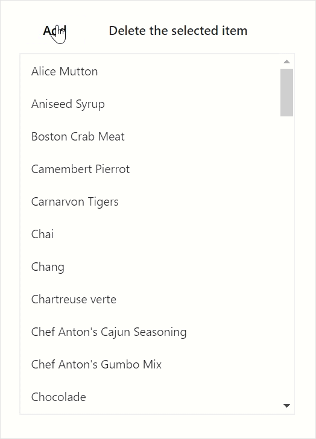

# Data Binding in Blazor ListView Component

ListView provides an option to load the data either from local dataSource or remote data services. This can be done through the dataSource property that supports the data type of array or DataManager. ListView supports different kind of data services such as OData, OData V4, and Web API, and data formats like XML, JSON, and, JSONP with the help of DataManager Adaptors.

| Fields | Type | Description |
|------|------|-------------|
| Id | string | Specifies ID attribute of list item, mapped in dataSource. |
| Text | string | Specifies list item display text field. |
| IsChecked | string | Specifies checked status of list item. |
| IsVisible | string | Specifies visibility state of list item. |
| Enabled | string | Specifies enabled state of list item. |
| IconCss | string | Specifies the icon class of each list item that will be added before to the list item text. |
| Child | string | Specifies child dataSource fields. |
| Tooltip | string | Specifies tooltip title text field. |
| GroupBy | string | Specifies category of each list item. |
| SortBy | string | Specifies sorting field, that is used to sort the listview data. |
| HtmlAttributes | string | Specifies list item html attributes field. |

> When complex data bind to ListView, you should map the ListViewFieldSettings properly. Otherwise, the ListView properties remain as undefined or null.

## Bind to local data

Local data can be represented in Array of JSON data:

### Array of JSON data

ListView can generate its list items through an array of complex data. To get it work properly, you should map the appropriate columns to the field property.

```cshtml
@using Syncfusion.Blazor.Lists
<SfListView DataSource="@Data">
    <ListViewFieldSettings TValue="DataModel" Id="Id" Text="Text"></ListViewFieldSettings>
</SfListView>

@code {
   public string HeaderTitle = "Listview";

    List<DataModel> Data = new List<DataModel>();

    protected override void OnInitialized()
    {
        base.OnInitialized();
        Data.Add(new DataModel { Text = "Hennessey Venom", Id = "list-01" });
        Data.Add(new DataModel { Text = "Bugatti Chiron", Id = "list-02" });
        Data.Add(new DataModel { Text = "Bugatti Veyron Super Sport", Id = "list-03" });
        Data.Add(new DataModel { Text = "SSC Ultimate Aero", Id = "list-04" });
        Data.Add(new DataModel { Text = "Koenigsegg CCR", Id = "list-05" });
        Data.Add(new DataModel { Text = "McLaren F1", Id = "list-06" });
        Data.Add(new DataModel { Text = "Aston Martin One- 77", Id = "list-07" });
        Data.Add(new DataModel { Text = "Jaguar XJ220", Id = "list-08" });
        Data.Add(new DataModel { Text = "McLaren P1", Id = "list-09" });
        Data.Add(new DataModel { Text = "Ferrari LaFerrari", Id = "list-10" });
    }

    public class DataModel
    {
        public string Id { get; set; }
        public string Text { get; set; }
    }

}
```

Output be like the below.


## Bind to remote data

The ListView supports to retrieve the data from remote data services with the help of DataManager control. The Query property allows to fetch data and return it to the ListView from the database.

In the following sample, first 6 products from the Product table of NorthWind data service are displayed.

```cshtml
@using Syncfusion.Blazor.Lists
@using Syncfusion.Blazor.Data

<SfListView  HeaderTitle="Products" ShowHeader="true" TValue="Data" Query="@query">
    <ListViewFieldSettings TValue="Data" Id="ProductID" Text="ProductName"></ListViewFieldSettings>
    <SfDataManager Url="https://services.odata.org/V4/Northwind/Northwind.svc/" Adaptor="Adaptors.ODataV4Adaptor"></SfDataManager>
</SfListView>

@code {

    public static List<string> column = new List<string>()
{
        "ProductID","ProductName"
    };
    Query query = new Query().From("Products").Select(column).Take(6);
    public class Data
    {
        public string ProductID { get; set; }
        public string ProductName { get; set; }
    }
}
```

Output be like the below.


## Entity Framework

You need to follow the below steps to consume data from the **Entity Framework** in the ListView component.

### Handle CRUD in data access layer class

Now add methods **AddProduct, DeleteProduct** in the **“DataAccessLayer.cs”** to handle the insert and remove operations respectively. The **CRUD** list items are bound to the **Products** parameter. Please refer the following code.

```csharp
using System.Collections.Generic;
using System.Linq;
using EFListView.Shared.Models;
using EFListView.Shared.DataAccess;
using Microsoft.EntityFrameworkCore;

namespace EFListView.Shared.DataAccess
{
    public class DataAccessLayer
    {

        DataContext db = new DataContext();

        public DbSet<Products> GetAllProducts()
        {
            try
            {
                return db.Products;
            }
            catch
            {
                throw;
            }
        }
  
        public void AddProduct(Products products)
        {
            try
            {
                db.Products.Add(products);
                db.SaveChanges();
            }
            catch
            {
                throw;
            }
        }

        public void DeleteProduct(Products products)
        {
            try
            {
                db.Products.Remove(products);
                db.SaveChanges();
            }
            catch
            {
                throw;
            }
        }
    }
}
```

### Enable CRUD in Web API

Now you have to create a new **Post** and **Delete** method in the Web API controller which will perform the CRUD operations and returns the appropriate resultant data. The **‘SfDataManager’** will make requests to this action based on route name.

```csharp
using System;
using System.Collections.Generic;
using System.Linq;
using Microsoft.AspNetCore.Mvc;
using EFListView.Shared.DataAccess;
using EFListView.Shared.Models;

namespace EFListView.Server.Controllers
{  
    [Route("api/[controller]")]
    [ApiController]
    public class ProductsController : ControllerBase
    {
        DataAccessLayer db = new DataAccessLayer();
        [HttpGet]
        public object Get()
        {
            return db.GetAllProducts().ToList();
        }

        [HttpPost]
        public object Post([FromBody]Products product)
        {
            db.AddProduct(product);
            return product;
        }

        [HttpDelete]
        public void Delete([FromBody]Products product)
        {
            db.DeleteProduct(product);
        }
    }
}
```

### Configure the ListView to perform CRUD operations

You can perform CRUD operations like Add and Delete by using the `AddItem`, `RemoveItem` methods.

* `AddItem` - Add a new list item into the ListView.
* `RemoveItem` - Delete a selected list item in the ListView.

```cshtml
@using Syncfusion.Blazor
@using Syncfusion.Blazor.Data
@using Syncfusion.Blazor.Lists
@using Syncfusion.Blazor.Buttons
@using EFListView.Shared.Models

<div class="btn-cls">
    <SfButton @onclick="Add"> Add </SfButton>
    <SfButton @onclick="Delete"> Delete the selected item </SfButton>
</div>

<div class="row">
    <div class="col-md-4">
        <SfListView CssClass="listview" TValue="Products" Height="400px" @ref="List">
            <ListViewFieldSettings TValue="Products" Text="ProductName" Id="ProductID"></ListViewFieldSettings>
            <SfDataManager Url="api/Products" Adaptor="Adaptors.WebApiAdaptor" CrossDomain="true"></SfDataManager>
        </SfListView>
    </div>
</div>

@code{

    SfListView<Products> List;
    List<Products> selectedItems = new List<Products>();

    List<Products> product = new List<Products>()
    {
        new Products{ ProductID = 100, ProductName = "Alice"}
    };

    public void Add()
    {
        this.List.AddItem(product, null);
    }

    async void Delete()
    {
        var items = await this.List.GetSelectedItems();
        if (items.Data != null)
        {
            selectedItems = items.Data;
            Products list = new Products() { ProductID = selectedItems[0].ProductID, ProductName = selectedItems[0].ProductName };
            await this.List.RemoveItem(list);
        }
    }
}

<style>
    .listview {
        border: 1px solid #dddddd;
    }

    .btn-cls {
        margin: 0px 5px 10px 5px;
    }
</style>
```

> You can find the fully working sample [`here`](https://github.com/SyncfusionExamples/Blazor-ListView-Entity-Framework).

The following GIF represents the ListView with Add, Delete the list items,
