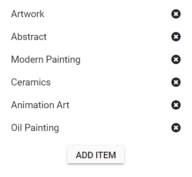

# Add and remove list items in Blazor ListView Component

You can add or remove list items from the ListView component using the `ObservableCollection`.

Refer to the following steps to add or remove a list item.

* Render the ListView with `ObservableCollection DataSource`, and use the [`ListViewTemplates`](https://help.syncfusion.com/cr/blazor/Syncfusion.Blazor.Lists.ListViewTemplates-1.html) to append the delete icon for each list item. Also, bind the click event for the delete icon.

* Render the Add Item button, and bind the click event. On the click event handler, pass data with random id to the **DataSource** using **Add method** to add a new list item on clicking the Add Item button.

* Bind the `onclick` handler to the delete icon created in step 1. Within the click event, remove the list item by passing the delete icon list item to `OnDelete` method.

```cshtml
@using Syncfusion.Blazor.Lists
@using System.Collections.ObjectModel

<div class="flex">
    <div class="margin">
        <SfListView ID="sample-list" DataSource="@DataSource">
            <ListViewFieldSettings TValue="ListDataModel" Id="Id" Text="Text"></ListViewFieldSettings>
            <ListViewTemplates TValue="ListDataModel">
                <Template>
                    @{
                        ListDataModel item = context as ListDataModel;
                        <div class="text-content">
                            @item.Text
                            <span class="delete-icon" @onclick="@(() => { OnDelete(item); })"></span>
                        </div>
                    }
                </Template>
            </ListViewTemplates>
        </SfListView>
    </div>
</div>

<div class="flex">
    <button class="e-btn" @onclick="@AddItem">Add item</button>
</div>

@code
{

    ObservableCollection<ListDataModel> DataSource = new ObservableCollection<ListDataModel>()
    {
        new ListDataModel{ Id = "1", Text = "Artwork"},
        new ListDataModel{ Id = "2", Text = "Abstract"},
        new ListDataModel{ Id = "3", Text = "Modern Painting"},
        new ListDataModel{ Id = "4", Text = "Ceramics"},
        new ListDataModel{ Id = "5", Text = "Animation Art"},
        new ListDataModel{ Id = "6", Text = "Oil Painting"},
    };

    void OnDelete(ListDataModel listDataModel)
    {
        DataSource.RemoveAt(DataSource.ToList<ListDataModel>().FindIndex(e => e.Id == listDataModel.Id));
    }

    void AddItem()
    {
        var random = new Random();
        DataSource.Add(new ListDataModel
            {
                Id = random.Next(100, 300).ToString(),
                Text = "Item " + random.Next(100, 300).ToString(),
            });
    }

    public class ListDataModel
    {
        public string Id { get; set; }
        public string Text { get; set; }
    }

}

<style>
    .flex {
        display: flex;
        justify-content: center;
    }

    .margin {
        margin: 10px;
        width: 300px;
    }

    #sample-list .delete-icon::after {
        content: "\e878";
        float: right;
        cursor: pointer;
    }

</style>
```


