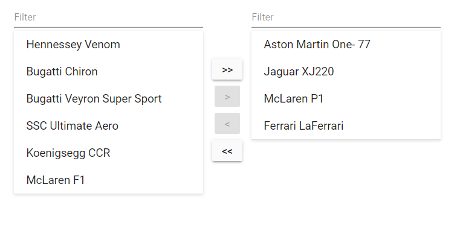

# How to create dual list from listview

The dual list contains two ListView. This allows you to move list items from one list to another using the client-side
events. This section explains how to integrate the ListView control to achieve dual list.

## Use cases

* Stock exchanges of two different countries
* Job applications (skill sets)

## Integration of Dual List

Here, two ListView controls have been used to display the list items. An Blazor Button is used to transfer data between
the ListView, and a textbox is used to achieve the UI of filtering support.

The dual list supports:

* Moving whole data from one list to another.
* Moving selected data from one list to another.
* Filtering the list by using a client-side typed character.

In the ListView control, sorting is enabled using the
`SortOrder` property, and the `Clicked` event is triggered
while selecting an item. Here, the `Clicked` event is triggered to enable and disable button states.

## Manipulating data

## Moving whole data from the first list to the second list(>>)

Here, the whole data can be moved from the first ListView to the second by clicking the first button. When clicking the button,
the whole list items are sliced, and `concat` with the second ListView. This button is enabled only when the data source
of the first ListView is not empty.

## Moving whole data from the second list to the first list(<<)**

The functionality of the second button is the same as above, and data is transferred from the second list to the first
list. This button is enabled only when the data source of the second ListView is not empty.

## Moving selected item from one list to another list (>) and (<)**

The `Clicked` event is triggered
when clicking a list item in the ListView. The selected items can be transferred between two lists. These buttons will be
enabled when selecting an item in lists.

```cshtml
@using Syncfusion.Blazor.Inputs
@using Syncfusion.Blazor.Lists

<div id="container">
    <div class="sample flex">
        <div class="flex">
            <div class="padding">
                <SfTextBox Placeholder="Filter" Input="@(e => OnInput(e, 1))"></SfTextBox>
                <SfListView DataSource="@FirstData">
                    <ListViewFieldSettings TValue="ListDataModel" Id="Id" Text="Text"></ListViewFieldSettings>
                    <ListViewEvents TValue="ListDataModel" Clicked="@(e => OnSelected(e, 1))"></ListViewEvents>
                </SfListView>
            </div>
            <div class="flex vertical vertical__center flex__center padding">
                <div class="padding">
                    <button disabled="@(!FirstListData.Any())" class="e-btn" @onclick="@(e => OnButtonClick(1))">@(">>")</button>
                </div>
                <div class="padding">
                    <button disabled="@(FirstSelected == null)" class="e-btn" @onclick="@(e => OnButtonClick(2))">@(">")</button>
                </div>
                <div class="padding">
                    <button disabled="@(SecondSelected == null)" class="e-btn" @onclick="@(e => OnButtonClick(3))">@("<")</button>
                </div>
                <div class="padding">
                    <button disabled="@(!SecondListData.Any())" class="e-btn" @onclick="@(e => OnButtonClick(4))">@("<<")</button>
                </div>
            </div>
            <div class="padding">
                <SfTextBox Placeholder="Filter" Input="@(e => OnInput(e, 2))"></SfTextBox>
                <SfListView DataSource="@SecondData">
                    <ListViewFieldSettings Id="Id" Text="Text" TValue="ListDataModel"></ListViewFieldSettings>
                    <ListViewEvents TValue="ListDataModel" Clicked="@(e => OnSelected(e, 2))"></ListViewEvents>
                </SfListView>
            </div>
        </div>
    </div>
</div>

@code
{
    List<ListDataModel> FirstData;

    List<ListDataModel> SecondData;

    ListDataModel FirstSelected;

    ListDataModel SecondSelected;

    protected override void OnInitialized()
    {
        FirstData = new List<ListDataModel>(FirstListData);
        SecondData = new List<ListDataModel>(SecondListData);
    }

    void OnButtonClick(int buttonIndex)
    {
        switch (buttonIndex)
        {
            case 1:
                FirstListData.ForEach(e => SecondListData.Add(e));
                FirstListData.Clear();
                FirstData.Clear();
                FirstData = new List<ListDataModel>(FirstListData);
                SecondData = new List<ListDataModel>(SecondListData);
                break;
            case 2:
                if (FirstSelected != null)
                {
                    SecondListData.Add(FirstSelected);
                    FirstListData.RemoveAt(FirstListData.FindIndex(e => e.Id == FirstSelected.Id));
                    FirstData = new List<ListDataModel>(FirstListData);
                    SecondData = new List<ListDataModel>(SecondListData);
                    FirstSelected = null;
                }
                break;
            case 3:
                if (SecondSelected != null)
                {
                    FirstListData.Add(SecondSelected);
                    SecondListData.RemoveAt(SecondListData.FindIndex(e => e.Id == SecondSelected.Id));
                    FirstData = new List<ListDataModel>(FirstListData);
                    SecondData = new List<ListDataModel>(SecondListData);
                    SecondSelected = null;
                }
                break;
            case 4:
                SecondListData.ForEach(e => FirstListData.Add(e));
                SecondData.Clear();
                SecondListData.Clear();
                SecondData = new List<ListDataModel>(SecondListData);
                FirstData = new List<ListDataModel>(FirstListData);
                break;
            default:
                break;
        }
    }

    void OnSelected(ClickEventArgs<ListDataModel> eventArgs, int listviewIndex)
    {
        if (listviewIndex == 1)
        {
            FirstSelected = eventArgs.ItemData;
        }
        else
        {
            SecondSelected = eventArgs.ItemData;
        }
    }

    void OnInput(InputEventArgs eventArgs, int listviewIndex)
    {
        if (listviewIndex == 1)
        {
            FirstData = FirstListData.FindAll(e => e.Text.ToLower().Contains(eventArgs.Value.ToLower()));
        }
        else
        {
            SecondData = SecondListData.FindAll(e => e.Text.ToLower().Contains(eventArgs.Value.ToLower()));
        }
    }

    List<ListDataModel> SecondListData = new List<ListDataModel>() {
        new ListDataModel {
            Text = "Aston Martin One- 77",
            Id = "07"
        },
        new ListDataModel {
            Text = "Jaguar XJ220",
            Id = "08"
        },
        new ListDataModel {
            Text = "McLaren P1",
            Id = "09"
        },
        new ListDataModel {
            Text = "Ferrari LaFerrari",
            Id = "14"
        },
    };

    List<ListDataModel> FirstListData = new List<ListDataModel>() {
        new ListDataModel {
            Text = "Hennessey Venom",
            Id = "01"
        },
        new ListDataModel {
            Text = "Bugatti Chiron",
            Id = "02"
        },
        new ListDataModel {
            Text = "Bugatti Veyron Super Sport",
            Id = "03"
        },
        new ListDataModel {
            Text = "SSC Ultimate Aero",
            Id = "04"
        },
        new ListDataModel {
            Text = "Koenigsegg CCR",
            Id = "05"
        },
        new ListDataModel {
            Text = "McLaren F1",
            Id = "06"
        }
    };

    public class ListDataModel
    {
        public string Id
        {
            get;
            set;
        }
        public string Text
        {
            get;
            set;
        }
    }
}

<style>
    .e-listview.e-lib {
        box-shadow: 0 1px 4px #ddd;
        border-bottom: 1px solid #ddd;
        width: 250px;
    }

    .sample {
        justify-content: center;
        min-height: 280px;
    }

    .padding {
        padding: 4px;
    }

    .right__align {
        text-align: right;
        margin-right: 8px;
        padding-right: 8px;
    }

    .left__align {
        margin-left: 8px;
        padding-left: 8px;
    }

    .content__container {
        background-color: aliceblue;
    }

    .flex {
        display: flex;
    }

    .flex__center {
        justify-content: center;
    }

    .vertical__center {
        align-items: center;
    }

    .vertical {
        flex-direction: column;
    }

    .flex__order__1 {
        order: 1;
    }

    .flex__order__2 {
        order: 2;
    }

    .flex__1 {
        flex: 1;
    }

    .flex__2 {
        flex: 2;
    }

    .flex__3 {
        flex: 3;
    }

    .flex__5 {
        flex: 5;
    }

    .flex__8 {
        flex: 8;
    }

    .bold {
        font-weight: 500;
    }

    .margin {
        margin: 10px;
    }

    .small__font {
        font-size: 13px;
        margin: 2px 0;
    }
</style>
```


