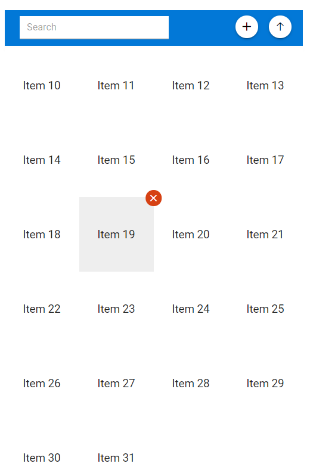

# How to customize listview as grid layout

In Listview, list items can be rendered in grid layout with following data manipulations.

* Add Item

* Remove Item

* Sort Items

* Filter Items

## Grid Layout

In this section, we will discuss about rendering of list items in grid layout.

* Initialize and render ListView with dataSource which will render list items in list layout.

* Now, add the below CSS to list item. This will make list items to render in grid layout

```css

#container .e-listview .e-list-item {
    height: 100px;
    width: 100px;
    float: left;
}

```

In the below sample, we have rendered List items in grid layout.

```C#

<div id="container">
    <div class="sample flex">
        <div class="flex">
            <div class="padding">
                <SfListView DataSource="@ListItems"></SfListView>
            </div>
        </div>
    </div>
</div>

@code
{
    List<int> ListItems = new List<int>() { 1, 2, 3, 4, 5, 6, 7, 8, 9, 10, 11, 12 };
}

<style>
    #container .e-listview {
        box-shadow: 0 1px 4px #ddd;
        border-bottom: 1px solid #ddd;
        width: 400px;
    }

    #container .e-listview .e-list-item {
        height: 100px;
        width: 100px;
        float: left;
    }

        #container .e-listview .e-list-item .e-text-content {
            display: flex;
            align-items: center;
            justify-content: center;
            cursor: pointer;
        }

    #container .e-listview .e-list-text {
        width: unset;
    }

    .sample {
        justify-content: center;
        min-height: 280px;
    }

    .padding {
        padding: 4px;
    }

    .flex {
        display: flex;
    }

    .flex__center {
        justify-content: center;
    }

    .margin {
        margin: 10px;
    }
</style>
```

## Data manipulation

In this section, we will discuss about ListView data manipulations.

### Add Item

In the below sample, you can add new item by clicking add button which will open dialog box with name text box. After entering the item details, click the add button. This will add your new item.

### Remove item

In the below sample, you can remove by hovering the item which will show delete button and click that delete button to delete that from your list.

### Sort Items

Listview can be sorted either in Ascending or Descending order. To enable sorting in your ListView, set `SortOrder` as `Ascending` or `Descending`.

We can also set sorting after control initialization.

In the below sample, we have sorted in `Ascending` order. To sort it in descending, click on sort order icon and vice versa.

```csharp
@using Syncfusion.Blazor.Popups
@using Syncfusion.Blazor.Buttons
@using Syncfusion.Blazor.Lists
@using ListviewSort = Syncfusion.Blazor.Lists.SortOrder

<div id="container">
    <div class="sample flex">
        <div class="flex">
            <div>
                <div class="headerContainer">
                    <div class="e-input-group">
                        <input id="search" class="e-input" placeholder="Search" @bind-value="@SearchValue" @oninput="@(e => Search(e.Value.ToString()))" />
                    </div>
                    <button id="sort"
                            class="e-btn e-small e-round e-primary e-icon-btn"
                            title="Sort"
                            @onclick="@(e => ListSortOrder = (ListSortOrder == ListviewSort.Ascending) ? ListviewSort.Descending : ListviewSort.Ascending)">
                        <span class="e-btn-icon e-icons e-sort-icon-ascending"></span>
                    </button>
                    <button id="add"
                            class="e-btn e-small e-round e-primary e-icon-btn"
                            title="Add"
                            @onclick="@(e => DialogObj.Show())">
                        <span class="e-btn-icon e-icons e-add-icon"></span>
                    </button>
                    <SfDialog @ref="DialogObj"

                               Target="#container"
                               ShowCloseIcon="true"
                               Header="@("Add item")"
                               @bind-Visible="@Visible"
                               Width="300px"
                               Height="230px">
                        <DialogTemplates>
                            <Content>
                                <div id="listDialog">
                                    <div class="input_name">
                                        <label for="name">Item text: </label>
                                        <input id="name" class="e-input" type="text" placeholder="Enter text" @bind-value="@Value" />
                                    </div>
                                </div>
                            </Content>
                        </DialogTemplates>
                        <DialogButtons>
                            <DialogButton OnClick="@(e => Add())" ButtonModel="@DialogBtn"></DialogButton>
                        </DialogButtons>
                    </SfDialog>
                </div>
            </div>
            <div>
                <div class="listview-container">
                    <SfListView DataSource="@DataSource" SortOrder="@ListSortOrder">
                        <ListViewFieldSettings TValue="ListDataModel" Id="Id" Text="Text"></ListViewFieldSettings>
                        <ListViewTemplates TValue="ListDataModel">
                            <Template>
                                @{
                                    ListDataModel currentData = (ListDataModel)context;
                                    <div>
                                        @currentData.Text
                                        <span class="e-badge e-badge-notification e-badge-overlap e-badge-danger e-badge-circle"
                                              @onclick="@(e => Remove(currentData))">
                                            <span class="delete-icon"></span>
                                        </span>
                                    </div>
                                }
                            </Template>
                        </ListViewTemplates>
                    </SfListView>
                </div>
            </div>
        </div>
    </div>
</div>

@code
{
    SfDialog DialogObj;

    ListviewSort ListSortOrder = ListviewSort.Ascending;

    DialogButtonModel DialogBtn = new DialogButtonModel { Content = "Add", IsPrimary = true, CssClass = "e-flat" };

    string Value = "";

    string SearchValue = "";

    bool Visible = false;

    List<ListDataModel> DataSourceOG = new List<ListDataModel>(
        Enumerable.Range(10, 22)
            .Select(
            index => new ListDataModel
            {
                Id = index.ToString(),
                Text = "Item " + index.ToString(),
            }
        ).ToList()
    );

    List<ListDataModel> DataSource;

    protected override void OnInitialized()
    {
        DataSource = new List<ListDataModel>(DataSourceOG);
    }

    void Search(string value)
    {
        if (value != "")
        {
            DataSource = new List<ListDataModel>(DataSourceOG.Where(e => e.Text.ToLower().Contains(value.ToLower())));
        } else
        {
            DataSource = new List<ListDataModel>(DataSourceOG);
        }

    }

    void Remove(ListDataModel data)
    {
        DataSourceOG.RemoveAt(DataSourceOG.FindIndex(e => e.Id == data.Id));
        DataSource = new List<ListDataModel>(DataSourceOG);
    }

    void Add()
    {
        DialogObj.Hide();
        DataSourceOG.Add(new ListDataModel { Id = Guid.NewGuid().ToString(), Text = Value });
        DataSource = new List<ListDataModel>(DataSourceOG);
        Value = "";
    }

    public class ListDataModel
    {
        public string Id
        {
            get;
            set;
        }
        public string Text
        {
            get;
            set;
        }
    }
}
<style>
    .headerContainer {
        height: 48px;
        line-height: 48px;
        background: rgb(2, 120, 215);
        color: white;
        margin-bottom: 3px;
    }

    #container .e-listview .e-content {
        overflow: visible;
    }

    #container .e-listview {
        overflow: visible;
    }

    #container .listview-container {
        display: inline-block;
        height: 300px;
    }

    .headerContainer .e-input-group {
        margin-left: 20px;
        width: 200px;
        background: white;
        height: 31px;
    }

    .headerContainer #search {
        height: 21px;
        margin-left: 10px;
    }

    #listDialog .input_name {
        margin-bottom: 20px;
    }

    .headerContainer #add,
    .headerContainer #sort {
        float: right;
        margin-right: 15px;
        margin-top: 7px;
        background: white;
        color: black
    }

    .headerContainer .e-input-search::before {
        font-family: 'e-icons';
        content: '\e961';
        margin-top: 3px;
    }

    .headerContainer .e-input-group .e-input-search {
        padding: 0 10px 0 10px;
    }

    .headerContainer .e-sort-icon-ascending::before {
        content: '\e840';
    }

    .headerContainer .e-sort-icon-descending::before {
        content: '\e83f';
    }

    .headerContainer .e-add-icon::before {
        content: '\e823';
    }
</style>
<style>
    #container .e-listview {
        box-shadow: 0 1px 4px #ddd;
        border-bottom: 1px solid #ddd;
    }

    #container .flex {
        display: flex;
        flex-direction: column;
        width: 400px;
        margin: auto;
    }

    #container .e-listview .e-list-item {
        height: 100px;
        width: 100px;
        float: left;
        padding: 0;
    }

        #container .e-listview .e-list-item .e-blazor-template {
            display: flex;
            align-items: center;
            justify-content: center;
            cursor: pointer;
            height: 100%;
        }

        #container .e-listview .e-list-item .delete-icon {
            font-size: 9px;
            font-family: 'e-icons';
        }

    #container .e-listview .e-badge {
        z-index: 10;
        display: none;
    }

    #container .e-listview .e-hover .e-badge {
        display: unset;
    }

    #container .e-listview .e-active .e-badge {
        display: unset;
    }

    #container .e-listview .e-list-item .delete-icon::before {
        content: '\e7fc';
        color: white;
    }

    .sample {
        justify-content: center;
        min-height: 280px;
    }

    .padding {
        padding: 4px;
    }

    .flex {
        display: flex;
    }

    .flex__center {
        justify-content: center;
    }

    .margin {
        margin: 10px;
    }
</style>
```


