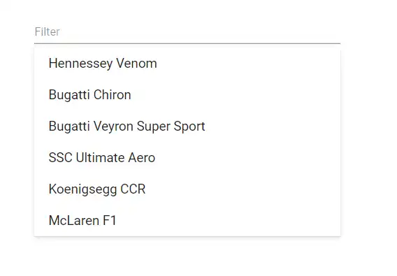

# How to filter and search list items in Blazor ListView

The filtered data can be displayed in the ListView component depending on the user inputs. Refer to the following steps to render the ListView with the filtered data.

* Render a textbox to get input for filtering data.

* Render ListView with [`DataSource`](https://help.syncfusion.com/cr/blazor/Syncfusion.Blazor.Lists.SfListView-1.html#Syncfusion_Blazor_Lists_SfListView_1_DataSource), and set the [`SortOrder`](https://help.syncfusion.com/cr/blazor/Syncfusion.Blazor.Lists.SfListView-1.html#Syncfusion_Blazor_Lists_SfListView_1_SortOrder) property.

* Bind the `Input` event for textbox to perform filtering operation. To filter list data, pass the text value to `OnInput` to manipulate the data, and then update filtered data as ListView dataSource.

```csharp

@using Syncfusion.Blazor.Inputs
@using Syncfusion.Blazor.Lists

<div id="container">
    <div id="sample">
        <SfTextBox Placeholder="Filter" Input="@OnInput"></SfTextBox>
        <SfListView ID="list" DataSource="@ListData">
            <ListViewFieldSettings TValue="ListDataModel" Id="Id" Text="Text"></ListViewFieldSettings>
        </SfListView>
    </div>
</div>

@code
{
    List<ListDataModel> ListData = new List<ListDataModel>();
    List<ListDataModel> DataSource = new List<ListDataModel>() {
        new ListDataModel {
            Text = "Hennessey Venom",
            Id = "list-01"
        },
        new ListDataModel {
            Text = "Bugatti Chiron",
            Id = "list-02"
        },
        new ListDataModel {
            Text = "Bugatti Veyron Super Sport",
            Id = "list-03"
        },
        new ListDataModel {
            Text = "SSC Ultimate Aero",
            Id = "list-04"
        },
        new ListDataModel {
            Text = "Koenigsegg CCR",
            Id = "list-05"
        },
        new ListDataModel {
            Text = "McLaren F1",
            Id = "list-06"
        }
    };

    protected override void OnInitialized()
    {
        ListData = DataSource;
    }

    void OnInput(InputEventArgs eventArgs)
    {
        ListData = DataSource.FindAll(e => e.Text.ToLower().StartsWith(eventArgs.Value));
    }

    public class ListDataModel
    {
        public string Id
        {
            get;
            set;
        }
        public string Text
        {
            get;
            set;
        }
    }
}

<style>
    #list {
        box-shadow: 0 1px 4px #ddd;
        border-bottom: 1px solid #ddd;
    }

    #sample {
        height: 220px;
        margin: 0 auto;
        display: block;
        max-width: 350px;
    }
</style>

```


