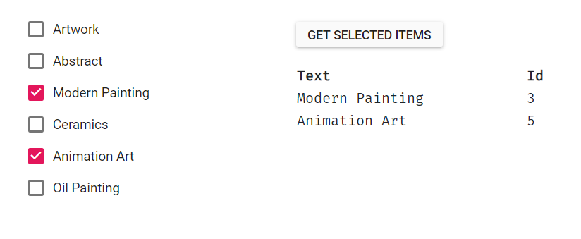
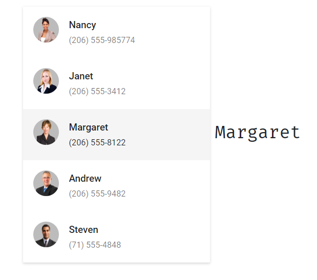

# Retrieving Selected Items from ListView Component

The Syncfusion<sup style="font-size:70%">&reg;</sup> Blazor ListView component offers functionalities for users to select one or more items from a list. This guide outlines how to retrieve selected items, a feature essential for applications that need to process or display data based on user choices.

## Get Selected Items from ListView Component

The ListView component in Syncfusion<sup style="font-size:70%">&reg;</sup> Blazor allows to select multiple items. The [`GetCheckedItemsAsync`](https://help.syncfusion.com/cr/blazor/Syncfusion.Blazor.Lists.SfListView-1.html#Syncfusion_Blazor_Lists_SfListView_1_GetCheckedItemsAsync) method is utilized to retrieve these selected items. Below are the details of this API:

| Return type | Purpose |
|------------|-------------------|
| Data | Returns the collections of list items data |
| Index | Returns the index of the selected item (applicable only in Virtualization) |
| ParentId | Returns the currently selected item's Parent Id (applicable only in Nested List) |
| Text | Returns array of text of selected item lists |

Here's a code snippet illustrating the implementation:

```cshtml
@using Syncfusion.Blazor.Lists

<div style="display: flex">
    <div class="margin">
        <SfListView @ref="@SfList"

                     DataSource="@DataSource"
                     ShowCheckBox="true">
            <ListViewFieldSettings TValue="ListDataModel" Id="Id" Text="Text"></ListViewFieldSettings>
        </SfListView>
    </div>
    <div class="margin">
        <div class="padding">
            <button class="e-btn" @onclick="@OnSelect">Get Selected Items</button>
        </div>
        <div class="padding">
            <table>
                <tr>
                    <th>Text</th>
                    <th>Id</th>
                </tr>
                @foreach (var item in SelectedItems)
                {
                    <tr>
                        <td>@item.Text</td>
                        <td>@item.Id</td>
                    </tr>
                }
            </table>
        </div>
    </div>
</div>

@code
{
    SfListView<ListDataModel> SfList;

    List<ListDataModel> SelectedItems = new List<ListDataModel>();

    List<ListDataModel> DataSource = new List<ListDataModel>()
    {
        new ListDataModel{ Id = "1", Text = "Artwork"},
        new ListDataModel{ Id = "2", Text = "Abstract"},
        new ListDataModel{ Id = "3", Text = "Modern Painting"},
        new ListDataModel{ Id = "4", Text = "Ceramics"},
        new ListDataModel{ Id = "5", Text = "Animation Art"},
        new ListDataModel{ Id = "6", Text = "Oil Painting"},
    };

    async void OnSelect()
    {
        var items = await SfList.GetCheckedItemsAsync();
        if (items.Data != null)
        {
            SelectedItems = items.Data;
            this.StateHasChanged();
        }
    }

    public class ListDataModel
    {
        public string Id { get; set; }
        public string Text { get; set; }
    }

}

<style>
    .margin {
        margin: 10px;
        width: 300px;
    }

    .padding {
        padding: 10px 0;
    }

    table {
        width: 100%;
    }
</style>
```



## Get Selected Items from Custom Template in Blazor ListView Component

In scenarios where custom templates are built in the Blazor ListView Component, multiple items can be selected. It's essential to map the `Id` and `Text` attributes properly using [`ListViewFieldSettings`](https://help.syncfusion.com/cr/blazor/Syncfusion.Blazor.Lists.ListViewFieldSettings-1.html). This ensures that selected item data is returned correctly in templates.

```cshtml
@using Syncfusion.Blazor.Lists

<div id="container">
    <div class="sample flex vertical-center">
        <div class="padding">
            <SfListView DataSource="@DataSource" CssClass="e-list-template">
                <ListViewFieldSettings TValue="ListDataModel" Id="Id" Text="Name"></ListViewFieldSettings>
                <ListViewTemplates TValue="ListDataModel">
                    <Template>
                        @{
                            ListDataModel currentData = (ListDataModel)context;
                            <div class="e-list-wrapper e-list-multi-line e-list-avatar" @onclick="(e => OnSelect(currentData))">
                                
                                <span class="e-list-item-header">@currentData.Name</span>
                                <span class="e-list-content">@currentData.Contact</span>
                            </div>
                        }
                    </Template>
                </ListViewTemplates>
            </SfListView>
        </div>
        <div class="padding">
            <h3>@(Selected?.Name)</h3>
        </div>
    </div>
</div>

@code
{
    ListDataModel Selected;

    List<ListDataModel> DataSource = new List<ListDataModel>() {
        new ListDataModel { Name = "Nancy", Contact = "(206) 555-985774", Id = "1", Image = "https://ej2.syncfusion.com/demos/src/grid/images/1.png", Category = "Experience" },
        new ListDataModel { Name = "Janet", Contact = "(206) 555-3412", Id = "2", Image = "https://ej2.syncfusion.com/demos/src/grid/images/3.png", Category = "Fresher" },
        new ListDataModel { Name = "Margaret", Contact = "(206) 555-8122", Id = "4", Image = "https://ej2.syncfusion.com/demos/src/grid/images/4.png", Category = "Experience" },
        new ListDataModel { Name = "Andrew ", Contact = "(206) 555-9482", Id = "5", Image = "https://ej2.syncfusion.com/demos/src/grid/images/2.png", Category = "Experience" },
        new ListDataModel { Name = "Steven", Contact = "(71) 555-4848", Id = "6", Image = "https://ej2.syncfusion.com/demos/src/grid/images/5.png", Category = "Fresher" },
    };

    void OnSelect(ListDataModel listData)
    {
        Selected = listData;
    }

    public class ListDataModel
    {
        public string Id { get; set; }
        public string Name { get; set; }
        public string Image { get; set; }
        public string Category { get; set; }
        public string Contact { get; set; }
    }
}
<style>
    #container .e-listview {
        box-shadow: 0 1px 4px #ddd;
        border-bottom: 1px solid #ddd;
    }

    .sample {
        justify-content: center;
        min-height: 280px;
    }

    .vertical-center {
        align-items: center;
    }

    .padding {
        padding: 4px;
    }

    .flex {
        display: flex;
    }

    .margin {
        margin: 10px;
    }
</style>
```



