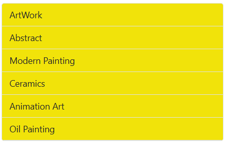

# HTML Attribute Support in Blazor ListView Component

The Blazor ListView component seamlessly integrates with standard HTML attributes. Attributes such as `id`, `style`, `title`, and others can be applied directly to the component's tag, allowing for easy customization of its root HTML element.

The following example demonstrates how to set the **id**, **style**, and **title** attributes directly on the **SfListView** tag.

```csharp

@using Syncfusion.Blazor.Lists

<SfListView DataSource="@Data" id="ListView" style="background:#f1e30a; width:350px" title="List of Items">
    <ListViewFieldSettings TValue="DataModel" Id="Id" Text="Text"></ListViewFieldSettings>
</SfListView>

@code {
    private DataModel[] Data =
    {
        new DataModel { Text = "ArtWork", Id = "list-01" },
        new DataModel { Text = "Abstract", Id = "list-02" },
        new DataModel { Text = "Modern Painting", Id = "list-03" },
        new DataModel { Text = "Ceramics", Id = "list-04" },
        new DataModel { Text = "Animation Art", Id = "list-05" },
        new DataModel { Text = "Oil Painting", Id = "list-06" }
    };

    public class DataModel
    {
        public string Text { get; set; }
        public string Id { get; set; }
    }
}

```


