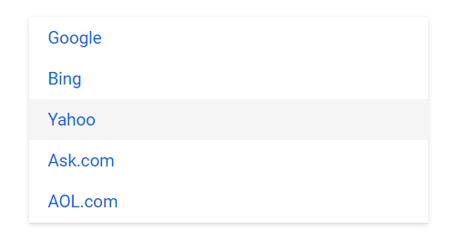

# How to ListView with hyper-link navigation

We can use `anchor` tag along with `href` attribute in our ListView `Template` property for navigation.

In the below sample, we have rendered `ListView` with search engines URL.

```csharp
@using Syncfusion.Blazor.Lists

<div id="container">
    <div id="sample">
        <SfListView ID="list" DataSource="@DataSource">
            <ListViewFieldSettings TValue="ListDataModel" Id="Id" Text="Name"></ListViewFieldSettings>
            <ListViewTemplates TValue="ListDataModel">
                <Template>
                    <a target='_blank' href="@((context as ListDataModel).Url)">
                        @((context as ListDataModel).Name)
                    </a>
                </Template>
            </ListViewTemplates>
        </SfListView>
    </div>
</div>

@code
{
    List<ListDataModel> DataSource = new List<ListDataModel>() {
        new ListDataModel {
            Id = "1",
            Name = "Google",
            Url = "https://www.google.com"
        },
        new ListDataModel {
            Id = "2",
            Name = "Bing",
            Url = "https://www.bing.com"
        },
        new ListDataModel {
            Id = "3",
            Name = "Yahoo",
            Url = "https://www.yahoo.com"
        },
        new ListDataModel {
            Id = "4",
            Name = "Ask.com",
            Url = "https://www.ask.com"
        },
        new ListDataModel {
            Id = "5",
            Name = "AOL.com",
            Url = "https://www.aol.com"
        }
    };

    public class ListDataModel
    {
        public string Id
        {
            get;
            set;
        }
        public string Name
        {
            get;
            set;
        }
        public string Url
        {
            get;
            set;
        }
    }
}

<style>
    #list {
        box-shadow: 0 1px 4px #ddd;
        border-bottom: 1px solid #ddd;
    }

    #sample {
        height: 220px;
        margin: 0 auto;
        display: block;
        max-width: 350px;
    }
</style>
```


