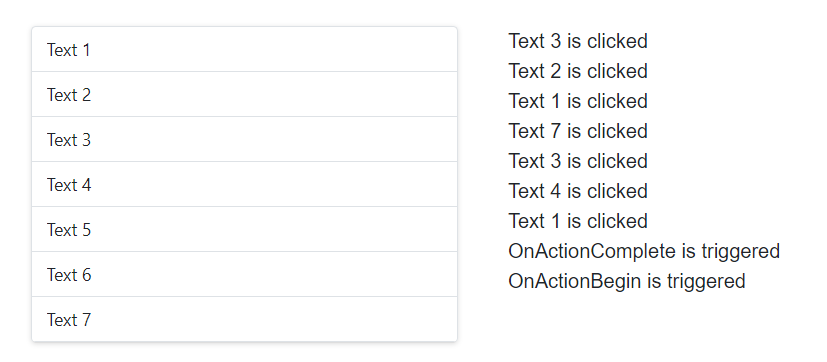

# Trace Events of ListView in Blazor ListView Component

The ListView component exposes various events that trigger in response to its actions, such as data binding or user interactions. These events serve as extension points for executing custom operations or tracking the component's behavior.

Follow these steps to trace and utilize ListView events:

1. Render the ListView with [`DataSource`](https://help.syncfusion.com/cr/blazor/Syncfusion.Blazor.Lists.SfListView-1.html#Syncfusion_Blazor_Lists_SfListView_1_DataSource), and bind the [`OnActionBegin`](https://help.syncfusion.com/cr/blazor/Syncfusion.Blazor.Lists.ListViewEvents-1.html#Syncfusion_Blazor_Lists_ListViewEvents_1_OnActionBegin), [`OnActionComplete`](https://help.syncfusion.com/cr/blazor/Syncfusion.Blazor.Lists.ListViewEvents-1.html#Syncfusion_Blazor_Lists_ListViewEvents_1_OnActionComplete), and [`Clicked`](https://help.syncfusion.com/cr/blazor/Syncfusion.Blazor.Lists.ListViewEvents-1.html#Syncfusion_Blazor_Lists_ListViewEvents_1_Clicked) events.

2. Perform custom operations in `OnActionBegin`, `OnActionComplete`, and `Clicked` events.

3. Provide event log details for `OnActionBegin` and `OnActionComplete` events, and they will be displayed in the event trace panel when the ListView action starts and the dataSource bound successfully.

4. Get the clicked item details from the `ClickEventArgs` in the Clicked event, and display the clicked list item text in the event trace panel while clicking list items.

```cshtml
@using Syncfusion.Blazor.Lists

<div id="container">
    <div class="flex vertical-center">
        <div class="sample padding">
            <SfListView DataSource="@DataSource">
                <ListViewFieldSettings TValue="ListDataModel" Id="Id" Text="Text"></ListViewFieldSettings>
                <ListViewEvents TValue="ListDataModel"
                                Clicked="@(e => Events.Add(e.Text +" is clicked"))"
                                OnActionBegin="@(e => Events.Add("OnActionBegin is triggered"))"
                                OnActionComplete="@(e => Events.Add("OnActionComplete is triggered"))">
                </ListViewEvents>
            </SfListView>
        </div>
        <div class="sample padding tracker">
            <ul style="list-style: none">
                @for (var i = Events.Count - 1; i >= 0; i--)
                {
                    <li>@Events[i]</li>
                }
            </ul>
        </div>
    </div>
</div>

@code
{
    List<string> Events = new List<string>();

    List<ListDataModel> DataSource = new List<ListDataModel>() {
        new ListDataModel { Id = "1", Text = "Text 1" },
        new ListDataModel { Id = "2", Text = "Text 2" },
        new ListDataModel { Id = "3", Text = "Text 3" },
        new ListDataModel { Id = "4", Text = "Text 4" },
        new ListDataModel { Id = "5", Text = "Text 5" },
        new ListDataModel { Id = "6", Text = "Text 6" },
        new ListDataModel { Id = "7", Text = "Text 7" },
    };

    public class ListDataModel
    {
        public string Id
        {
            get;
            set;
        }
        public string Text
        {
            get;
            set;
        }
    }
}
<style>
    #container .e-listview {
        box-shadow: 0 1px 4px #ddd;
        border-bottom: 1px solid #ddd;
    }

    .tracker {
        max-height: 250px;
        overflow: auto;
    }

    .sample {
        justify-content: center;
        min-height: 280px;
        width: 350px;
    }

    .vertical-center {
        align-items: center;
    }

    .padding {
        padding: 4px;
    }

    .flex {
        display: flex;
    }

    .flex__center {
        justify-content: center;
    }

    .margin {
        margin: 10px;
    }
</style>
```


