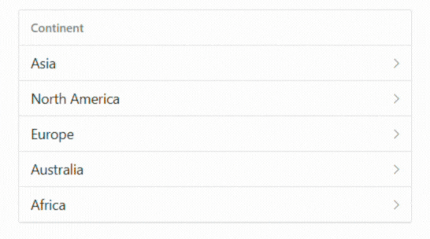

# Nested List in Blazor ListView Component

The ListView component supports rendering nested list structures. To enable this, the [`Child`](https://help.syncfusion.com/cr/blazor/Syncfusion.Blazor.Lists.ListViewFieldSettings-1.html#Syncfusion_Blazor_Lists_ListViewFieldSettings_1_Child) property in `ListViewFieldSettings` must be defined, mapping to a property in the data source that contains the child items.

```cshtml
@using Syncfusion.Blazor.Lists
<SfListView DataSource="@ListData" ShowHeader="true" HeaderTitle="Continent">
    <ListViewFieldSettings TValue="DataModel" Id="Id" Text="Text" Child="Child"></ListViewFieldSettings>
</SfListView>

@code {
    List<DataModel> ListData = new List<DataModel>();

    protected override void OnInitialized()
    {
        base.OnInitialized();

        ListData.Add(new DataModel
        {
            Text = "Asia",
            Id = "01",
            Category = "Continent",
            Child = new List<DataModel>() {
                new DataModel {
                    Text = "India",
                    Id = "1",
                    Category = "Asia",
                    Child = new List<DataModel> () {
                        new DataModel {
                            Id = "1001",
                            Text = "Delhi",
                            Category = "India"
                        },
                        new DataModel {
                            Text = "Kashmir",
                            Id = "1002",
                            Category = "India"
                        },
                        new DataModel {
                            Text = "Goa",
                            Id = "1003",
                            Category = "India"
                        }
                    }
                },
                new DataModel {
                    Text = "China",
                    Id = "2",
                    Category = "Asia",
                    Child = new List<DataModel> () {
                        new DataModel {
                            Text = "Zhejiang",
                            Id = "2001",
                            Category = "China"
                        },
                        new DataModel {
                            Text = "Hunan",
                            Id = "2002",
                            Category = "China"
                        },
                        new DataModel {
                            Text = "Shandong",
                            Id = "2003",
                            Category = "China"
                        }
                    }
                }
            }
        });

        ListData.Add(new DataModel
        {
            Text = "North America",
            Id = "02",
            Category = "Continent",
            Child = new List<DataModel>() {
                new DataModel {
                    Text = "USA",
                    Id = "3",
                    Category = "North America",
                    Child = new List<DataModel> () {
                        new DataModel {
                            Text = "California",
                            Id = "3001",
                            Category = "USA"
                        },
                        new DataModel {
                            Text = "New York",
                            Id = "3002",
                            Category = "USA"
                        },
                        new DataModel {
                            Text = "Florida",
                            Id = "3003",
                            Category = "USA"
                        }
                    }
                },
                new DataModel {
                    Text = "Canada",
                    Id = "4",
                    Category = "North America",
                    Child = new List<DataModel> () {
                        new DataModel {
                            Text = "Ontario",
                            Id = "4001",
                            Category = "Canada"
                        },
                        new DataModel {
                            Text = "Alberta",
                            Id = "4002",
                            Category = "Canada"
                        },
                        new DataModel {
                            Text = "Manitoba",
                            Id = "4003",
                            Category = "Canada"
                        }
                    }
                }
            }
        });

        ListData.Add(new DataModel
        {
            Text = "Europe",
            Id = "03",
            Category = "Continent",
            Child = new List<DataModel>() {
                new DataModel {
                    Text = "Germany",
                    Id = "5",
                    Category = "Europe",
                    Child = new List<DataModel> () {
                        new DataModel {
                            Text = "Berlin",
                            Id = "5001",
                            Category = "Germany"
                        },
                        new DataModel {
                            Text = "Bavaria",
                            Id = "5002",
                            Category = "Germany"
                        },
                        new DataModel {
                            Text = "Hesse",
                            Id = "5003",
                            Category = "Germany"
                        }
                    }
                },
                new DataModel {
                    Text = "France",
                    Id = "6",
                    Category = "Europe",
                    Child = new List<DataModel> () {
                        new DataModel {
                            Text = "Paris",
                            Id = "6001",
                            Category = "France"
                        },
                        new DataModel {
                            Text = "Lyon",
                            Id = "6002",
                            Category = "France"
                        },
                        new DataModel {
                            Text = "Marseille",
                            Id = "6003",
                            Category = "France"
                        }
                    }
                }
            }
        });
    }

    public class DataModel
    {
        public string Id { get; set; }
        public string Text { get; set; }
        public string Category { get; set; }
        public List<DataModel> Child { get; set; }
    }
}

```

