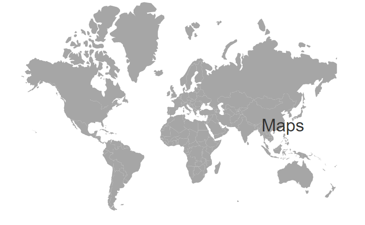

# Annotations in Blazor Maps component

Annotations are used to mark the specific area of interest in the Maps with texts, shapes, or images. Any number of annotations can be added to the Maps component.

## Annotation

By using the `ContentTemplate` property of [MapsAnnotation](https://help.syncfusion.com/cr/blazor/Syncfusion.Blazor.Maps.MapsAnnotation.html), text content or an HTML element can be specified to render a new HTML element in Maps.

```cshtml
@using Syncfusion.Blazor.Maps

<SfMaps>
    <MapsAnnotations>
        <MapsAnnotation X="0%" Y="50%">
            <ContentTemplate>
                <div>
                    
                </div>
            </ContentTemplate>
        </MapsAnnotation>
    </MapsAnnotations>
    <MapsLayers>
        <MapsLayer ShapeData='new {dataOptions ="https://cdn.syncfusion.com/maps/map-data/world-map.json"}'
                   ShapePropertyPath='new string[] {"name"}' TValue="string">
        </MapsLayer>
    </MapsLayers>
</SfMaps>
```


## Annotation customization

### Changing the z-index

The stack order of an annotation element can be changed using the [ZIndex](https://help.syncfusion.com/cr/blazor/Syncfusion.Blazor.Maps.MapsAnnotation.html#Syncfusion_Blazor_Maps_MapsAnnotation_ZIndex) property in the [MapsAnnotation](https://help.syncfusion.com/cr/blazor/Syncfusion.Blazor.Maps.MapsAnnotation.html) class.

```cshtml
@using Syncfusion.Blazor.Maps

<SfMaps>
    <MapsAnnotations>
        <MapsAnnotation X="0%" Y="50%" ZIndex= "-1">
            <ContentTemplate>
                <div>
                    <div id="first"><h1>Maps</h1></div>
                </div>
            </ContentTemplate>
        </MapsAnnotation>
    </MapsAnnotations>
    <MapsLayers>
        <MapsLayer ShapeData='new {dataOptions ="https://cdn.syncfusion.com/maps/map-data/world-map.json"}'
                   ShapePropertyPath='new string[] {"name"}' TValue="string">
        </MapsLayer>
    </MapsLayers>
</SfMaps>
```


### Positioning an annotation

Annotations can be placed anywhere in the Maps by specifying percentage values to the [X](https://help.syncfusion.com/cr/blazor/Syncfusion.Blazor.Maps.MapsAnnotation.html#Syncfusion_Blazor_Maps_MapsAnnotation_X) and [Y](https://help.syncfusion.com/cr/blazor/Syncfusion.Blazor.Maps.MapsAnnotation.html#Syncfusion_Blazor_Maps_MapsAnnotation_Y) properties in the [MapsAnnotation](https://help.syncfusion.com/cr/blazor/Syncfusion.Blazor.Maps.MapsAnnotation.html) class.

```cshtml
@using Syncfusion.Blazor.Maps

<SfMaps>
    <MapsAnnotations>
        <MapsAnnotation X="20%" Y="50%" ZIndex= "-1">
            <ContentTemplate>
                <div>
                    <div id="first"><h1>Maps</h1></div>
                </div>
            </ContentTemplate>
        </MapsAnnotation>
    </MapsAnnotations>
    <MapsLayers>
        <MapsLayer ShapeData='new {dataOptions ="https://cdn.syncfusion.com/maps/map-data/world-map.json"}'
                   ShapePropertyPath='new string[] {"name"}' TValue="string">
        </MapsLayer>
    </MapsLayers>
</SfMaps>
```


### Alignment of an annotation

Annotations can be aligned using the [HorizontalAlignment](https://help.syncfusion.com/cr/blazor/Syncfusion.Blazor.Maps.MapsAnnotation.html#Syncfusion_Blazor_Maps_MapsAnnotation_HorizontalAlignment) and [VerticalAlignment](https://help.syncfusion.com/cr/blazor/Syncfusion.Blazor.Maps.MapsAnnotation.html#Syncfusion_Blazor_Maps_MapsAnnotation_VerticalAlignment)  properties in the [`MapsAnnotation`](https://help.syncfusion.com/cr/blazor/Syncfusion.Blazor.Maps.MapsAnnotation.html) class. The possible values can be "[**Center**](https://help.syncfusion.com/cr/blazor/Syncfusion.Blazor.Maps.AnnotationAlignment.html#Syncfusion_Blazor_Maps_AnnotationAlignment_Center)", "[**Far**](https://help.syncfusion.com/cr/blazor/Syncfusion.Blazor.Maps.AnnotationAlignment.html#Syncfusion_Blazor_Maps_AnnotationAlignment_Far)", "[**Near**](https://help.syncfusion.com/cr/blazor/Syncfusion.Blazor.Maps.AnnotationAlignment.html#Syncfusion_Blazor_Maps_AnnotationAlignment_Near)" and "[**None**](https://help.syncfusion.com/cr/blazor/Syncfusion.Blazor.Maps.AnnotationAlignment.html#Syncfusion_Blazor_Maps_AnnotationAlignment_None)".

```cshtml
@using Syncfusion.Blazor.Maps

<SfMaps>
    <MapsAnnotations>
        <MapsAnnotation X="20%" Y="10%" ZIndex= "-1" VerticalAlignment="AnnotationAlignment.Center" HorizontalAlignment="AnnotationAlignment.Center">
            <ContentTemplate>
                <div>
                    <div id="first"><h1>Maps</h1></div>
                </div>
            </ContentTemplate>
        </MapsAnnotation>
    </MapsAnnotations>
    <MapsLayers>
        <MapsLayer ShapeData='new {dataOptions ="https://cdn.syncfusion.com/maps/map-data/world-map.json"}'
                   ShapePropertyPath='new string[] {"name"}' TValue="string">
        </MapsLayer>
    </MapsLayers>
</SfMaps>
```



## Multiple Annotation

Multiple annotations can be added to the Maps by adding multiple [MapsAnnotation](https://help.syncfusion.com/cr/blazor/Syncfusion.Blazor.Maps.MapsAnnotation.html) classes in the [MapsAnnotations](https://help.syncfusion.com/cr/blazor/Syncfusion.Blazor.Maps.MapsAnnotations.html) class and customization for the annotations can be done with the [MapsAnnotation](https://help.syncfusion.com/cr/blazor/Syncfusion.Blazor.Maps.MapsAnnotation.html) class.

```cshtml
@using Syncfusion.Blazor.Maps

<SfMaps>
    <MapsAnnotations>
        <MapsAnnotation X="0%" Y="50%">
            <ContentTemplate>
                <div>
                    
                </div>
            </ContentTemplate>
        </MapsAnnotation>
        <MapsAnnotation X="20%" Y="10%" ZIndex= "-1" VerticalAlignment="AnnotationAlignment.Center" HorizontalAlignment="AnnotationAlignment.Center">
            <ContentTemplate>
                <div>
                    <div id="first"><h1>Maps</h1></div>
                </div>
            </ContentTemplate>
        </MapsAnnotation>
    </MapsAnnotations>
    <MapsLayers>
        <MapsLayer ShapeData='new {dataOptions ="https://cdn.syncfusion.com/maps/map-data/world-map.json"}'
                   ShapePropertyPath='new string[] {"name"}' TValue="string">
        </MapsLayer>
    </MapsLayers>
</SfMaps>
```

