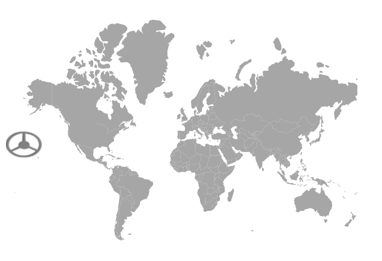
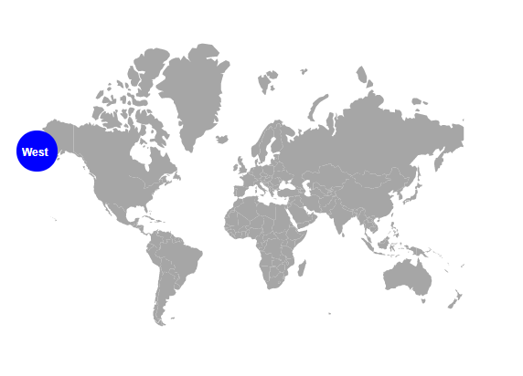
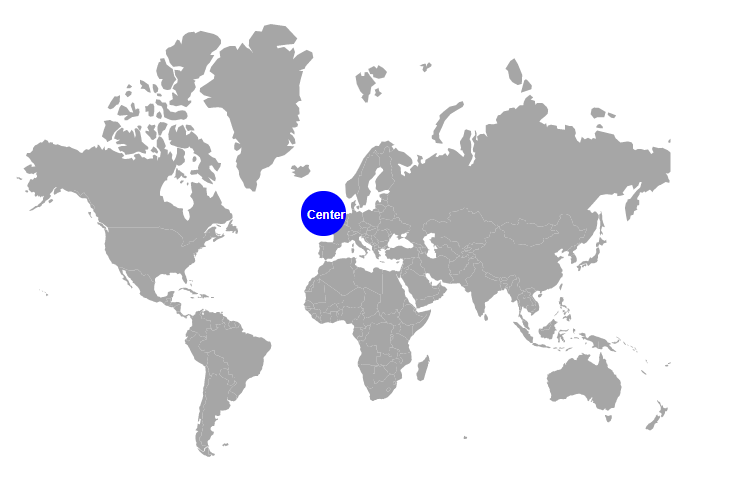
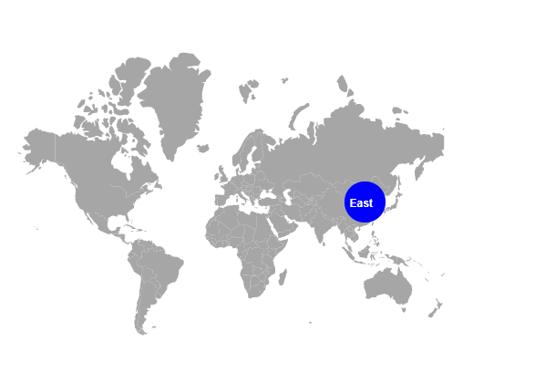
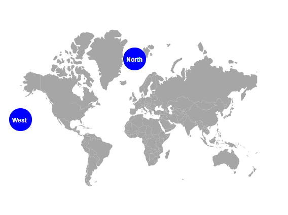

# Annotations in Blazor Maps component

Annotations mark areas of interest on the map using text, shapes, or images. Any number of annotations can be added to the Maps component.

## Annotation

Use the `ContentTemplate` property of [MapsAnnotation](https://help.syncfusion.com/cr/blazor/Syncfusion.Blazor.Maps.MapsAnnotation.html) to render text content or an HTML element as an annotation in Maps.

```cshtml

@using Syncfusion.Blazor.Maps

<SfMaps>
    <MapsAnnotations>
        <MapsAnnotation X="0%" Y="50%">
            <ContentTemplate>
                <div>
                    
                </div>
            </ContentTemplate>
        </MapsAnnotation>
    </MapsAnnotations>
    <MapsLayers>
        <MapsLayer ShapeData='new {dataOptions ="https://cdn.syncfusion.com/maps/map-data/world-map.json"}'
                   ShapePropertyPath='new string[] {"name"}' TValue="string">
        </MapsLayer>
    </MapsLayers>
</SfMaps>

```



## Annotation customization

### Changing the z-index

Change the stacking order of an annotation element using the [ZIndex](https://help.syncfusion.com/cr/blazor/Syncfusion.Blazor.Maps.MapsAnnotation.html#Syncfusion_Blazor_Maps_MapsAnnotation_ZIndex) property of [MapsAnnotation](https://help.syncfusion.com/cr/blazor/Syncfusion.Blazor.Maps.MapsAnnotation.html).

```cshtml

@using Syncfusion.Blazor.Maps

<SfMaps>
    <MapsAnnotations>
        <MapsAnnotation X="0%" Y="50%" ZIndex= "-1">
            <ContentTemplate>
                <div>
                    <div id="first"><h1>Maps</h1></div>
                </div>
            </ContentTemplate>
        </MapsAnnotation>
    </MapsAnnotations>
    <MapsLayers>
        <MapsLayer ShapeData='new {dataOptions ="https://cdn.syncfusion.com/maps/map-data/world-map.json"}'
                   ShapePropertyPath='new string[] {"name"}' TValue="string">
        </MapsLayer>
    </MapsLayers>
</SfMaps>

```



### Positioning an annotation

Place annotations anywhere on the map by specifying percentage values for the [X](https://help.syncfusion.com/cr/blazor/Syncfusion.Blazor.Maps.MapsAnnotation.html#Syncfusion_Blazor_Maps_MapsAnnotation_X) and [Y](https://help.syncfusion.com/cr/blazor/Syncfusion.Blazor.Maps.MapsAnnotation.html#Syncfusion_Blazor_Maps_MapsAnnotation_Y) properties of [MapsAnnotation](https://help.syncfusion.com/cr/blazor/Syncfusion.Blazor.Maps.MapsAnnotation.html).

```cshtml

@using Syncfusion.Blazor.Maps

<SfMaps>
    <MapsAnnotations>
        <MapsAnnotation X="20%" Y="50%" ZIndex= "-1">
            <ContentTemplate>
                <div>
                    <div id="first"><h1>Maps</h1></div>
                </div>
            </ContentTemplate>
        </MapsAnnotation>
    </MapsAnnotations>
    <MapsLayers>
        <MapsLayer ShapeData='new {dataOptions ="https://cdn.syncfusion.com/maps/map-data/world-map.json"}'
                   ShapePropertyPath='new string[] {"name"}' TValue="string">
        </MapsLayer>
    </MapsLayers>
</SfMaps>

```



### Alignment of an annotation

Align annotations using the [HorizontalAlignment](https://help.syncfusion.com/cr/blazor/Syncfusion.Blazor.Maps.MapsAnnotation.html#Syncfusion_Blazor_Maps_MapsAnnotation_HorizontalAlignment) and [VerticalAlignment](https://help.syncfusion.com/cr/blazor/Syncfusion.Blazor.Maps.MapsAnnotation.html#Syncfusion_Blazor_Maps_MapsAnnotation_VerticalAlignment) properties of [MapsAnnotation](https://help.syncfusion.com/cr/blazor/Syncfusion.Blazor.Maps.MapsAnnotation.html). Possible values: [Center](https://help.syncfusion.com/cr/blazor/Syncfusion.Blazor.Maps.AnnotationAlignment.html#Syncfusion_Blazor_Maps_AnnotationAlignment_Center), [Far](https://help.syncfusion.com/cr/blazor/Syncfusion.Blazor.Maps.AnnotationAlignment.html#Syncfusion_Blazor_Maps_AnnotationAlignment_Far), [Near](https://help.syncfusion.com/cr/blazor/Syncfusion.Blazor.Maps.AnnotationAlignment.html#Syncfusion_Blazor_Maps_AnnotationAlignment_Near), and [None](https://help.syncfusion.com/cr/blazor/Syncfusion.Blazor.Maps.AnnotationAlignment.html#Syncfusion_Blazor_Maps_AnnotationAlignment_None).

```cshtml

@using Syncfusion.Blazor.Maps

<SfMaps>
    <MapsAnnotations>
        <MapsAnnotation X="20%" Y="10%" ZIndex= "-1" VerticalAlignment="AnnotationAlignment.Center" HorizontalAlignment="AnnotationAlignment.Center">
            <ContentTemplate>
                <div>
                    <div id="first"><h1>Maps</h1></div>
                </div>
            </ContentTemplate>
        </MapsAnnotation>
    </MapsAnnotations>
    <MapsLayers>
        <MapsLayer ShapeData='new {dataOptions ="https://cdn.syncfusion.com/maps/map-data/world-map.json"}'
                   ShapePropertyPath='new string[] {"name"}' TValue="string">
        </MapsLayer>
    </MapsLayers>
</SfMaps>

```



## Multiple Annotation

Add multiple annotations by including multiple [MapsAnnotation](https://help.syncfusion.com/cr/blazor/Syncfusion.Blazor.Maps.MapsAnnotation.html) elements within [MapsAnnotations](https://help.syncfusion.com/cr/blazor/Syncfusion.Blazor.Maps.MapsAnnotations.html). Customize each annotation using the [MapsAnnotation](https://help.syncfusion.com/cr/blazor/Syncfusion.Blazor.Maps.MapsAnnotation.html) properties.

```cshtml

@using Syncfusion.Blazor.Maps

<SfMaps>
    <MapsAnnotations>
        <MapsAnnotation X="0%" Y="50%">
            <ContentTemplate>
               <div>
                   <div id="first"><h1>Maps</h1></div>
               </div>
            </ContentTemplate>
        </MapsAnnotation>
        <MapsAnnotation ZIndex= "-1" HorizontalAlignment="AnnotationAlignment.Center">
            <ContentTemplate>
                <div>
                    <div id="second"><h1>Maps-Annotation</h1></div>
                </div>
            </ContentTemplate>
        </MapsAnnotation>
    </MapsAnnotations>
    <MapsLayers>
        <MapsLayer ShapeData='new {dataOptions ="https://cdn.syncfusion.com/maps/map-data/world-map.json"}'
                   ShapePropertyPath='new string[] {"name"}' TValue="string">
        </MapsLayer>
    </MapsLayers>
</SfMaps>

```


