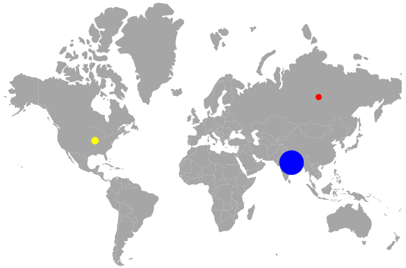

# Bubbles

Bubbles in the Maps component represent the underlying data values of the maps. Bubbles are scattered throughout the map shapes that contain bound values.

To add bubbles to the maps, bind data source to [`MapsBubble`](https://help.syncfusion.com/cr/aspnetcore-blazor/Syncfusion.Blazor.Maps.MapsBubbleSettings.html), and set [`ValuePath`](https://help.syncfusion.com/cr/blazor/Syncfusion.Blazor.Maps.MapsBubble.html#Syncfusion_Blazor_Maps_MapsBubble_ValuePath) as `Population`. The following code example demonstrates how to enable bubbles for the World map with data source.

```cshtml
@using Syncfusion.Blazor.Maps

<SfMaps>
    <MapsLayers>
        <MapsLayer ShapeData='new {dataOptions ="https://cdn.syncfusion.com/maps/map-data/world-map.json"}'
                   DataSource="PopulationDetails"
                   ShapeDataPath="Name"
                   ShapePropertyPath='new string[] {"name"}' TValue="Country">
            @* To add bubbles based on population count *@
            <MapsBubbleSettings>
                <MapsBubble Visible="true" ValuePath="Population" ColorValuePath="Color" DataSource="PopulationDetails" TValue="Country">
                </MapsBubble>
            </MapsBubbleSettings>
        </MapsLayer>
    </MapsLayers>
</SfMaps>

@code{
    public class Country
    {
        public string Name { get; set; }
        public double Population { get; set; }
        public string Color { get; set; }
    };
    private List<Country> PopulationDetails = new List<Country> {
       new Country
       {
           Name ="United States",
           Population = 325020000,
           Color = "#b5e485"
       },
       new Country
       {
           Name = "Russia",
           Population = 142905208,
           Color = "#7bc1e8"
       },
       new Country
        {
           Name="India",
           Population=1198003000,
           Color = "#df819c"
        }
    };
}
```


## Bubble sizing

Using the [`MinRadius`](https://help.syncfusion.com/cr/blazor/Syncfusion.Blazor.Maps.MapsBubble.html#Syncfusion_Blazor_Maps_MapsBubble_MinRadius) and [`MaxRadius`](https://help.syncfusion.com/cr/blazor/Syncfusion.Blazor.Maps.MapsBubble.html#Syncfusion_Blazor_Maps_MapsBubble_MaxRadius) properties in [`MapsBubble`](https://help.syncfusion.com/cr/aspnetcore-blazor/Syncfusion.Blazor.Maps.MapsBubble.html), you can render the bubbles in different sizes based on the [`ValuePath`](https://help.syncfusion.com/cr/blazor/Syncfusion.Blazor.Maps.MapsBubble.html#Syncfusion_Blazor_Maps_MapsBubble_ValuePath) and [`DataSource`](https://help.syncfusion.com/cr/blazor/Syncfusion.Blazor.Maps.MapsBubble.html#Syncfusion_Blazor_Maps_MapsBubble_DataSource) values.

```cshtml
@using Syncfusion.Blazor.Maps

<SfMaps>
    <MapsLayers>
        <MapsLayer ShapeData='new {dataOptions ="https://cdn.syncfusion.com/maps/map-data/world-map.json"}'
                   DataSource="PopulationDetails"
                   ShapeDataPath="Name"
                   ShapePropertyPath='new string[] {"name"}' TValue="PopulationDetail">
            <MapsBubbleSettings>
                <MapsBubble Visible="true"
                            ValuePath="Density"
                            ColorValuePath="Color"
                            MinRadius="5"
                            MaxRadius="20"
                            DataSource="PopulationDetails" TValue="PopulationDetail">
                </MapsBubble>
            </MapsBubbleSettings>
        </MapsLayer>
    </MapsLayers>
</SfMaps>

@code {
    public class PopulationDetail
    {
        public string Name { get; set; }
        public double Population { get; set; }
        public double Density { get; set; }
        public string Color { get; set; }
    };
    private List<PopulationDetail> PopulationDetails = new List<PopulationDetail> {
       new PopulationDetail
       {
           Name ="United States",
           Population = 325020000,
           Density = 33,
           Color="yellow"
       },
       new PopulationDetail
       {
           Name = "Russia",
           Population = 142905208,
           Density = 8.3,
           Color="red"
       },
       new PopulationDetail
        {
           Name="India",
           Population=1198003000,
           Density=364,
           Color="blue"
        }
    };
}
```



## Multiple bubble groups

You can specify multiple types of bubble groups using the [`MapsBubble`](https://help.syncfusion.com/cr/aspnetcore-blazor/Syncfusion.Blazor.Maps.MapsBubble.html) property and customize it according to your requirement.

In the following code example, the gender-wise population ratio is demonstrated with two different bubble groups.

```cshtml
@using Syncfusion.Blazor.Maps

<SfMaps>
    <MapsLayers>
        <MapsLayer ShapeData='new {dataOptions ="https://cdn.syncfusion.com/maps/map-data/world-map.json"}'
                   ShapePropertyPath='new string[] {"name"}'
                   DataSource="GenderRatios"
                   ShapeDataPath="Country" TValue="GenderRatio">
            @* To add multiple bubble groups *@
            <MapsBubbleSettings>
                <MapsBubble Visible="true"
                            MinRadius="5"
                            MaxRadius="20"
                            ValuePath="FemaleRatio"
                            ColorValuePath="FemaleRatioColor"
                            DataSource="GenderRatios" TValue="GenderRatio">
                </MapsBubble>
                <MapsBubble Visible="true"
                            BubbleType="BubbleType.Circle"
                            Opacity="0.4"
                            MinRadius="15"
                            MaxRadius="25"
                            ValuePath="MaleRatio"
                            ColorValuePath="MaleRatioColor"
                            DataSource="GenderRatios" TValue="GenderRatio">
                </MapsBubble>
            </MapsBubbleSettings>
        </MapsLayer>
    </MapsLayers>
</SfMaps>

@code{
    public class GenderRatio
    {
        public string Country { get; set; }
        public double FemaleRatio { get; set; }
        public double MaleRatio { get; set; }
        public string FemaleRatioColor { get; set; }
        public string MaleRatioColor { get; set; }
    }

    private List<GenderRatio> GenderRatios = new List<GenderRatio> {
        new GenderRatio {
            Country ="United States",
            FemaleRatio =50.50442726,
            MaleRatio =49.49557274,
            FemaleRatioColor ="green",
            MaleRatioColor = "blue"
        },
        new GenderRatio {
            Country ="India",
            FemaleRatio =48.18032713,
            MaleRatio =51.81967287,
            FemaleRatioColor ="blue",
            MaleRatioColor = "#c2d2d6"
        },
        new GenderRatio {
            Country ="Oman",
            FemaleRatio =34.15597234,
            MaleRatio =65.84402766,
            FemaleRatioColor ="#09156d",
            MaleRatioColor="orange"
        },
        new GenderRatio {
            Country ="United Arab Emirates",
            FemaleRatio =27.59638942,
            MaleRatio =72.40361058,
            FemaleRatioColor ="#09156d",
            MaleRatioColor="orange"
        }
    };
}
```


## Enabling legend for bubble

To enable the legends for bubbles, set [`Visible`](https://help.syncfusion.com/cr/blazor/Syncfusion.Blazor.Maps.MapsBubble.html#Syncfusion_Blazor_Maps_MapsBubble_Visible) to true and set [`Type`](https://help.syncfusion.com/cr/aspnetcore-blazor/Syncfusion.Blazor.Maps.LegendType.html) to [`Bubbles`](https://help.syncfusion.com/cr/aspnetcore-blazor/Syncfusion.Blazor.Maps.LegendType.html) in [`MapsLegendSettings`](https://help.syncfusion.com/cr/aspnetcore-blazor/Syncfusion.Blazor.Maps.MapsLegendSettings.html).

The following code example demonstrates how to enable the legends for bubbles with each bubble different colors rendering.

```cshtml
@using Syncfusion.Blazor.Maps

<SfMaps>
    @* To enable legend for bubbles *@
    <MapsLegendSettings Visible="true" Type="LegendType.Bubbles"></MapsLegendSettings>
    <MapsLayers>
        <MapsLayer ShapeData='new {dataOptions ="https://cdn.syncfusion.com/maps/map-data/world-map.json"}'
                   DataSource="PopulationDetails"
                   ShapeDataPath="Name"
                   ShapePropertyPath='new string[] {"name"}' TValue="PopulationDetail">
            <MapsBubbleSettings>
                <MapsBubble Visible="true"
                            ValuePath="Population"
                            ColorValuePath="Color"
                            DataSource="PopulationDetails" TValue="PopulationDetail">
                </MapsBubble>
            </MapsBubbleSettings>
        </MapsLayer>
    </MapsLayers>
</SfMaps>
```

> Refer [code block](#bubble-sizing) to know the property value of `PopulationDetails`.


> Please refer to [legend section](legend) for more information on legend settings.