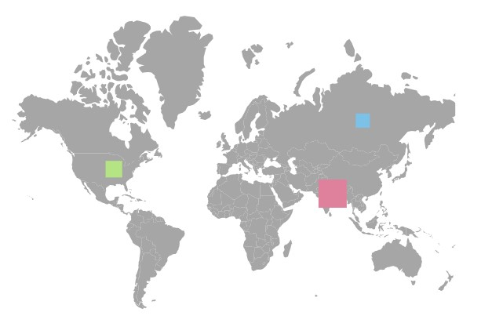

# Bubble in Blazor Maps Component

Bubbles in the Maps control represents the underlying data values of the Maps. It can be scattered throughout the Maps shapes that contain values in the data source. Bubbles are enabled by setting the [Visible](https://help.syncfusion.com/cr/blazor/Syncfusion.Blazor.Maps.MapsBubble-1.html#Syncfusion_Blazor_Maps_MapsBubble_1_Visible) property of [MapsBubble](https://help.syncfusion.com/cr/blazor/Syncfusion.Blazor.Maps.MapsBubble-1.html) to **true**. To add bubbles to the Maps, bind the data source to the [DataSource](https://help.syncfusion.com/cr/blazor/Syncfusion.Blazor.Maps.MapsBubble-1.html#Syncfusion_Blazor_Maps_MapsBubble_1_DataSource) property of the [MapsBubble](https://help.syncfusion.com/cr/blazor/Syncfusion.Blazor.Maps.MapsBubble-1.html) and set the field name, that contains the numerical data, in the data source to the [ValuePath](https://help.syncfusion.com/cr/blazor/Syncfusion.Blazor.Maps.MapsBubble-1.html#Syncfusion_Blazor_Maps_MapsBubble_1_ValuePath) property.

```cshtml
@using Syncfusion.Blazor.Maps

<SfMaps>
    <MapsLayers>
        <MapsLayer ShapeData='new {dataOptions ="https://cdn.syncfusion.com/maps/map-data/world-map.json"}'
                   DataSource="PopulationDetails" ShapeDataPath="Name" ShapePropertyPath='new string[] {"name"}' TValue="Country">
            @* To add bubbles based on population count *@
            <MapsBubbleSettings>
                <MapsBubble Visible="true" ValuePath="Population" ColorValuePath="Color" DataSource="PopulationDetails" TValue="Country">
                </MapsBubble>
            </MapsBubbleSettings>
        </MapsLayer>
    </MapsLayers>
</SfMaps>

@code{
    public class Country
    {
        public string Name { get; set; }
        public double Population { get; set; }
        public string Color { get; set; }
    };
    public List<Country> PopulationDetails = new List<Country> {
       new Country
       {
           Name ="United States", Population = 325020000, Color = "#b5e485"
       },
       new Country
       {
           Name = "Russia", Population = 142905208, Color = "#7bc1e8"
       },
       new Country
        {
           Name="India", Population=1198003000, Color = "#df819c"
        }
    };
}
```


## Bubble shapes

The following types of shapes are available to render the bubbles in Maps.

* Circle
* Square

By default, bubbles are rendered in the **Circle** type. To change the type of the bubble, set the [BubbleType](https://help.syncfusion.com/cr/blazor/Syncfusion.Blazor.Maps.MapsBubble-1.html#Syncfusion_Blazor_Maps_MapsBubble_1_BubbleType) property of [MapsBubble](https://help.syncfusion.com/cr/blazor/Syncfusion.Blazor.Maps.MapsBubble-1.html) as **Square** to render the square shape bubbles.

```cshtml
@using Syncfusion.Blazor.Maps

<SfMaps>
    <MapsLayers>
        <MapsLayer ShapeData='new {dataOptions ="https://cdn.syncfusion.com/maps/map-data/world-map.json"}'
                   ShapeDataPath="Name" ShapePropertyPath='new string[] {"name"}' TValue="Country">
            @* To add bubbles based on population count *@
            <MapsBubbleSettings>
                <MapsBubble Visible="true" ValuePath="Population" ColorValuePath="Color" DataSource="PopulationDetails"
                            BubbleType="Syncfusion.Blazor.Maps.BubbleType.Square" TValue="Country">
                </MapsBubble>
            </MapsBubbleSettings>
        </MapsLayer>
    </MapsLayers>
</SfMaps>

@code{
    public class Country
    {
        public string Name { get; set; }
        public double Population { get; set; }
        public string Color { get; set; }
    };
    public List<Country> PopulationDetails = new List<Country> {
       new Country
       {
           Name = "United States", Population = 325020000, Color = "#b5e485"
       },
       new Country
       {
           Name = "Russia", Population = 142905208, Color = "#7bc1e8"
       },
       new Country
       {
           Name = "India", Population=1198003000, Color = "#df819c"
       }
    };
}
```



## Customization

The following properties and a class are available in [MapsBubble](https://help.syncfusion.com/cr/blazor/Syncfusion.Blazor.Maps.MapsBubble-1.html) to customize the bubbles of the Maps component.

* [MapsBubbleBorder](https://help.syncfusion.com/cr/blazor/Syncfusion.Blazor.Maps.MapsBubbleBorder.html) - To customize the color and width of the border of the bubbles in Maps.
* [Fill](https://help.syncfusion.com/cr/blazor/Syncfusion.Blazor.Maps.MapsBubble-1.html#Syncfusion_Blazor_Maps_MapsBubble_1_Fill) - To apply the color for bubbles in Maps.
* [Opacity](https://help.syncfusion.com/cr/blazor/Syncfusion.Blazor.Maps.MapsBubble-1.html#Syncfusion_Blazor_Maps_MapsBubble_1_Opacity) - To apply opacity to the bubbles in Maps.
* [AnimationDelay](https://help.syncfusion.com/cr/blazor/Syncfusion.Blazor.Maps.MapsBubble-1.html#Syncfusion_Blazor_Maps_MapsBubble_1_AnimationDelay) - To change the time delay in the transition for bubbles.
* [AnimationDuration](https://help.syncfusion.com/cr/blazor/Syncfusion.Blazor.Maps.MapsBubble-1.html#Syncfusion_Blazor_Maps_MapsBubble_1_AnimationDuration) - To change the time duration of animation for bubbles.

```cshtml
@using Syncfusion.Blazor.Maps

<SfMaps>
    <MapsLayers>
        <MapsLayer ShapeData='new {dataOptions ="https://cdn.syncfusion.com/maps/map-data/world-map.json"}'
                   ShapeDataPath="Name" ShapePropertyPath='new string[] {"name"}' TValue="Country">
            @* To add bubbles based on population count *@
            <MapsBubbleSettings>
                <MapsBubble Visible="true" ValuePath="Population" Fill="green" MinRadius=5 MaxRadius=40 AnimationDelay=100
				            AnimationDuration=1000 Opacity=1 DataSource="PopulationDetails" TValue="Country">
                    <MapsBubbleBorder Color="blue" Width=2></MapsBubbleBorder>
                </MapsBubble>
            </MapsBubbleSettings>
        </MapsLayer>
    </MapsLayers>
</SfMaps>

@code{
    public class Country
    {
        public string Name { get; set; }
        public double Population { get; set; }
    };
    public List<Country> PopulationDetails = new List<Country> {
       new Country
       {
           Name ="Australia", Population = 325020000
       },
       new Country
       {
           Name = "Russia", Population = 142905208
       },
       new Country
       {
           Name = "India", Population=1198003000
       }
    };
}
```


## Setting colors to the bubbles from the data source

The color for each bubble in the Maps can be set using the [ColorValuePath](https://help.syncfusion.com/cr/blazor/Syncfusion.Blazor.Maps.MapsBubble-1.html#Syncfusion_Blazor_Maps_MapsBubble_1_ColorValuePath) property of [MapsBubble](https://help.syncfusion.com/cr/blazor/Syncfusion.Blazor.Maps.MapsBubble-1.html). The value for the [ColorValuePath](https://help.syncfusion.com/cr/blazor/Syncfusion.Blazor.Maps.MapsBubble-1.html#Syncfusion_Blazor_Maps_MapsBubble_1_ColorValuePath) property is the field name from the data source of the [MapsBubble](https://help.syncfusion.com/cr/blazor/Syncfusion.Blazor.Maps.MapsBubble-1.html) which contains the color values.

```cshtml
@using Syncfusion.Blazor.Maps

<SfMaps>
    <MapsLayers>
        <MapsLayer ShapeData='new {dataOptions ="https://cdn.syncfusion.com/maps/map-data/world-map.json"}'
                   ShapeDataPath="Name" ShapePropertyPath='new string[] {"name"}' TValue="Country">
            @* To add bubbles based on population count *@
            <MapsBubbleSettings>
                <MapsBubble Visible="true" ValuePath="Population" ColorValuePath="Color" MinRadius=20 MaxRadius=40 
                            DataSource="PopulationDetails" TValue="Country">
                </MapsBubble>
            </MapsBubbleSettings>
        </MapsLayer>
    </MapsLayers>
</SfMaps>

@code{
    public class Country
    {
        public string Name { get; set; }
        public double Population { get; set; }
        public string Color { get; set; }
    };
    public List<Country> PopulationDetails = new List<Country> {
       new Country
       {
           Name = "Australia", Population = 325020000, Color = "#0000FF"
       },
       new Country
       {
           Name = "Russia", Population = 142905208, Color = "#09156D"
       },
       new Country
       {
           Name = "India", Population = 1198003000, Color = "#C2D2D6"
       }
    };
}
```


## Setting the range of the bubble size

The size of the bubbles is calculated from the values got from the [ValuePath](https://help.syncfusion.com/cr/blazor/Syncfusion.Blazor.Maps.MapsBubble-1.html#Syncfusion_Blazor_Maps_MapsBubble_1_ValuePath) property. The range for the radius of the bubbles can be modified using [MinRadius](https://help.syncfusion.com/cr/blazor/Syncfusion.Blazor.Maps.MapsBubble-1.html#Syncfusion_Blazor_Maps_MapsBubble_1_MinRadius) and [MaxRadius](https://help.syncfusion.com/cr/blazor/Syncfusion.Blazor.Maps.MapsBubble-1.html#Syncfusion_Blazor_Maps_MapsBubble_1_MaxRadius) properties.

```cshtml
@using Syncfusion.Blazor.Maps

<SfMaps>
    <MapsLayers>
        <MapsLayer ShapeData='new {dataOptions ="https://cdn.syncfusion.com/maps/map-data/world-map.json"}'
                   DataSource="PopulationDetails" ShapeDataPath="Name" ShapePropertyPath='new string[] {"name"}' TValue="PopulationDetail">
            <MapsBubbleSettings>
                <MapsBubble Visible="true" ValuePath="Density" ColorValuePath="Color" MinRadius="5" MaxRadius="20"
                            DataSource="PopulationDetails" TValue="PopulationDetail">
                </MapsBubble>
            </MapsBubbleSettings>
        </MapsLayer>
    </MapsLayers>
</SfMaps>

@code {
    public class PopulationDetail
    {
        public string Name { get; set; }
        public double Population { get; set; }
        public double Density { get; set; }
        public string Color { get; set; }
    };
    public List<PopulationDetail> PopulationDetails = new List<PopulationDetail> {
       new PopulationDetail
       {
           Name ="United States", Population = 325020000, Density = 33, Color="yellow"
       },
       new PopulationDetail
       {
           Name = "Russia", Population = 142905208, Density = 8.3, Color="red"
       },
       new PopulationDetail
       {
           Name="India", Population=1198003000, Density=364, Color="blue"
       }
    };
}
```


## Multiple bubble groups

Multiple groups of bubbles can be added in the Maps by adding multiple [MapsBubble](https://help.syncfusion.com/cr/blazor/Syncfusion.Blazor.Maps.MapsBubble-1.html) in the [MapsBubbleSettings](https://help.syncfusion.com/cr/blazor/Syncfusion.Blazor.Maps.MapsBubbleSettings.html) and customization for the bubbles can be done with the [MapsBubble](https://help.syncfusion.com/cr/blazor/Syncfusion.Blazor.Maps.MapsBubble-1.html) class. In the following example, the gender-wise population ratio is demonstrated with two different bubble groups.

```cshtml
@using Syncfusion.Blazor.Maps

<SfMaps>
    <MapsLayers>
        <MapsLayer ShapeData='new {dataOptions ="https://cdn.syncfusion.com/maps/map-data/world-map.json"}'
                   ShapePropertyPath='new string[] {"name"}' DataSource="GenderRatios" ShapeDataPath="Country" TValue="GenderRatio">
            @* To add multiple bubble groups *@
            <MapsBubbleSettings>
                <MapsBubble Visible="true" MinRadius="5" MaxRadius="20" ValuePath="FemaleRatio" ColorValuePath="FemaleRatioColor"
                            DataSource="GenderRatios" TValue="GenderRatio">
                </MapsBubble>
                <MapsBubble Visible="true" BubbleType="BubbleType.Circle" Opacity="0.4" MinRadius="15" MaxRadius="25" ValuePath="MaleRatio"
                            ColorValuePath="MaleRatioColor" DataSource="GenderRatios" TValue="GenderRatio">
                </MapsBubble>
            </MapsBubbleSettings>
        </MapsLayer>
    </MapsLayers>
</SfMaps>

@code{
    public class GenderRatio
    {
        public string Country { get; set; }
        public double FemaleRatio { get; set; }
        public double MaleRatio { get; set; }
        public string FemaleRatioColor { get; set; }
        public string MaleRatioColor { get; set; }
    }

    public List<GenderRatio> GenderRatios = new List<GenderRatio> {
        new GenderRatio {
            Country ="United States", FemaleRatio =50.50442726, MaleRatio =49.49557274, FemaleRatioColor ="green", MaleRatioColor = "blue"
        },
        new GenderRatio {
            Country ="India", FemaleRatio =48.18032713, MaleRatio =51.81967287, FemaleRatioColor ="blue", MaleRatioColor = "#c2d2d6"
        },
        new GenderRatio {
            Country ="Oman", FemaleRatio =34.15597234, MaleRatio =65.84402766, FemaleRatioColor ="#09156d", MaleRatioColor="orange"
        },
        new GenderRatio {
            Country ="United Arab Emirates", FemaleRatio =27.59638942, MaleRatio =72.40361058, FemaleRatioColor ="#09156d", MaleRatioColor="orange"
        }
    };
}
```


## Enable tooltip for bubble

The tooltip for the bubbles can be enabled by setting the [Visible](https://help.syncfusion.com/cr/blazor/Syncfusion.Blazor.Maps.MapsTooltipSettings.html#Syncfusion_Blazor_Maps_MapsTooltipSettings_Visible) property of the [MapsBubbleTooltipSettings](https://help.syncfusion.com/cr/blazor/Syncfusion.Blazor.Maps.MapsBubbleTooltipSettings.html) as **true**. The content for the tooltip can be set using the [ValuePath](https://help.syncfusion.com/cr/blazor/Syncfusion.Blazor.Maps.MapsTooltipSettings.html#Syncfusion_Blazor_Maps_MapsTooltipSettings_ValuePath) property in the [MapsBubbleTooltipSettings](https://help.syncfusion.com/cr/blazor/Syncfusion.Blazor.Maps.MapsBubbleTooltipSettings.html) of the [MapsBubble](https://help.syncfusion.com/cr/blazor/Syncfusion.Blazor.Maps.MapsBubble-1.html) where the value for the [ValuePath](https://help.syncfusion.com/cr/blazor/Syncfusion.Blazor.Maps.MapsTooltipSettings.html#Syncfusion_Blazor_Maps_MapsTooltipSettings_ValuePath) property is the field name from the data source of the [MapsBubble](https://help.syncfusion.com/cr/blazor/Syncfusion.Blazor.Maps.MapsBubble-1.html). Any HTML element can be added as the template in tooltip using the [TooltipTemplate](https://help.syncfusion.com/cr/blazor/Syncfusion.Blazor.Maps.MapsBubbleTooltipSettings.html#Syncfusion_Blazor_Maps_MapsBubbleTooltipSettings_TooltipTemplate) property.

```cshtml
@using Syncfusion.Blazor.Maps

<SfMaps>
    <MapsLayers>
        <MapsLayer ShapeData='new {dataOptions ="https://cdn.syncfusion.com/maps/map-data/world-map.json"}'
                   ShapeDataPath="Name" ShapePropertyPath='new string[] {"name"}' TValue="Country">
            @* To add bubbles based on population count *@
            <MapsBubbleSettings>
                <MapsBubble Visible="true" ValuePath="Population" ColorValuePath="Color" MinRadius=20 MaxRadius=40
                            DataSource="PopulationDetails" TValue="Country">
                    <MapsBubbleTooltipSettings Visible="true" ValuePath="Population"></MapsBubbleTooltipSettings>
                </MapsBubble>
            </MapsBubbleSettings>
        </MapsLayer>
    </MapsLayers>
</SfMaps>

@code{
    public class Country
    {
        public string Name { get; set; }
        public double Population { get; set; }
        public string Color { get; set; }
    };
    public List<Country> PopulationDetails = new List<Country> {
       new Country
       {
           Name ="United States", Population = 325020000, Color = "#b5e485"
       },
       new Country
       {
           Name = "Russia", Population = 142905208, Color = "#7bc1e8"
       },
       new Country
       {
           Name="India", Population=1198003000, Color = "#df819c"
       }
    };
}
```

