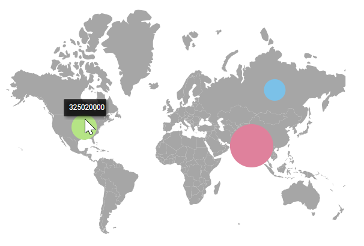

# Bubble in Blazor Maps Component

Bubbles in the Maps control represent underlying data values. They render over map shapes that have corresponding data in the data source. Enable bubbles by setting the [Visible](https://help.syncfusion.com/cr/blazor/Syncfusion.Blazor.Maps.MapsBubble-1.html#Syncfusion_Blazor_Maps_MapsBubble_1_Visible) property of [MapsBubble](https://help.syncfusion.com/cr/blazor/Syncfusion.Blazor.Maps.MapsBubble-1.html) to **true**. To add bubbles, bind the data source to the [DataSource](https://help.syncfusion.com/cr/blazor/Syncfusion.Blazor.Maps.MapsBubble-1.html#Syncfusion_Blazor_Maps_MapsBubble_1_DataSource) property of [MapsBubble](https://help.syncfusion.com/cr/blazor/Syncfusion.Blazor.Maps.MapsBubble-1.html) and set the numeric field name in the [ValuePath](https://help.syncfusion.com/cr/blazor/Syncfusion.Blazor.Maps.MapsBubble-1.html#Syncfusion_Blazor_Maps_MapsBubble_1_ValuePath) property.

```cshtml

@using Syncfusion.Blazor.Maps

<SfMaps>
    <MapsLayers>
        <MapsLayer ShapeData='new {dataOptions ="https://cdn.syncfusion.com/maps/map-data/world-map.json"}'
                   DataSource="PopulationDetails" ShapeDataPath="Name" ShapePropertyPath='new string[] {"name"}' TValue="Country">
            @* To add bubbles based on population count *@
            <MapsBubbleSettings>
                <MapsBubble Visible="true" ValuePath="Population" ColorValuePath="Color" DataSource="PopulationDetails" TValue="Country">
                </MapsBubble>
            </MapsBubbleSettings>
        </MapsLayer>
    </MapsLayers>
</SfMaps>

@code {
    public class Country
    {
        public string Name { get; set; }
        public double Population { get; set; }
        public string Color { get; set; }
    };

    public List<Country> PopulationDetails = new List<Country> {
        new Country
        {
            Name = "United States", Population = 325020000, Color = "#b5e485"
        },
        new Country
        {
            Name = "Russia", Population = 142905208, Color = "#7bc1e8"
        },
       new Country
        {
            Name ="India", Population=1198003000, Color = "#df819c"
        }
    };
}

```


## Bubble shapes

The following bubble shapes are available in Maps:

- Circle
- Square

By default, bubbles render as **Circle**. To render squares, set the [BubbleType](https://help.syncfusion.com/cr/blazor/Syncfusion.Blazor.Maps.MapsBubble-1.html#Syncfusion_Blazor_Maps_MapsBubble_1_BubbleType) property of [MapsBubble](https://help.syncfusion.com/cr/blazor/Syncfusion.Blazor.Maps.MapsBubble-1.html) to **Square**.

```cshtml

@using Syncfusion.Blazor.Maps

<SfMaps>
    <MapsLayers>
        <MapsLayer ShapeData='new {dataOptions ="https://cdn.syncfusion.com/maps/map-data/world-map.json"}'
                   ShapeDataPath="Name" ShapePropertyPath='new string[] {"name"}' TValue="Country">
            @* To add bubbles based on population count *@
            <MapsBubbleSettings>
                <MapsBubble Visible="true" ValuePath="Population" ColorValuePath="Color" DataSource="PopulationDetails"
                            BubbleType="Syncfusion.Blazor.Maps.BubbleType.Square" TValue="Country">
                </MapsBubble>
            </MapsBubbleSettings>
        </MapsLayer>
    </MapsLayers>
</SfMaps>

@code {
    public class Country
    {
        public string Name { get; set; }
        public double Population { get; set; }
        public string Color { get; set; }
    };
    public List<Country> PopulationDetails = new List<Country> {
        new Country
        {
            Name = "United States", Population = 325020000, Color = "#b5e485"
        },
        new Country
        {
            Name = "Russia", Population = 142905208, Color = "#7bc1e8"
        },
       new Country
        {
            Name ="India", Population=1198003000, Color = "#df819c"
        }
    };
}

```


## Customization

Use the following [MapsBubble](https://help.syncfusion.com/cr/blazor/Syncfusion.Blazor.Maps.MapsBubble-1.html) APIs to customize bubble appearance:

- [MapsBubbleBorder](https://help.syncfusion.com/cr/blazor/Syncfusion.Blazor.Maps.MapsBubbleBorder.html) — Customize border color and width.
- [Fill](https://help.syncfusion.com/cr/blazor/Syncfusion.Blazor.Maps.MapsBubble-1.html#Syncfusion_Blazor_Maps_MapsBubble_1_Fill) — Sets bubble fill color.
- [Opacity](https://help.syncfusion.com/cr/blazor/Syncfusion.Blazor.Maps.MapsBubble-1.html#Syncfusion_Blazor_Maps_MapsBubble_1_Opacity) — Applies transparency.
- [AnimationDelay](https://help.syncfusion.com/cr/blazor/Syncfusion.Blazor.Maps.MapsBubble-1.html#Syncfusion_Blazor_Maps_MapsBubble_1_AnimationDelay) — To delay the transition.
- [AnimationDuration](https://help.syncfusion.com/cr/blazor/Syncfusion.Blazor.Maps.MapsBubble-1.html#Syncfusion_Blazor_Maps_MapsBubble_1_AnimationDuration) — Controls animation length.

```cshtml

@using Syncfusion.Blazor.Maps

<SfMaps>
    <MapsLayers>
        <MapsLayer ShapeData='new {dataOptions ="https://cdn.syncfusion.com/maps/map-data/world-map.json"}'
                   ShapeDataPath="Name" ShapePropertyPath='new string[] {"name"}' TValue="Country">
            @* To add bubbles based on population count *@
            <MapsBubbleSettings>
                <MapsBubble Visible="true" ValuePath="Population" Fill="green" MinRadius=5 MaxRadius=40 AnimationDelay=100 AnimationDuration=1000 Opacity=1 DataSource="PopulationDetails" TValue="Country">
                    <MapsBubbleBorder Color="blue" Width=2></MapsBubbleBorder>
                </MapsBubble>
            </MapsBubbleSettings>
        </MapsLayer>
    </MapsLayers>
</SfMaps>

@code {
    public class Country
    {
        public string Name { get; set; }
        public double Population { get; set; }
    };

    public List<Country> PopulationDetails = new List<Country> {
       new Country
       {
           Name = "Australia", Population = 325020000
       },
       new Country
       {
           Name = "Russia", Population = 142905208
       },
       new Country
       {
           Name = "India", Population = 1198003000
       }
    };
}

```


## Setting colors to the bubbles from the data source

Assign each bubble colors using the [ColorValuePath](https://help.syncfusion.com/cr/blazor/Syncfusion.Blazor.Maps.MapsBubble-1.html#Syncfusion_Blazor_Maps_MapsBubble_1_ColorValuePath) property of [MapsBubble](https://help.syncfusion.com/cr/blazor/Syncfusion.Blazor.Maps.MapsBubble-1.html). Set this to the field in the bubble data source that contains color values.

```cshtml

@using Syncfusion.Blazor.Maps

<SfMaps>
    <MapsLayers>
        <MapsLayer ShapeData='new {dataOptions ="https://cdn.syncfusion.com/maps/map-data/world-map.json"}'
                   ShapeDataPath="Name" ShapePropertyPath='new string[] {"name"}' TValue="Country">
            @* To add bubbles based on population count *@
            <MapsBubbleSettings>
                <MapsBubble Visible="true" ValuePath="Population" ColorValuePath="Color" MinRadius=20 MaxRadius=40 
                            DataSource="PopulationDetails" TValue="Country">
                </MapsBubble>
            </MapsBubbleSettings>
        </MapsLayer>
    </MapsLayers>
</SfMaps>

@code {
    public class Country
    {
        public string Name { get; set; }
        public double Population { get; set; }
        public string Color { get; set; }
    };

    public List<Country> PopulationDetails = new List<Country> {
       new Country
       {
           Name = "Australia", Population = 325020000, Color = "#0000FF"
       },
       new Country
       {
           Name = "Russia", Population = 142905208, Color = "#09156D"
       },
       new Country
       {
           Name = "India", Population = 1198003000, Color = "#C2D2D6"
       }
    };
}

```


## Setting the range of the bubble size

Bubble size is computed from the values specified by [ValuePath](https://help.syncfusion.com/cr/blazor/Syncfusion.Blazor.Maps.MapsBubble-1.html#Syncfusion_Blazor_Maps_MapsBubble_1_ValuePath) property. Control the radius range using [MinRadius](https://help.syncfusion.com/cr/blazor/Syncfusion.Blazor.Maps.MapsBubble-1.html#Syncfusion_Blazor_Maps_MapsBubble_1_MinRadius) and [MaxRadius](https://help.syncfusion.com/cr/blazor/Syncfusion.Blazor.Maps.MapsBubble-1.html#Syncfusion_Blazor_Maps_MapsBubble_1_MaxRadius) properties.

```cshtml

@using Syncfusion.Blazor.Maps

<SfMaps>
    <MapsLayers>
        <MapsLayer ShapeData='new {dataOptions ="https://cdn.syncfusion.com/maps/map-data/world-map.json"}'
                   DataSource="PopulationDetails" ShapeDataPath="Name" ShapePropertyPath='new string[] {"name"}' TValue="PopulationDetail">
            <MapsBubbleSettings>
                <MapsBubble Visible="true" ValuePath="Density" ColorValuePath="Color" MinRadius="5" MaxRadius="20"
                            DataSource="PopulationDetails" TValue="PopulationDetail">
                </MapsBubble>
            </MapsBubbleSettings>
        </MapsLayer>
    </MapsLayers>
</SfMaps>

@code {
    public class PopulationDetail
    {
        public string Name { get; set; }
        public double Population { get; set; }
        public double Density { get; set; }
        public string Color { get; set; }
    };

    public List<PopulationDetail> PopulationDetails = new List<PopulationDetail> {
       new PopulationDetail
       {
           Name = "United States", Population = 325020000, Density = 33, Color = "yellow"
       },
       new PopulationDetail
       {
           Name = "Russia", Population = 142905208, Density = 8.3, Color = "red"
       },
       new PopulationDetail
       {
           Name = "India", Population = 1198003000, Density = 364, Color = "blue"
       }
    };
}

```


## Multiple bubble groups

Add multiple bubble groups by defining more than one [MapsBubble](https://help.syncfusion.com/cr/blazor/Syncfusion.Blazor.Maps.MapsBubble-1.html) within [MapsBubbleSettings](https://help.syncfusion.com/cr/blazor/Syncfusion.Blazor.Maps.MapsBubbleSettings.html). Each group can use distinct settings. The following example shows gender-wise population ratios using two bubble groups.

```cshtml

@using Syncfusion.Blazor.Maps

<SfMaps>
    <MapsLayers>
        <MapsLayer ShapeData='new {dataOptions ="https://cdn.syncfusion.com/maps/map-data/world-map.json"}'
                   ShapePropertyPath='new string[] {"name"}' DataSource="GenderRatios" ShapeDataPath="Country" TValue="GenderRatio">
            @* To add multiple bubble groups *@
            <MapsBubbleSettings>
                <MapsBubble Visible="true" MinRadius="5" MaxRadius="20" ValuePath="FemaleRatio" ColorValuePath="FemaleRatioColor"
                            DataSource="GenderRatios" TValue="GenderRatio">
                </MapsBubble>
                <MapsBubble Visible="true" BubbleType="BubbleType.Circle" Opacity="0.4" MinRadius="15" MaxRadius="25" ValuePath="MaleRatio"
                            ColorValuePath="MaleRatioColor" DataSource="GenderRatios" TValue="GenderRatio">
                </MapsBubble>
            </MapsBubbleSettings>
        </MapsLayer>
    </MapsLayers>
</SfMaps>

@code {
    public class GenderRatio
    {
        public string Country { get; set; }
        public double FemaleRatio { get; set; }
        public double MaleRatio { get; set; }
        public string FemaleRatioColor { get; set; }
        public string MaleRatioColor { get; set; }
    }

    public List<GenderRatio> GenderRatios = new List<GenderRatio> {
        new GenderRatio {
            Country = "United States", FemaleRatio = 50.50442726, MaleRatio = 49.49557274, FemaleRatioColor = "green", MaleRatioColor = "blue"
        },
        new GenderRatio {
            Country = "India", FemaleRatio = 48.18032713, MaleRatio = 51.81967287, FemaleRatioColor = "blue", MaleRatioColor = "#c2d2d6"
        },
        new GenderRatio {
            Country = "Oman", FemaleRatio = 34.15597234, MaleRatio = 65.84402766, FemaleRatioColor = "#09156d", MaleRatioColor = "orange"
        },
        new GenderRatio {
            Country = "United Arab Emirates", FemaleRatio = 27.59638942, MaleRatio = 72.40361058, FemaleRatioColor = "#09156d", MaleRatioColor = "orange"
        }
    };
}

```


## Enable tooltip for bubble

Enable bubble tooltips by setting the [Visible](https://help.syncfusion.com/cr/blazor/Syncfusion.Blazor.Maps.MapsTooltipSettings.html#Syncfusion_Blazor_Maps_MapsTooltipSettings_Visible) property of [MapsBubbleTooltipSettings](https://help.syncfusion.com/cr/blazor/Syncfusion.Blazor.Maps.MapsBubbleTooltipSettings.html) to **true**. Specify the tooltip content using the [ValuePath](https://help.syncfusion.com/cr/blazor/Syncfusion.Blazor.Maps.MapsTooltipSettings.html#Syncfusion_Blazor_Maps_MapsTooltipSettings_ValuePath) property. Use [TooltipTemplate](https://help.syncfusion.com/cr/blazor/Syncfusion.Blazor.Maps.MapsBubbleTooltipSettings.html#Syncfusion_Blazor_Maps_MapsBubbleTooltipSettings_TooltipTemplate) to define custom HTML content.

```cshtml

@using Syncfusion.Blazor.Maps

<SfMaps>
    <MapsLayers>
        <MapsLayer ShapeData='new {dataOptions ="https://cdn.syncfusion.com/maps/map-data/world-map.json"}'
                   ShapeDataPath="Name" ShapePropertyPath='new string[] {"name"}' TValue="Country">
            @* To add bubbles based on population count *@
            <MapsBubbleSettings>
                <MapsBubble Visible="true" ValuePath="Population" ColorValuePath="Color" MinRadius=20 MaxRadius=40
                            DataSource="PopulationDetails" TValue="Country">
                    <MapsBubbleTooltipSettings Visible="true" ValuePath="Population"></MapsBubbleTooltipSettings>
                </MapsBubble>
            </MapsBubbleSettings>
        </MapsLayer>
    </MapsLayers>
</SfMaps>

@code {
    public class Country
    {
        public string Name { get; set; }
        public double Population { get; set; }
        public string Color { get; set; }
    };

    public List<Country> PopulationDetails = new List<Country> {
       new Country
       {
           Name = "United States", Population = 325020000, Color = "#b5e485"
       },
       new Country
       {
           Name = "Russia", Population = 142905208, Color = "#7bc1e8"
       },
       new Country
       {
           Name = "India", Population = 1198003000, Color = "#df819c"
       }
    };
}

```


