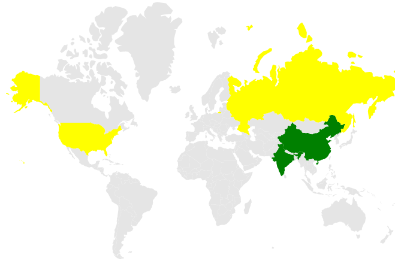

# Color Mapping in Blazor Maps Component

Color mapping customizes shape colors based on data values. It supports three types.

1. Range color mapping
2. Equal color mapping
3. Desaturation color mapping

To apply color mapping to map shapes, bind the data source to the [DataSource](https://help.syncfusion.com/cr/blazor/Syncfusion.Blazor.Maps.MapsLayer-1.html#Syncfusion_Blazor_Maps_MapsLayer_1_DataSource) property of [MapsLayer](https://help.syncfusion.com/cr/blazor/Syncfusion.Blazor.Maps.MapsLayer-1.html), and set the field that contains the color value to the [ColorValuePath](https://help.syncfusion.com/cr/blazor/Syncfusion.Blazor.Maps.MapsShapeSettings.html#Syncfusion_Blazor_Maps_MapsShapeSettings_ColorValuePath) property.

## Types of color mapping

### Range color mapping

Range color mapping applies colors to map shapes whose numeric values fall within the given color mapping ranges. The [StartRange](https://help.syncfusion.com/cr/blazor/Syncfusion.Blazor.Maps.MapsColorMapping.html#Syncfusion_Blazor_Maps_MapsColorMapping_StartRange) and [EndRange](https://help.syncfusion.com/cr/blazor/Syncfusion.Blazor.Maps.MapsColorMapping.html#Syncfusion_Blazor_Maps_MapsColorMapping_EndRange) properties in [MapsShapeColorMapping](https://help.syncfusion.com/cr/blazor/Syncfusion.Blazor.Maps.MapsShapeColorMapping.html) defines the color mapping ranges.

Bind the **PopulationDetails** data to the [DataSource](https://help.syncfusion.com/cr/blazor/Syncfusion.Blazor.Maps.MapsLayer-1.html#Syncfusion_Blazor_Maps_MapsLayer_1_DataSource) property of [MapsLayer](https://help.syncfusion.com/cr/blazor/Syncfusion.Blazor.Maps.MapsLayer-1.html) and set the [ColorValuePath](https://help.syncfusion.com/cr/blazor/Syncfusion.Blazor.Maps.MapsShapeSettings.html#Syncfusion_Blazor_Maps_MapsShapeSettings_ColorValuePath) property of [MapsShapeSettings](https://help.syncfusion.com/cr/blazor/Syncfusion.Blazor.Maps.MapsShapeSettings.html) to **Density**. Configure range values using [StartRange](https://help.syncfusion.com/cr/blazor/Syncfusion.Blazor.Maps.MapsColorMapping.html#Syncfusion_Blazor_Maps_MapsColorMapping_StartRange) and [EndRange](https://help.syncfusion.com/cr/blazor/Syncfusion.Blazor.Maps.MapsColorMapping.html#Syncfusion_Blazor_Maps_MapsColorMapping_EndRange) properties in [MapsShapeColorMapping](https://help.syncfusion.com/cr/blazor/Syncfusion.Blazor.Maps.MapsShapeColorMapping.html).

```cshtml

@using Syncfusion.Blazor.Maps

<SfMaps>
    <MapsLayers>
        <MapsLayer ShapeData='new {dataOptions ="https://cdn.syncfusion.com/maps/map-data/world-map.json"}' DataSource="PopulationDetails"
		    ShapeDataPath="Name" ShapePropertyPath='new string[] {"name"}' TValue="PopulationDetail">
            @* To apply color based on density range *@
            <MapsShapeSettings Fill="#E5E5E5" ColorValuePath="Density">
                <MapsShapeColorMappings>
                    <MapsShapeColorMapping StartRange="0.00001" EndRange="100" Color='new string[] {"yellow"}' />
                    <MapsShapeColorMapping StartRange="100" EndRange="400" Color='new string[] {"green"}' />
                </MapsShapeColorMappings>
            </MapsShapeSettings>
        </MapsLayer>
    </MapsLayers>
</SfMaps>

@code {
    public class PopulationDetail
    {
        public string Code { get; set; }
        public double Value { get; set; }
        public string Name { get; set; }
        public double Population { get; set; }
        public double Density { get; set; }
    };

    public List<PopulationDetail> PopulationDetails = new List<PopulationDetail> {
       new PopulationDetail
       {
           Code = "US", Value = 34, Name ="United States", Population = 325020000, Density = 33
       },
       new PopulationDetail
       {
           Code ="RU", Value = 9, Name = "Russia", Population = 142905208, Density = 8.3
       },
       new PopulationDetail
       {
           Code = "In", Value = 384, Name = "India", Population = 1198003000, Density = 364
       },
       new PopulationDetail
       {
           Code = "CN", Value = 143, Name = "China", Population = 1389750000,Density = 144
       }
    };
}

```



### Equal color mapping

Equal color mapping applies colors when the [Value](https://help.syncfusion.com/cr/blazor/Syncfusion.Blazor.Maps.MapsColorMapping.html#Syncfusion_Blazor_Maps_MapsColorMapping_Value) property of [MapsShapeColorMapping](https://help.syncfusion.com/cr/blazor/Syncfusion.Blazor.Maps.MapsShapeColorMapping.html) matches a corresponding value in the data source.

The following example highlights permanent and non-permanent members of the UN Security Council in 2017. Bind **CouncilMemberDetails** to the [DataSource](https://help.syncfusion.com/cr/blazor/Syncfusion.Blazor.Maps.MapsLayer-1.html#Syncfusion_Blazor_Maps_MapsLayer_1_DataSource) property of [MapsLayer](https://help.syncfusion.com/cr/blazor/Syncfusion.Blazor.Maps.MapsLayer-1.html) and set [ColorValuePath](https://help.syncfusion.com/cr/blazor/Syncfusion.Blazor.Maps.MapsShapeSettings.html#Syncfusion_Blazor_Maps_MapsShapeSettings_ColorValuePath) property of [MapsShapeSettings](https://help.syncfusion.com/cr/blazor/Syncfusion.Blazor.Maps.MapsShapeSettings.html) to **Membership**. Configure [Value](https://help.syncfusion.com/cr/blazor/Syncfusion.Blazor.Maps.MapsColorMapping.html#Syncfusion_Blazor_Maps_MapsColorMapping_Value) property as **Permanent** and **Non-Permanent** in separate mappings. When the value specified by [ColorValuePath](https://help.syncfusion.com/cr/blazor/Syncfusion.Blazor.Maps.MapsShapeSettings.html#Syncfusion_Blazor_Maps_MapsShapeSettings_ColorValuePath) property matches with the corresponding field name in the data source, the corresponding color is applied.

```cshtml

@using Syncfusion.Blazor.Maps

<SfMaps>
    <MapsLayers>
        <MapsLayer ShapeData='new {dataOptions ="https://cdn.syncfusion.com/maps/map-data/world-map.json"}' DataSource="CouncilMemberDetails" ShapeDataPath="Country" ShapePropertyPath='new string[] {"name"}' TValue="UNCouncil">
            @* To apply color based on membership type *@
            <MapsShapeSettings Fill="#E5E5E5" ColorValuePath="Membership">
                <MapsShapeColorMappings>
                    <MapsShapeColorMapping Value="Permanent" Color='new string[] {"#D84444"}' />
                    <MapsShapeColorMapping Value="Non-Permanent" Color='new string[] {"#316DB5"}' />
                </MapsShapeColorMappings>
            </MapsShapeSettings>
        </MapsLayer>
    </MapsLayers>
</SfMaps>

@code {
    public class UNCouncil
    {
        public string Country { get; set; }
        public string Membership { get; set; }
    };

    public List<UNCouncil> CouncilMemberDetails = new List<UNCouncil> {
        new UNCouncil { Country = "China", Membership = "Permanent" },
        new UNCouncil { Country = "France", Membership = "Permanent" },
        new UNCouncil { Country = "Russia", Membership = "Permanent" },
        new UNCouncil { Country = "Kazakhstan", Membership = "Non-Permanent" },
        new UNCouncil { Country = "Poland", Membership = "Non-Permanent" },
        new UNCouncil { Country = "Sweden", Membership = "Non-Permanent" }
    };
}

```


### Desaturation color mapping

Desaturation color mapping works like range color mapping, but applies opacity based on [MinOpacity](https://help.syncfusion.com/cr/blazor/Syncfusion.Blazor.Maps.MapsColorMapping.html#Syncfusion_Blazor_Maps_MapsColorMapping_MinOpacity) and [MaxOpacity](https://help.syncfusion.com/cr/blazor/Syncfusion.Blazor.Maps.MapsColorMapping.html#Syncfusion_Blazor_Maps_MapsColorMapping_MaxOpacity) properties in [MapsShapeColorMapping](https://help.syncfusion.com/cr/blazor/Syncfusion.Blazor.Maps.MapsShapeColorMapping.html).

N>The following example applies desaturation color mapping to shapes using the **PopulationDetails** data from the [Range color mapping](#range-color-mapping) section.

Bind **PopulationDetails** to the [DataSource](https://help.syncfusion.com/cr/blazor/Syncfusion.Blazor.Maps.MapsLayer-1.html#Syncfusion_Blazor_Maps_MapsLayer_1_DataSource) property of [MapsLayer](https://help.syncfusion.com/cr/blazor/Syncfusion.Blazor.Maps.MapsLayer-1.html) and set [ColorValuePath](https://help.syncfusion.com/cr/blazor/Syncfusion.Blazor.Maps.MapsShapeSettings.html#Syncfusion_Blazor_Maps_MapsShapeSettings_ColorValuePath) property of [MapsShapeSettings](https://help.syncfusion.com/cr/blazor/Syncfusion.Blazor.Maps.MapsShapeSettings.html) to **Density**. Configure the range using [StartRange](https://help.syncfusion.com/cr/blazor/Syncfusion.Blazor.Maps.MapsColorMapping.html#Syncfusion_Blazor_Maps_MapsColorMapping_StartRange) and [EndRange](https://help.syncfusion.com/cr/blazor/Syncfusion.Blazor.Maps.MapsColorMapping.html#Syncfusion_Blazor_Maps_MapsColorMapping_EndRange) properties in [MapsShapeColorMapping](https://help.syncfusion.com/cr/blazor/Syncfusion.Blazor.Maps.MapsShapeColorMapping.html).

```cshtml

@using Syncfusion.Blazor.Maps

<SfMaps>
    <MapsLayers>
        <MapsLayer ShapeData='new {dataOptions ="https://cdn.syncfusion.com/maps/map-data/world-map.json"}' DataSource="PopulationDetails" ShapeDataPath="Name" ShapePropertyPath='new string[] {"name"}' TValue="PopulationDetail">
            <MapsShapeSettings Fill="#E5E5E5" ColorValuePath="Density">
                <MapsShapeColorMappings>
                    <MapsShapeColorMapping StartRange="100" EndRange="400" Color='new string[] {"blue"}' MinOpacity="0.3" MaxOpacity="1" />
                </MapsShapeColorMappings>
            </MapsShapeSettings>
        </MapsLayer>
    </MapsLayers>
</SfMaps>

```


## Multiple colors for a single shape

Multiple colors can be added to color mapping to create a gradient effect for specific shapes based on ranges in the data source. Using the [Color](https://help.syncfusion.com/cr/blazor/Syncfusion.Blazor.Maps.MapsColorMapping.html#Syncfusion_Blazor_Maps_MapsColorMapping_Color) property of [MapsShapeColorMapping](https://help.syncfusion.com/cr/blazor/Syncfusion.Blazor.Maps.MapsShapeColorMapping.html), multiple colors can be assigned to shapes as a gradient.

N>The following example demonstrates multiple colors in color mapping using the **PopulationDetails** data from the [Range color mapping](#range-color-mapping) section.

Bind **PopulationDetails** to the [DataSource](https://help.syncfusion.com/cr/blazor/Syncfusion.Blazor.Maps.MapsLayer-1.html#Syncfusion_Blazor_Maps_MapsLayer_1_DataSource) property of [MapsLayer](https://help.syncfusion.com/cr/blazor/Syncfusion.Blazor.Maps.MapsLayer-1.html) and set [ColorValuePath](https://help.syncfusion.com/cr/blazor/Syncfusion.Blazor.Maps.MapsShapeSettings.html#Syncfusion_Blazor_Maps_MapsShapeSettings_ColorValuePath) property of [MapsShapeSettings](https://help.syncfusion.com/cr/blazor/Syncfusion.Blazor.Maps.MapsShapeSettings.html) to **Density**. Configure the range values using [StartRange](https://help.syncfusion.com/cr/blazor/Syncfusion.Blazor.Maps.MapsColorMapping.html#Syncfusion_Blazor_Maps_MapsColorMapping_StartRange) and [EndRange](https://help.syncfusion.com/cr/blazor/Syncfusion.Blazor.Maps.MapsColorMapping.html#Syncfusion_Blazor_Maps_MapsColorMapping_EndRange) properties in [MapsShapeColorMapping](https://help.syncfusion.com/cr/blazor/Syncfusion.Blazor.Maps.MapsShapeColorMapping.html).

```cshtml

@using Syncfusion.Blazor.Maps

<SfMaps>
    <MapsLayers>
        <MapsLayer ShapeData='new {dataOptions ="https://cdn.syncfusion.com/maps/map-data/world-map.json"}'
                   DataSource="PopulationDetails" ShapeDataPath="Name" ShapePropertyPath='new string[] {"name"}' TValue="PopulationDetail">
            <MapsShapeSettings Fill="#E5E5E5" ColorValuePath="Density">
                <MapsShapeColorMappings>
                    <MapsShapeColorMapping StartRange="0.00001" EndRange="50" Color='new string[] { "red", "blue"}' />
                    <MapsShapeColorMapping StartRange="50" EndRange="400" Color='new string[] { "green", "yellow"}' />
                </MapsShapeColorMappings>
            </MapsShapeSettings>
        </MapsLayer>
    </MapsLayers>
</SfMaps>

```


## Color for items excluded from color mapping

Color mapping can also define a color for shapes that do not match range or equal-value criteria by using the [Color](https://help.syncfusion.com/cr/blazor/Syncfusion.Blazor.Maps.MapsColorMapping.html#Syncfusion_Blazor_Maps_MapsColorMapping_Color) property of [MapsShapeColorMapping](https://help.syncfusion.com/cr/blazor/Syncfusion.Blazor.Maps.MapsShapeColorMapping.html).

N>The following example shows how to set a color for items excluded from color mapping using the **PopulationDetails** data from the [Range color mapping](#range-color-mapping) section.

In the following example, color mapping is configured for the range 0 to 300. If any records fall outside this range, the mapping is not applied. To color these excluded items, set only the [Color](https://help.syncfusion.com/cr/blazor/Syncfusion.Blazor.Maps.MapsColorMapping.html#Syncfusion_Blazor_Maps_MapsColorMapping_Color) property in [MapsShapeColorMapping](https://help.syncfusion.com/cr/blazor/Syncfusion.Blazor.Maps.MapsShapeColorMapping.html).

```cshtml

@using Syncfusion.Blazor.Maps

<SfMaps>
    <MapsLayers>
        <MapsLayer ShapeData='new {dataOptions ="https://cdn.syncfusion.com/maps/map-data/world-map.json"}' DataSource="PopulationDetails" ShapeDataPath="Name" ShapePropertyPath='new string[] {"name"}' TValue="PopulationDetail">
            <MapsShapeSettings Fill="#E5E5E5" ColorValuePath="Density">
                <MapsShapeColorMappings>
                    <MapsShapeColorMapping StartRange="0.00001" EndRange="100" Color='new string[] {"orange"}' />
                    <MapsShapeColorMapping StartRange="100" EndRange="300" Color='new string[] {"blue"}' />
                    @* To apply color for excluded items *@
                    <MapsShapeColorMapping Color='new string[] {"green"}' />
                </MapsShapeColorMappings>
            </MapsShapeSettings>
        </MapsLayer>
    </MapsLayers>
</SfMaps>

```


## Color mapping for bubbles

Range, equal, and desaturation color mapping types are also supported for bubbles. To apply color mapping to bubbles, bind the data source to the [DataSource](https://help.syncfusion.com/cr/blazor/Syncfusion.Blazor.Maps.MapsBubble-1.html#Syncfusion_Blazor_Maps_MapsBubble_1_DataSource) property of [MapsBubble](https://help.syncfusion.com/cr/blazor/Syncfusion.Blazor.Maps.MapsBubble-1.html) and set the field that contains the color value to [ColorValuePath](https://help.syncfusion.com/cr/blazor/Syncfusion.Blazor.Maps.MapsBubble-1.html#Syncfusion_Blazor_Maps_MapsBubble_1_ColorValuePath) property. Multiple colors for a single set of bubbles and colors for excluded items using [MapsBubbleColorMapping](https://help.syncfusion.com/cr/blazor/Syncfusion.Blazor.Maps.MapsBubbleColorMapping.html) are also supported.

```cshtml

@using Syncfusion.Blazor.Maps

<SfMaps>
    <MapsLayers>
        <MapsLayer ShapeData='new {dataOptions ="https://cdn.syncfusion.com/maps/map-data/world-map.json"}'
		        ShapeDataPath="Name" ShapePropertyPath='new string[] {"name"}' TValue="BubbleData">
        <MapsShapeSettings Fill="#E5E5E5"/>
            <MapsBubbleSettings>
                <MapsBubble Visible="true" ValuePath="Population" ColorValuePath="Population" MinRadius=5 DataSource="BubbleColorMapping"
			        TValue="BubbleData">
                    <MapsBubbleColorMappings>
                        <MapsBubbleColorMapping Value="38332521" Color='new string[] {"#D84444"}' />
                        <MapsBubbleColorMapping Value="19651127" Color='new string[] {"#316DB5"}' />
                        <MapsBubbleColorMapping Value="3090416" Color='new string[] {"blue"}' />
                    </MapsBubbleColorMappings>
                </MapsBubble>
            </MapsBubbleSettings>
        </MapsLayer>
    </MapsLayers>
</SfMaps>

@code {
    public class BubbleData
    {
        public string Name { get; set; }
        public string Population { get; set; }
    };

    public List<BubbleData> BubbleColorMapping = new List<BubbleData>{
        new BubbleData { Name = "India", Population = "38332521" },
        new BubbleData { Name = "Russia", Population = "19651127" },
        new BubbleData { Name = "Pakistan", Population = "3090416"}
    };
}

```


