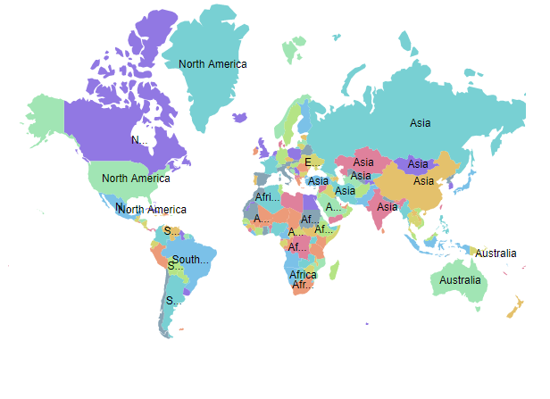
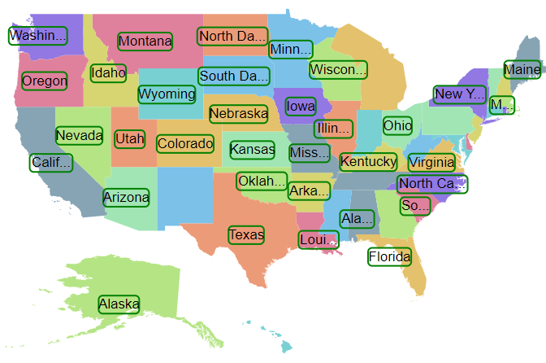
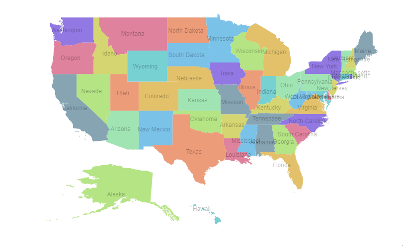
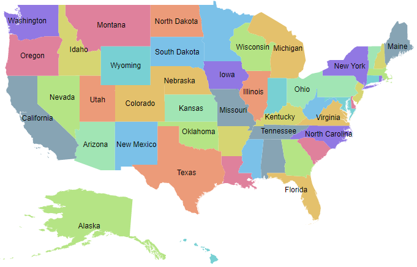
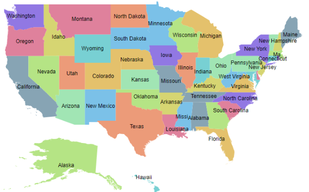
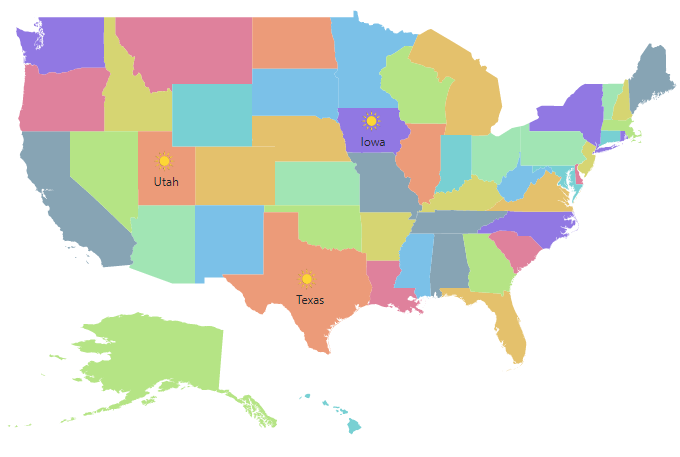

# Data labels in Blazor Maps Component

Data labels display text for shapes in the Maps component. Enable them by setting the [Visible](https://help.syncfusion.com/cr/blazor/Syncfusion.Blazor.Maps.MapsDataLabelSettings.html#Syncfusion_Blazor_Maps_MapsDataLabelSettings_Visible) property of [MapsDataLabelSettings](https://help.syncfusion.com/cr/blazor/Syncfusion.Blazor.Maps.MapsDataLabelSettings.html) to **true**.

## Adding data labels

Use the [LabelPath](https://help.syncfusion.com/cr/blazor/Syncfusion.Blazor.Maps.MapsDataLabelSettings.html#Syncfusion_Blazor_Maps_MapsDataLabelSettings_LabelPath) property of [MapsDataLabelSettings](https://help.syncfusion.com/cr/blazor/Syncfusion.Blazor.Maps.MapsDataLabelSettings.html) to specify the field used for label text. The value can come from a field in the shape data or from the layer’s data source. In the following example, the [LabelPath](https://help.syncfusion.com/cr/blazor/Syncfusion.Blazor.Maps.MapsDataLabelSettings.html#Syncfusion_Blazor_Maps_MapsDataLabelSettings_LabelPath) property value is taken from the shape data of the Maps layer.

```cshtml

@using Syncfusion.Blazor.Maps

<SfMaps>
    <MapsLayers>
        <MapsLayer ShapeData='new {dataOptions= "https://cdn.syncfusion.com/maps/map-data/usa.json"}' TValue="string">
            @* To add data labels *@
            <MapsDataLabelSettings Visible="true" LabelPath="name"></MapsDataLabelSettings>
            <MapsShapeSettings Autofill="true"></MapsShapeSettings>
        </MapsLayer>
    </MapsLayers>
</SfMaps>

```


In the following example, the [LabelPath](https://help.syncfusion.com/cr/blazor/Syncfusion.Blazor.Maps.MapsDataLabelSettings.html#Syncfusion_Blazor_Maps_MapsDataLabelSettings_LabelPath) property value is taken from the field in the layer’s data source.

```cshtml

@using Syncfusion.Blazor.Maps

<SfMaps ID="Maps">
    <MapsLayers>
        <MapsLayer ShapeData='new {dataOptions= "https://cdn.syncfusion.com/maps/map-data/world-map.json"}' TValue="PopulationDetail"
                   DataSource="PopulationDetails" ShapeDataPath="@ShapeDataPath" ShapePropertyPath="@ShapePropertyPath">
            @* To add data labels *@
            <MapsDataLabelSettings Visible="true" LabelPath="Continent"></MapsDataLabelSettings>
            <MapsShapeSettings Autofill="true"></MapsShapeSettings>
        </MapsLayer>
    </MapsLayers>
</SfMaps>

@code {
    public string[] ShapePropertyPath = { "name" };
    public string ShapeDataPath = "Name";

    public class PopulationDetail
    {
        public string Code { get; set; }
        public double Value { get; set; }
        public string Name { get; set; }
        public double Population { get; set; }
        public double Density { get; set; }
        public string Color { get; set; }
        public string Continent { get; set; }
    };

    public List<PopulationDetail> PopulationDetails = new List<PopulationDetail> {
        new PopulationDetail {
            Code = "AF", Value = 53, Name = "Afghanistan", Population = 29863010, Density = 119, Color = "Red", Continent = "Asia"
        },
        new PopulationDetail {
            Code = "AL", Value = 117, Name = "Albania", Population = 3195000, Density = 111, Color = "Blue", Continent = "Europe"
        },
        new PopulationDetail {
            Code = "DZ", Value = 15, Name = "Algeria", Population = 34895000, Density = 15, Color = "Green", Continent = "Africa"
        }
    };
}
```



## Customization

The following options in [MapsDataLabelSettings](https://help.syncfusion.com/cr/blazor/Syncfusion.Blazor.Maps.MapsDataLabelSettings.html) customize the appearance of data labels:

- [MapsLayerDataLabelBorder](https://help.syncfusion.com/cr/blazor/Syncfusion.Blazor.Maps.MapsLayerDataLabelBorder.html): Configures label border color and width.
- [Fill](https://help.syncfusion.com/cr/blazor/Syncfusion.Blazor.Maps.MapsDataLabelSettings.html#Syncfusion_Blazor_Maps_MapsDataLabelSettings_Fill): Sets the label background color.
- [Opacity](https://help.syncfusion.com/cr/blazor/Syncfusion.Blazor.Maps.MapsDataLabelSettings.html#Syncfusion_Blazor_Maps_MapsDataLabelSettings_Opacity): Controls label transparency.
- [MapsLayerDataLabelTextStyle](https://help.syncfusion.com/cr/blazor/Syncfusion.Blazor.Maps.MapsLayerDataLabelTextStyle.html): Configures label text style.

```cshtml

@using Syncfusion.Blazor.Maps

<SfMaps>
    <MapsLayers>
        <MapsLayer ShapeData='new {dataOptions= "https://cdn.syncfusion.com/maps/map-data/usa.json"}' TValue="string">
            @* To add data labels *@
            <MapsDataLabelSettings Visible="true" LabelPath="name" Fill="red" Opacity="0.9">
                <MapsLayerDataLabelBorder Color="green" Width="2"></MapsLayerDataLabelBorder>
                <MapsLayerDataLabelTextStyle Color="blue" Size="12px" FontStyle="Sans-serif" FontWeight="normal">
                </MapsLayerDataLabelTextStyle>
            </MapsDataLabelSettings>
            <MapsShapeSettings Autofill="true"></MapsShapeSettings>
        </MapsLayer>
    </MapsLayers>
</SfMaps>

```



## Label animation

Animate data labels on initial render by setting the [AnimationDuration](https://help.syncfusion.com/cr/blazor/Syncfusion.Blazor.Maps.MapsDataLabelSettings.html#Syncfusion_Blazor_Maps_MapsDataLabelSettings_AnimationDuration) property in `MapsDataLabelSettings`. The duration is specified in milliseconds.

```cshtml

@using Syncfusion.Blazor.Maps

<SfMaps>
    <MapsLayers>
        <MapsLayer ShapeData='new {dataOptions= "https://cdn.syncfusion.com/maps/map-data/usa.json"}' TValue="string">
            @* To add data labels *@
            <MapsDataLabelSettings Visible="true" LabelPath="name" AnimationDuration="5000"></MapsDataLabelSettings>
            <MapsShapeSettings Autofill="true"></MapsShapeSettings>
            <MapsLayerTooltipSettings Visible="true" ValuePath="name"></MapsLayerTooltipSettings>
        </MapsLayer>
    </MapsLayers>
</SfMaps>

```



## Smart labels

Handle labels that intersect shape borders by using the [SmartLabelMode](https://help.syncfusion.com/cr/blazor/Syncfusion.Blazor.Maps.MapsDataLabelSettings.html#Syncfusion_Blazor_Maps_MapsDataLabelSettings_SmartLabelMode) property. Available options:

- None
- Hide
- Trim

```cshtml

@using Syncfusion.Blazor.Maps

<SfMaps>
    <MapsLayers>
        <MapsLayer ShapeData='new {dataOptions= "https://cdn.syncfusion.com/maps/map-data/usa.json"}' TValue="string">
            @* To hide intersect labels with shape border *@
            <MapsDataLabelSettings Visible="true" LabelPath="name" SmartLabelMode="SmartLabelMode.Hide">
            </MapsDataLabelSettings>
            <MapsShapeSettings Autofill="true"></MapsShapeSettings>
        </MapsLayer>
    </MapsLayers>
</SfMaps>

```



## Intersect action

Handle labels that intersect with other labels by using the [IntersectionAction](https://help.syncfusion.com/cr/blazor/Syncfusion.Blazor.Maps.MapsDataLabelSettings.html#Syncfusion_Blazor_Maps_MapsDataLabelSettings_IntersectionAction) property. Available options:

- None
- Hide
- Trim
```cshtml

@using Syncfusion.Blazor.Maps

<SfMaps>
    <MapsLayers>
        <MapsLayer ShapeData='new {dataOptions= "https://cdn.syncfusion.com/maps/map-data/usa.json"}' TValue="string">
            @* To trim intersect labels *@
            <MapsDataLabelSettings Visible="true" LabelPath="name" IntersectionAction="IntersectAction.Trim">
            </MapsDataLabelSettings>
            <MapsShapeSettings Autofill="true"></MapsShapeSettings>
        </MapsLayer>
    </MapsLayers>
</SfMaps>

```



## Adding data label as a template

Add data labels using a template by setting the [LabelTemplate](https://help.syncfusion.com/cr/blazor/Syncfusion.Blazor.Maps.MapsDataLabelSettings.html#Syncfusion_Blazor_Maps_MapsDataLabelSettings_LabelTemplate) property of [MapsDataLabelSettings](https://help.syncfusion.com/cr/blazor/Syncfusion.Blazor.Maps.MapsDataLabelSettings.html). Any text or HTML element can be used within the template.

N> The data label customization properties [SmartLabelMode](https://help.syncfusion.com/cr/blazor/Syncfusion.Blazor.Maps.MapsDataLabelSettings.html#Syncfusion_Blazor_Maps_MapsDataLabelSettings_SmartLabelMode), [AnimationDuration](https://help.syncfusion.com/cr/blazor/Syncfusion.Blazor.Maps.MapsDataLabelSettings.html#Syncfusion_Blazor_Maps_MapsDataLabelSettings_AnimationDuration), and [IntersectionAction](https://help.syncfusion.com/cr/blazor/Syncfusion.Blazor.Maps.MapsDataLabelSettings.html#Syncfusion_Blazor_Maps_MapsDataLabelSettings_IntersectionAction) do not apply to [LabelTemplate](https://help.syncfusion.com/cr/blazor/Syncfusion.Blazor.Maps.MapsDataLabelSettings.html#Syncfusion_Blazor_Maps_MapsDataLabelSettings_LabelTemplate). Style the template using CSS on the template elements.

```cshtml

@using Syncfusion.Blazor.Maps

<SfMaps>
    <MapsLayers>
        <MapsLayer ShapeData='new {dataOptions= "https://cdn.syncfusion.com/maps/map-data/world-map.json"}' TValue="PopulationDetail"
                   DataSource="PopulationDetails" ShapeDataPath="@ShapeDataPath" ShapePropertyPath="@ShapePropertyPath">
            <MapsDataLabelSettings Visible="true">
                <LabelTemplate>
                    @{
                        var Data = context as PopulationDetail;
                        <div style="width:50px; height:20px;border: 2px solid black; text-align:center;">
                            <p style="color:red; font-size:12px;">@Data.Continent</p>
                        </div>
                    }
                </LabelTemplate>
            </MapsDataLabelSettings>
        </MapsLayer>
    </MapsLayers>
</SfMaps>

@code {
    public string[] ShapePropertyPath = { "name" };
    public string ShapeDataPath = "Name";

    public class PopulationDetail
    {
        public string Code { get; set; }
        public double Value { get; set; }
        public string Name { get; set; }
        public double Population { get; set; }
        public double Density { get; set; }
        public string Color { get; set; }
        public string Continent { get; set; }
    };

    public List<PopulationDetail> PopulationDetails = new List<PopulationDetail> {
        new PopulationDetail { Code = "AF", Value = 53, Name = "Afghanistan", Population = 29863010, Density = 119, Color = "Red", Continent = "Asia" },
        new PopulationDetail { Code = "AL", Value = 117, Name = "Albania", Population = 3195000, Density = 111, Color = "Blue", Continent = "Europe" },
        new PopulationDetail { Code = "DZ", Value = 15, Name = "Algeria", Population = 34895000, Density = 15, Color = "Green", Continent = "Africa" }
    };
}

```


