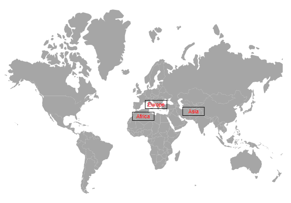

# Data labels in Blazor Maps Component

Data labels provide information to users about the shapes of the Maps component. It can be enabled by setting the [Visible](https://help.syncfusion.com/cr/blazor/Syncfusion.Blazor.Maps.MapsDataLabelSettings.html#Syncfusion_Blazor_Maps_MapsDataLabelSettings_Visible) property of the [MapsDataLabelSettings](https://help.syncfusion.com/cr/blazor/Syncfusion.Blazor.Maps.MapsDataLabelSettings.html) to **true**.

## Adding data labels

To display the data labels in the Maps, set the field name containing the text to be displayed from the data source or shape data in the [LabelPath](https://help.syncfusion.com/cr/blazor/Syncfusion.Blazor.Maps.MapsDataLabelSettings.html#Syncfusion_Blazor_Maps_MapsDataLabelSettings_LabelPath) property of the `DataLabelSettings` property.

In the following example, the value of `LabelPath` property is set from the field name in the shape data of the Maps layer.

```cshtml
@using Syncfusion.Blazor.Maps

<SfMaps>
    <MapsLayers>
        <MapsLayer ShapeData='new {dataOptions= "https://cdn.syncfusion.com/maps/map-data/usa.json"}' TValue="string">
            @* To add data labels *@
            <MapsDataLabelSettings Visible="true" LabelPath="name"></MapsDataLabelSettings>
            <MapsShapeSettings Autofill="true"></MapsShapeSettings>
        </MapsLayer>
    </MapsLayers>
</SfMaps>
```


In the following example, the value of `LabelPath` property is set from the field name in the data source of the layer settings.

```cshtml
@using Syncfusion.Blazor.Maps

<SfMaps ID="Maps">
    <MapsLayers>
        <MapsLayer ShapeData='new {dataOptions= "https://cdn.syncfusion.com/maps/map-data/world-map.json"}' TValue="PopulationDetail"
                   DataSource="PopulationDetailss" ShapeDataPath="@ShapeDataPath" ShapePropertyPath="@ShapePropertyPath">
            @* To add data labels *@
            <MapsDataLabelSettings Visible="true" LabelPath="Continent"></MapsDataLabelSettings>
            <MapsShapeSettings Autofill="true"></MapsShapeSettings>
        </MapsLayer>
    </MapsLayers>
</SfMaps>

@code{
    public class PopulationDetail
    {
        public string Code { get; set; }
        public double Value { get; set; }
        public string Name { get; set; }
        public double Population { get; set; }
        public double Density { get; set; }
        public string Color { get; set; }
        public string Continent { get; set; }
    };
    public List<PopulationDetail> PopulationDetailss = new List<PopulationDetail> {
        new PopulationDetail {
            Code = "AF", Value= 53, Name= "Afghanistan", Population= 29863010, Density= 119, Color = "Red", Continent = "Asia"
        },
        new PopulationDetail {
            Code= "AL", Value= 117, Name= "Albania", Population= 3195000, Density= 111, Color = "Blue", Continent = "Europe"
        },
        new PopulationDetail {
            Code= "DZ", Value= 15, Name= "Algeria", Population= 34895000, Density= 15, Color = "Green", Continent = "Africa"
        }
    };
    public string[] ShapePropertyPath = { "name" };
    public string ShapeDataPath = "Name";
}
```


## Customization

The following properties and classes are available in the `MapsDataLabelSettings` to customize the data label of the Maps component.

* [MapsLayerDataLabelBorder](https://help.syncfusion.com/cr/blazor/Syncfusion.Blazor.Maps.MapsLayerDataLabelBorder.html) - To customize the color, width and opacity for the border of the data labels in Maps.
* [Fill](https://help.syncfusion.com/cr/blazor/Syncfusion.Blazor.Maps.MapsDataLabelSettings.html#Syncfusion_Blazor_Maps_MapsDataLabelSettings_Fill) - To apply the color of the data labels in Maps.
* [Opacity](https://help.syncfusion.com/cr/blazor/Syncfusion.Blazor.Maps.MapsDataLabelSettings.html#Syncfusion_Blazor_Maps_MapsDataLabelSettings_Opacity) - To customize the transparency of the data labels in Maps.
* [MapsLayerDataLabelTextStyle](https://help.syncfusion.com/cr/blazor/Syncfusion.Blazor.Maps.MapsLayerDataLabelTextStyle.html) - To customize the text style of the data labels in Maps.

```cshtml
@using Syncfusion.Blazor.Maps

<SfMaps>
    <MapsLayers>
        <MapsLayer ShapeData='new {dataOptions= "https://cdn.syncfusion.com/maps/map-data/usa.json"}' TValue="string">
            @* To add data labels *@
            <MapsDataLabelSettings SmartLabelMode="SmartLabelMode.Trim" IntersectionAction="IntersectAction.Hide" Visible="true" LabelPath="name" Fill="transparent" Opacity="0.9">
                <MapsLayerDataLabelBorder Color="green" Width="2"></MapsLayerDataLabelBorder>
                <MapsLayerDataLabelTextStyle Size="17px" FontStyle="Sans-serif" FontWeight="normal">
                </MapsLayerDataLabelTextStyle>
            </MapsDataLabelSettings>
            <MapsLayerTooltipSettings Visible="true" ValuePath="name">
            </MapsLayerTooltipSettings>
            <MapsShapeSettings Autofill="true"></MapsShapeSettings>
        </MapsLayer>
    </MapsLayers>
</SfMaps>
```


## Smart labels

The Maps component provides an option to handle the labels when they intersect with the corresponding shape borders using the [SmartLabelMode](https://help.syncfusion.com/cr/blazor/Syncfusion.Blazor.Maps.MapsDataLabelSettings.html#Syncfusion_Blazor_Maps_MapsDataLabelSettings_SmartLabelMode) property. The following options are available in the `SmartLabelMode` property.

* **None** -  It specifies that no action is taken, when a label exceeds the shape's region.
* **Hide** -  It specifies to hide the labels, when it exceeds the shape's region.
* **Trim** -  It specifies to trim the labels, when it exceeds the shape's region.

```cshtml
@using Syncfusion.Blazor.Maps

<SfMaps>
    <MapsLayers>
        <MapsLayer ShapeData='new {dataOptions= "https://cdn.syncfusion.com/maps/map-data/usa.json"}' TValue="string">
            @* To hide intersect labels with shape border *@
            <MapsDataLabelSettings Visible="true" LabelPath="name" SmartLabelMode="SmartLabelMode.Hide">
            </MapsDataLabelSettings>
            <MapsShapeSettings Autofill="true"></MapsShapeSettings>
        </MapsLayer>
    </MapsLayers>
</SfMaps>
```


## Intersect action

The Maps component provides an option to handle the labels when a label intersects with another label using the [IntersectionAction](https://help.syncfusion.com/cr/blazor/Syncfusion.Blazor.Maps.MapsDataLabelSettings.html#Syncfusion_Blazor_Maps_MapsDataLabelSettings_IntersectionAction) property. The following options are available in the `IntersectionAction` property.

* **None** -  It specifies that no action is taken, when the labels intersect.
* **Hide** -  It specifies to hide the labels when they intersect.
* **Trim** -  It specifies to trim the labels when they intersect.

```cshtml
@using Syncfusion.Blazor.Maps

<SfMaps>
    <MapsLayers>
        <MapsLayer ShapeData='new {dataOptions= "https://cdn.syncfusion.com/maps/map-data/usa.json"}' TValue="string">
            @* To trim intersect labels *@
            <MapsDataLabelSettings Visible="true" LabelPath="name" IntersectionAction="IntersectAction.Trim">
            </MapsDataLabelSettings>
            <MapsShapeSettings Autofill="true"></MapsShapeSettings>
        </MapsLayer>
    </MapsLayers>
</SfMaps>
```


## Adding data label as a template

Any HTML elements can be added as a template in the data labels by using the [LabelTemplate](https://help.syncfusion.com/cr/blazor/Syncfusion.Blazor.Maps.MapsDataLabelSettings.html#Syncfusion_Blazor_Maps_MapsDataLabelSettings_LabelTemplate) property of `DataLabelSettings` in the Maps component.

N>The properties of data label such as, `SmartLabelMode` , `IntersectionAction`, `Fill` and `Opacity` and classes such as `MapsLayerDataLabelBorder` and `MapsLayerDataLabelTextStyle` are not applicable to `LabelTemplate` property. The styles can be applied to the label template using the CSS styles of the HTML element.

```cshtml
@using Syncfusion.Blazor.Maps

<SfMaps>
    <MapsLayers>
        <MapsLayer ShapeData='new {dataOptions= "https://cdn.syncfusion.com/maps/map-data/usa.json"}' TValue="MarkerData"
                   DataSource="MarkerDataSource" ShapeDataPath="@ShapeDataPath" ShapePropertyPath="@ShapePropertyPath">
            <MapsDataLabelSettings Visible="true" LabelPath="Name">
                <LabelTemplate>
                    @{
                        var Data = context as MarkerData;
                        <div></div>
                        <div>@Data.Name</div>
                    }
                </LabelTemplate>
            </MapsDataLabelSettings>
            <MapsShapeSettings Autofill="true"></MapsShapeSettings>
        </MapsLayer>
    </MapsLayers>
</SfMaps>

@code {
    public class MarkerData
    {
        public string Name { get; set; }
        public double Population { get; set; }
    };
    public List<MarkerData> MarkerDataSource = new List<MarkerData> {
        new MarkerData {
            Name= "Iowa", Population= 29863010 
        },
        new MarkerData {
            Name= "Utah", Population= 1263010
        },
        new MarkerData {
            Name= "Texas", Population= 963010
        }
    };
    public string[] ShapePropertyPath = { "name" };
    public string ShapeDataPath = "Name";
}
```


