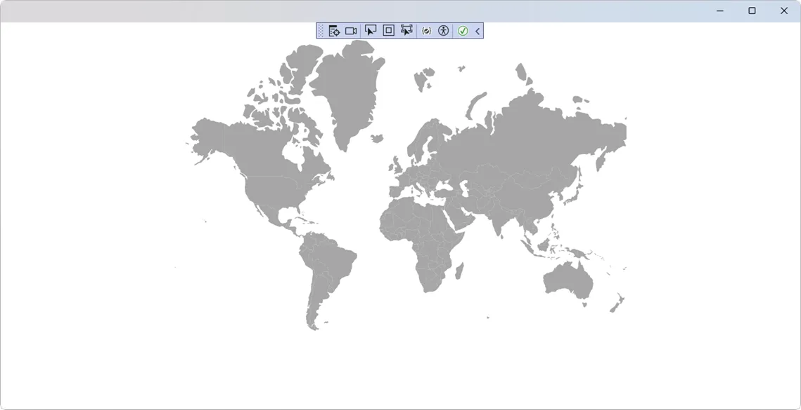
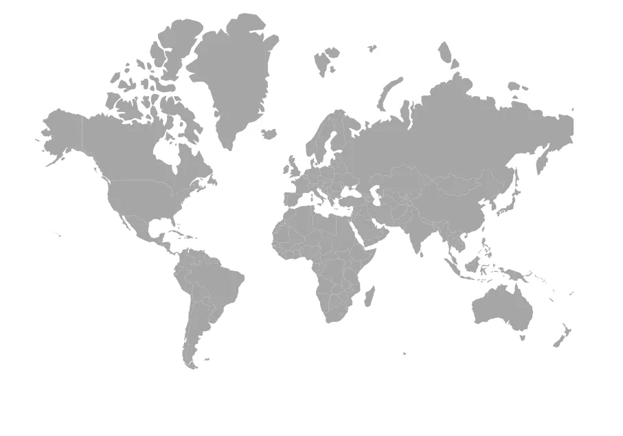

# Getting Started with Blazor Maps component in Blazor MAUI App

This section explains the step-by-step process of integrating the [Blazor Maps](https://www.syncfusion.com/blazor-components/blazor-map) component into your Blazor MAUI App using both [Visual Studio](https://visualstudio.microsoft.com/vs/) and [Visual Studio Code](https://code.visualstudio.com/).





## Prerequisites

To use the MAUI project templates, install the Mobile development with the .NET extension for Visual Studio. For more details, refer to [here](https://learn.microsoft.com/en-us/dotnet/MAUI/get-started/installation?tabs=vswin) or the [Syncfusion® Blazor Extension](https://blazor.syncfusion.com/documentation/visual-studio-integration/template-studio).

## Create a new Blazor MAUI App in Visual Studio

Create a Blazor MAUI App using Visual Studio via [Microsoft Templates](https://learn.microsoft.com/en-us/dotnet/maui/get-started/first-app?pivots=devices-windows&view=net-maui-9.0&tabs=vswin). For detailed instructions, refer to the [Blazor MAUI App Getting Started](https://blazor.syncfusion.com/documentation/getting-started/maui-blazor-app) documentation.





## Prerequisites

To use the MAUI project templates, install the Mobile development with the .NET extension for Visual Studio Code. For more details, refer to [here](https://learn.microsoft.com/en-us/dotnet/maui/get-started/installation?view=net-maui-9.0&tabs=visual-studio-code) or the [Syncfusion® Blazor Extension](https://blazor.syncfusion.com/documentation/visual-studio-code-integration/create-project).

## Create a new Blazor MAUI App in Visual Studio Code

Create a Blazor MAUI App using Visual Studio Code via [Microsoft Templates](https://learn.microsoft.com/en-us/dotnet/maui/get-started/first-app?pivots=devices-windows&view=net-maui-9.0&tabs=visual-studio-code) or the [Syncfusion® Blazor Extension](https://blazor.syncfusion.com/documentation/visual-studio-code-integration/create-project). For detailed instructions, refer to the [Blazor MAUI App Getting Started](https://blazor.syncfusion.com/documentation/getting-started/maui-blazor-app) documentation.

Alternatively, create a MAUI application using the following command in the integrated terminal (<kbd>Ctrl</kbd>+<kbd>`</kbd>).




dotnet new maui-blazor -o MauiBlazorApp
cd MauiBlazorApp








## Install required Blazor packages

Install the [Syncfusion.Blazor.Maps](https://www.nuget.org/packages/Syncfusion.Blazor.Maps) NuGet package in your project using the NuGet Package Manager in Visual Studio (*Tools → NuGet Package Manager → Manage NuGet Packages for Solution*), or the integrated terminal in Visual Studio Code (dotnet add package Syncfusion.Blazor.Maps --version {{ site.releaseversion }}).

Alternatively, run the following command in the Package Manager Console to achieve the same.




Install-Package Syncfusion.Blazor.Maps -Version {{ site.releaseversion }}




N> All Syncfusion Blazor packages are available on [nuget.org](https://www.nuget.org/packages?q=syncfusion.blazor). See the [NuGet packages](https://blazor.syncfusion.com/documentation/nuget-packages) topic for details.

## Add import namespaces

After the package is installed, open the **~/_Imports.razor** file and import the `Syncfusion.Blazor` and `Syncfusion.Blazor.Maps` namespaces.

N> The `~/` notation represents the root directory of your project. This file is typically located in your project's root folder.




@using Syncfusion.Blazor 
@using Syncfusion.Blazor.Maps




## Register Blazor service

Register the Blazor service in the **~/MauiProgram.cs** file. This step enables the Syncfusion components to work in your application.




....
using Syncfusion.Blazor;

....

public static class MauiProgram
{
    public static MauiApp CreateMauiApp()
    {
        ....
        builder.Services.AddSyncfusionBlazor();
        ....
    }
}




## Add script resources

The Syncfusion JavaScript library needs to be included in your application. The script can be accessed from NuGet through [Static Web Assets](https://blazor.syncfusion.com/documentation/common/adding-script-references#static-web-assets). Include the script reference in the **~/index.html** file (this is the root HTML file of your application).

```html

<script src="_content/Syncfusion.Blazor.Core/scripts/syncfusion-blazor.min.js" type="text/javascript"></script>

```

N> Check out the [Adding Script Reference](https://blazor.syncfusion.com/documentation/common/adding-script-references) topic to learn different approaches for adding script references in your Blazor application.

## Add Blazor Maps component with GeoJSON data

Add the Blazor Maps component in the **~/Pages/Home.razor** file. Bind GeoJSON data to the Maps to render any geometric shape in SVG (Scalable Vector Graphics) for powerful data visualization of shapes. You can use the [ShapeData](https://help.syncfusion.com/cr/blazor/Syncfusion.Blazor.Maps.MapsLayer-1.html#Syncfusion_Blazor_Maps_MapsLayer_1_ShapeData) property in [MapsLayer](https://help.syncfusion.com/cr/blazor/Syncfusion.Blazor.Maps.MapsLayer-1.html) to load the GeoJSON shape data into the Maps component.




@using Syncfusion.Blazor.Maps

<!-- SfMaps is the root container component for the maps -->
<SfMaps>
    <!-- MapsLayers contains one or more map layers to display on the map -->
    <MapsLayers>
        <!-- MapsLayer defines a map layer with shape data and configuration -->
        <MapsLayer ShapeData='new {dataOptions= "https://cdn.syncfusion.com/maps/map-data/world-map.json"}' TValue="string">
        </MapsLayer>
    </MapsLayers>
</SfMaps>




N> The "world-map.json" file contains the World map GeoJSON data.

### How to run the sample on Windows

Run the sample in Windows Machine mode, and it will run Blazor MAUI in Windows.



### How to run the sample on Android

To run the Blazor Maps in a Blazor Android MAUI application using the Android emulator, follow these steps:

Refer [here](https://learn.microsoft.com/en-us/dotnet/maui/android/emulator/device-manager#android-device-manager-on-windows) to install and launch Android emulator.

N> If encounter any errors while using the Android Emulator, refer to the following link for troubleshooting guidance[Troubleshooting Android Emulator](https://learn.microsoft.com/en-us/dotnet/maui/android/emulator/troubleshooting).



## Bind data source

The [DataSource](https://help.syncfusion.com/cr/blazor/Syncfusion.Blazor.Maps.MapsLayer-1.html#Syncfusion_Blazor_Maps_MapsLayer_1_DataSource) property is used to represent statistical data in the Maps component. We can define a list of objects as a data source to the Maps component. This data source will be further used to color the map, display data labels, display tooltips, and more. Assign the below list **SecurityCouncilDetails** to the [DataSource](https://help.syncfusion.com/cr/blazor/Syncfusion.Blazor.Maps.MapsLayer-1.html#Syncfusion_Blazor_Maps_MapsLayer_1_DataSource) property in [MapsLayer](https://help.syncfusion.com/cr/blazor/Syncfusion.Blazor.Maps.MapsLayer-1.html).




@code {
    public List<UNCouncilCountry> SecurityCouncilDetails = new List<UNCouncilCountry>{
         new UNCouncilCountry { Name= "China", Membership= "Permanent" },
         new UNCouncilCountry { Name= "France", Membership= "Permanent" },
         new UNCouncilCountry { Name= "Russia", Membership= "Permanent" },
         new UNCouncilCountry { Name= "Kazakhstan", Membership= "Non-Permanent" },
         new UNCouncilCountry { Name= "Poland", Membership= "Non-Permanent" },
         new UNCouncilCountry { Name= "Sweden", Membership= "Non-Permanent" },
         new UNCouncilCountry { Name= "United Kingdom", Membership= "Permanent" },
         new UNCouncilCountry { Name= "United States", Membership= "Permanent" },
         new UNCouncilCountry { Name= "Bolivia", Membership= "Non-Permanent" },
         new UNCouncilCountry { Name= "Eq. Guinea", Membership= "Non-Permanent" },
         new UNCouncilCountry { Name= "Ethiopia", Membership= "Non-Permanent" },
         new UNCouncilCountry { Name= "Côte d Ivoire", Membership= "Permanent" },
         new UNCouncilCountry { Name= "Kuwait", Membership= "Non-Permanent" },
         new UNCouncilCountry { Name= "Netherlands", Membership= "Non-Permanent" },
         new UNCouncilCountry { Name= "Peru", Membership= "Non-Permanent" }
    };

    public class UNCouncilCountry
    {
        public string Name { get; set; }
        public string Membership { get; set; }
    };
}




N> The United Nations Security Council data is referred from [source](https://en.wikipedia.org/wiki/List_of_members_of_the_United_Nations_Security_Council).

You should also specify the field names in the shape data and data source to the [ShapePropertyPath](https://help.syncfusion.com/cr/blazor/Syncfusion.Blazor.Maps.MapsLayer-1.html#Syncfusion_Blazor_Maps_MapsLayer_1_ShapePropertyPath) and [ShapeDataPath](https://help.syncfusion.com/cr/blazor/Syncfusion.Blazor.Maps.MapsLayer-1.html#Syncfusion_Blazor_Maps_MapsLayer_1_ShapeDataPath) properties, respectively. These are used to identify the appropriate shapes and match the specific data source values to them.

The following complete example shows a Maps component with the GeoJSON layer and data source binding:




@using Syncfusion.Blazor.Maps

<SfMaps>
    <MapsLayers>
        <MapsLayer ShapeData='new {dataOptions= "https://cdn.syncfusion.com/maps/map-data/world-map.json"}'
                   ShapePropertyPath='new string[] {"name"}'
                   DataSource="SecurityCouncilDetails"
                   ShapeDataPath="Name" TValue="UNCouncilCountry">
        </MapsLayer>
    </MapsLayers>
</SfMaps>

@code {
    public List<UNCouncilCountry> SecurityCouncilDetails = new List<UNCouncilCountry>{
         new UNCouncilCountry { Name= "China", Membership= "Permanent" },
         new UNCouncilCountry { Name= "France", Membership= "Permanent" },
         new UNCouncilCountry { Name= "Russia", Membership= "Permanent" },
         new UNCouncilCountry { Name= "Kazakhstan", Membership= "Non-Permanent" },
         new UNCouncilCountry { Name= "Poland", Membership= "Non-Permanent" },
         new UNCouncilCountry { Name= "Sweden", Membership= "Non-Permanent" },
         new UNCouncilCountry { Name= "United Kingdom", Membership= "Permanent" },
         new UNCouncilCountry { Name= "United States", Membership= "Permanent" },
         new UNCouncilCountry { Name= "Bolivia", Membership= "Non-Permanent" },
         new UNCouncilCountry { Name= "Eq. Guinea", Membership= "Non-Permanent" },
         new UNCouncilCountry { Name= "Ethiopia", Membership= "Non-Permanent" },
         new UNCouncilCountry { Name= "Côte d Ivoire", Membership= "Permanent" },
         new UNCouncilCountry { Name= "Kuwait", Membership= "Non-Permanent" },
         new UNCouncilCountry { Name= "Netherlands", Membership= "Non-Permanent" },
         new UNCouncilCountry { Name= "Peru", Membership= "Non-Permanent" }
    };

    public class UNCouncilCountry
    {
        public string Name { get; set; }
        public string Membership { get; set; }
    };
}




This example demonstrates the complete setup with:
- The **ShapeData** pointing to the GeoJSON world map
- The **ShapePropertyPath** set to `"name"` to match shape names
- The **DataSource** bound to `SecurityCouncilDetails`
- The **ShapeDataPath** set to `"Name"` to match data source field

N> Please [refer to the section](populate-data#data-binding) for more information on data binding.

N> [View Sample in GitHub](https://github.com/SyncfusionExamples/Blazor-Getting-Started-Examples/tree/main/Maps).

## See also

* [Getting Started with Blazor for WebAssembly application in .NET Core CLI](https://blazor.syncfusion.com/documentation/getting-started/blazor-webassembly-dotnet-cli)

* [Getting Started with Blazor for server-side application in Visual Studio](https://blazor.syncfusion.com/documentation/getting-started/blazor-server-side-visual-studio)

* [Getting Started with Blazor for server-side application in .NET Core CLI](https://blazor.syncfusion.com/documentation/getting-started/blazor-server-side-dotnet-cli)
