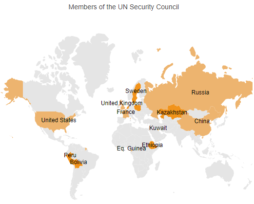
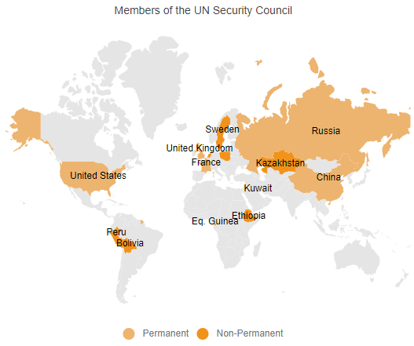
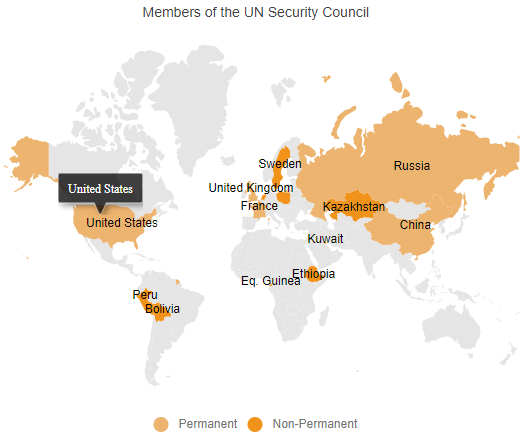

# Getting Started with Blazor Maps Component

This section briefly explains about how to include [Blazor Maps](https://www.syncfusion.com/blazor-components/blazor-map) component in your Blazor Server App and Blazor WebAssembly App using Visual Studio.

## Prerequisites

* [System requirements for Blazor components](https://blazor.syncfusion.com/documentation/system-requirements)

## Create a new Blazor App in Visual Studio

You can create **Blazor Server App** or **Blazor WebAssembly App** using Visual Studio in one of the following ways,

* [Create a Project using Microsoft Templates](https://docs.microsoft.com/en-us/aspnet/core/blazor/tooling?pivots=windows)

* [Create a Project using Syncfusion Blazor Extension](https://blazor.syncfusion.com/documentation/visual-studio-integration/vs2019-extensions/create-project)

## Install Syncfusion Blazor Maps NuGet in the App

Syncfusion Blazor components are available in [nuget.org](https://www.nuget.org/packages?q=syncfusion.blazor). To use Syncfusion Blazor components in the application, add reference to the corresponding NuGet. Refer to [NuGet packages topic](https://blazor.syncfusion.com/documentation/nuget-packages) for available NuGet packages list with component details.

To add Blazor Maps component in the app, open the NuGet package manager in Visual Studio (*Tools → NuGet Package Manager → Manage NuGet Packages for Solution*), search for [Syncfusion.Blazor.Maps](https://www.nuget.org/packages/Syncfusion.Blazor.Maps) and then install it.

## Register Syncfusion Blazor Service

Open **~/_Imports.razor** file and import the Syncfusion.Blazor namespace.




@using Syncfusion.Blazor




Now, register the Syncfusion Blazor Service in the Blazor Server App or Blazor WebAssembly App. Here, Syncfusion Blazor Service is registered by setting [IgnoreScriptIsolation](https://help.syncfusion.com/cr/blazor/Syncfusion.Blazor.GlobalOptions.html#Syncfusion_Blazor_GlobalOptions_IgnoreScriptIsolation) property as true to load the scripts externally in the [next steps](#add-script-reference).

### Blazor Server App

* For **.NET 6** app, open the **~/Program.cs** file and register the Syncfusion Blazor Service.

* For **.NET 5 and .NET 3.X** app, open the **~/Startup.cs** file and register the Syncfusion Blazor Service.




using Microsoft.AspNetCore.Components;
using Microsoft.AspNetCore.Components.Web;
using Syncfusion.Blazor;

var builder = WebApplication.CreateBuilder(args);

// Add services to the container.
builder.Services.AddRazorPages();
builder.Services.AddServerSideBlazor();
builder.Services.AddSyncfusionBlazor(options => { options.IgnoreScriptIsolation = true; });

var app = builder.Build();
....





using Syncfusion.Blazor;

namespace BlazorApplication
{
    public class Startup
    {
        ...
        public void ConfigureServices(IServiceCollection services)
        {
            services.AddRazorPages();
            services.AddServerSideBlazor();
            services.AddSyncfusionBlazor(options => { options.IgnoreScriptIsolation = true; });
        }
        ...
    }
}




### Blazor WebAssembly App

Open **~/Program.cs** file and register the Syncfusion Blazor Service in the client web app.




using Microsoft.AspNetCore.Components.Web;
using Microsoft.AspNetCore.Components.WebAssembly.Hosting;
using Syncfusion.Blazor;

var builder = WebAssemblyHostBuilder.CreateDefault(args);
builder.RootComponents.Add<App>("#app");
builder.RootComponents.Add<HeadOutlet>("head::after");

builder.Services.AddScoped(sp => new HttpClient { BaseAddress = new Uri(builder.HostEnvironment.BaseAddress) });

builder.Services.AddSyncfusionBlazor(options => { options.IgnoreScriptIsolation = true; });
await builder.Build().RunAsync();
....





using Syncfusion.Blazor;

namespace WebApplication1
{
    public class Program
    {
        public static async Task Main(string[] args)
        {
            ....
            builder.Services.AddSyncfusionBlazor(options => { options.IgnoreScriptIsolation = true; });
            await builder.Build().RunAsync();
        }
    }
}




## Add Style Sheet

Checkout the [Blazor Themes topic](https://blazor.syncfusion.com/documentation/appearance/themes) to learn different ways ([Static Web Assets](https://blazor.syncfusion.com/documentation/appearance/themes#static-web-assets), [CDN](https://sfblazor.azurewebsites.net/staging/documentation/appearance/themes#cdn-reference) and [CRG](https://blazor.syncfusion.com/documentation/common/custom-resource-generator)) to refer themes in Blazor application, and to have the expected appearance for Syncfusion Blazor components. Here, the theme is referred using [Static Web Assets](https://blazor.syncfusion.com/documentation/appearance/themes#static-web-assets).

To add theme to the app, open the NuGet package manager in Visual Studio (*Tools → NuGet Package Manager → Manage NuGet Packages for Solution*), search for [Syncfusion.Blazor.Themes](https://www.nuget.org/packages/Syncfusion.Blazor.Themes/) and then install it. Then, the theme style sheet from NuGet can be referred as follows,

### Blazor Server App

* For .NET 6 app, add the Syncfusion bootstrap5 theme in the `<head>` of the **~/Pages/_Layout.cshtml** file.

* For .NET 5 and .NET 3.X app, add the Syncfusion bootstrap5 theme in the `<head>` of the **~/Pages/_Host.cshtml** file.




<head>
    <link href="_content/Syncfusion.Blazor.Themes/bootstrap5.css" rel="stylesheet" />
</head>





<head>
    <link href="_content/Syncfusion.Blazor.Themes/bootstrap5.css" rel="stylesheet" />
</head>




### Blazor WebAssembly App

For Blazor WebAssembly App, refer the theme style sheet from NuGet in the `<head>` of **wwwroot/index.html** file in the client web app.




<head>
    <link href="_content/Syncfusion.Blazor.Themes/bootstrap5.css" rel="stylesheet" />
</head>




## Add Script Reference

Checkout [Adding Script Reference topic](https://blazor.syncfusion.com/documentation/common/adding-script-references) to learn different ways to add script reference in Blazor Application. In this getting started walk-through, the required scripts are referred using [Static Web Assets](https://sfblazor.azurewebsites.net/staging/documentation/common/adding-script-references#static-web-assets) externally inside the `<head>` as follows,

### Blazor Server App

* For **.NET 6** app, refer script in the `<head>` of the **~/Pages/_Layout.cshtml** file.

* For **.NET 5 and .NET 3.X** app, refer script in the `<head>` of the **~/Pages/_Host.cshtml** file.




<head>
    ....
    <link href="_content/Syncfusion.Blazor.Themes/bootstrap5.css" rel="stylesheet" />
    
</head>





<head>
    ....
    <link href="_content/Syncfusion.Blazor.Themes/bootstrap5.css" rel="stylesheet" />
    
</head>




### Blazor WebAssembly App

For Blazor WebAssembly App, refer script in the `<head>` of the **~/index.html** file.




<head>
    ....
    <link href="_content/Syncfusion.Blazor.Themes/bootstrap5.css" rel="stylesheet" />
    
</head>




> Syncfusion recommends to reference scripts using [Static Web Assets](https://blazor.syncfusion.com/documentation/common/adding-script-references#static-web-assets), [CDN](https://blazor.syncfusion.com/documentation/common/adding-script-references#cdn-reference) and [CRG](https://blazor.syncfusion.com/documentation/common/custom-resource-generator) by [disabling JavaScript isolation](https://blazor.syncfusion.com/documentation/common/adding-script-references#disable-javascript-isolation) for better loading performance of the Blazor application.

## Add Blazor Maps component

* Open **~/_Imports.razor** file or any other page under the `~/Pages` folder where the component is to be added and import the **Syncfusion.Blazor.Maps** namespace.




@using Syncfusion.Blazor
@using Syncfusion.Blazor.Maps




* Now, add the Syncfusion Maps component in razor file. Here, the Maps component is added in the **~/Pages/Index.razor** file under the **~/Pages** folder.




<SfMaps>
</SfMaps>




The Maps will not show any content on the web page while running the application because the properties related to the layer are not initialized in the above code.

## Adding GeoJSON data in Maps layer

Bind GeoJSON data to the Maps to render any geometric shape in SVG (Scalable Vector Graphics) for powerful data visualization of shapes. For example, you can render the World map and make desired customizations on it. You can also add any number of layers in the Maps.

You can use the [ShapeData](https://help.syncfusion.com/cr/blazor/Syncfusion.Blazor.Maps.MapsLayer-1.html#Syncfusion_Blazor_Maps_MapsLayer_1_ShapeData) property in [MapsLayer](https://help.syncfusion.com/cr/blazor/Syncfusion.Blazor.Maps.MapsLayer-1.html) to load the GeoJSON shape data into the Maps component.




<SfMaps>
    <MapsLayers>
        <MapsLayer ShapeData='new {dataOptions= "https://cdn.syncfusion.com/maps/map-data/world-map.json"}' TValue="string">
        </MapsLayer>
    </MapsLayers>
</SfMaps>




> The "world-map.json" file contains the World map GeoJSON data.

## Bind data source

The [DataSource](https://help.syncfusion.com/cr/blazor/Syncfusion.Blazor.Maps.MapsLayer-1.html#Syncfusion_Blazor_Maps_MapsLayer_1_DataSource) property is used to represent statistical data in the Maps component. We can define a list of objects as a data source to the Maps component. This data source will be further used to color the map, display data labels, display tooltips, and more. Assign the below list **SecurityCouncilDetails** to the [DataSource](https://help.syncfusion.com/cr/blazor/Syncfusion.Blazor.Maps.MapsLayer-1.html#Syncfusion_Blazor_Maps_MapsLayer_1_DataSource) property in [MapsLayer](https://help.syncfusion.com/cr/blazor/Syncfusion.Blazor.Maps.MapsLayer-1.html).




@code {
    public List<UNCouncilCountry> SecurityCouncilDetails = new List<UNCouncilCountry>{
         new UNCouncilCountry { Name= "China", Membership= "Permanent"},
         new UNCouncilCountry { Name= "France", Membership= "Permanent" },
         new UNCouncilCountry { Name= "Russia", Membership= "Permanent"},
         new UNCouncilCountry { Name= "Kazakhstan", Membership= "Non-Permanent"},
         new UNCouncilCountry { Name= "Poland", Membership= "Non-Permanent"},
         new UNCouncilCountry { Name= "Sweden", Membership= "Non-Permanent"},
         new UNCouncilCountry { Name= "United Kingdom", Membership= "Permanent"},
         new UNCouncilCountry { Name= "United States", Membership= "Permanent"},
         new UNCouncilCountry { Name= "Bolivia", Membership= "Non-Permanent"},
         new UNCouncilCountry { Name= "Eq. Guinea", Membership= "Non-Permanent"},
         new UNCouncilCountry { Name= "Ethiopia", Membership= "Non-Permanent"},
         new UNCouncilCountry { Name= "Côte d Ivoire", Membership= "Permanent"},
         new UNCouncilCountry { Name= "Kuwait", Membership= "Non-Permanent"},
         new UNCouncilCountry { Name= "Netherlands", Membership= "Non-Permanent"},
         new UNCouncilCountry { Name= "Peru", Membership= "Non-Permanent"}
    };

    public class UNCouncilCountry
    {
        public string Name { get; set; }
        public string Membership { get; set; }
    };
}




> The United Nations Security Council data is referred from [source](https://en.wikipedia.org/wiki/List_of_members_of_the_United_Nations_Security_Council).

You should also specify the field names in the shape data and data source to the [ShapePropertyPath](https://help.syncfusion.com/cr/blazor/Syncfusion.Blazor.Maps.MapsLayer-1.html#Syncfusion_Blazor_Maps_MapsLayer_1_ShapePropertyPath) and [ShapeDataPath](https://help.syncfusion.com/cr/blazor/Syncfusion.Blazor.Maps.MapsLayer-1.html#Syncfusion_Blazor_Maps_MapsLayer_1_ShapeDataPath) properties, respectively. These are used to identify the appropriate shapes and match the specific data source values to them.

> Please [refer to the section](populate-data#data-binding) for more information on data binding.




<SfMaps>
    <MapsLayers>
        @*To map shape data name field and data source field*@
        <MapsLayer ShapeData='new {dataOptions= "https://cdn.syncfusion.com/maps/map-data/world-map.json"}'
                   ShapePropertyPath='new string[] {"name"}'
                   DataSource="SecurityCouncilDetails"
                   ShapeDataPath="Name" TValue="UNCouncilCountry">
        </MapsLayer>
    </MapsLayers>
</SfMaps>




> For example, consider field names specified in [ShapePropertyPath](https://help.syncfusion.com/cr/blazor/Syncfusion.Blazor.Maps.MapsLayer-1.html#Syncfusion_Blazor_Maps_MapsLayer_1_ShapePropertyPath) and [ShapeDataPath](https://help.syncfusion.com/cr/blazor/Syncfusion.Blazor.Maps.MapsLayer-1.html#Syncfusion_Blazor_Maps_MapsLayer_1_ShapeDataPath) have the same value: **"United States"**. So corresponding color, data label and tooltip related settings will be applied to the **United States** shape.

## Apply color mapping

The color mapping supports customization of shape colors based on the underlying value of shape received from the bound data source. The values from the field name specified in the [ShapeDataPath](https://help.syncfusion.com/cr/blazor/Syncfusion.Blazor.Maps.MapsLayer-1.html#Syncfusion_Blazor_Maps_MapsLayer_1_ShapeDataPath) property will be compared for the shapes with the values in the field name specified in the [ColorValuePath](https://help.syncfusion.com/cr/blazor/Syncfusion.Blazor.Maps.MapsShapeSettings.html#Syncfusion_Blazor_Maps_MapsShapeSettings_ColorValuePath) property in [MapsShapeSettings](https://help.syncfusion.com/cr/blazor/Syncfusion.Blazor.Maps.MapsShapeSettings.html). Also, specify color and value in [MapsShapeColorMapping](https://help.syncfusion.com/cr/blazor/Syncfusion.Blazor.Maps.MapsShapeColorMapping.html). Here, in this example, **"#EDB46F"** is specified for **"Permanent"** and **"#F1931B"** is specified for **"Non-Permanent"**.




<SfMaps>
    <MapsLayers>
        <MapsLayer ShapeData='new {dataOptions= "https://cdn.syncfusion.com/maps/map-data/world-map.json"}'
                   ShapePropertyPath='new string[] {"name"}'
                   DataSource="SecurityCouncilDetails"
                   ShapeDataPath="Name" TValue="UNCouncilCountry">
            @* Color mapping related configuration *@
            <MapsShapeSettings Fill="#E5E5E5" ColorValuePath="Membership">
                <MapsShapeColorMappings>
                    <MapsShapeColorMapping Value="Permanent" Color='new string[] {"#EDB46F"}'></MapsShapeColorMapping>
                    <MapsShapeColorMapping Value="Non-Permanent" Color='new string[] {"#F1931B"}'></MapsShapeColorMapping>
                </MapsShapeColorMappings>
            </MapsShapeSettings>
        </MapsLayer>
    </MapsLayers>
</SfMaps>




> Refer [code block](#bind-data-source) to know the property value of **SecurityCouncilDetails**.

## Adding data labels

Label provides information to users about the shapes, and you can enable label text to the shapes in the Maps component by setting the [Visible](https://help.syncfusion.com/cr/blazor/Syncfusion.Blazor.Maps.MapsDataLabelSettings.html#Syncfusion_Blazor_Maps_MapsDataLabelSettings_Visible) property as **true** and field name from data source in the [LabelPath](https://help.syncfusion.com/cr/blazor/Syncfusion.Blazor.Maps.MapsDataLabelSettings.html#Syncfusion_Blazor_Maps_MapsDataLabelSettings_LabelPath) property in [MapsDataLabelSettings](https://help.syncfusion.com/cr/blazor/Syncfusion.Blazor.Maps.MapsDataLabelSettings.html).




<SfMaps>
    <MapsLayers>
        <MapsLayer ShapeData='new {dataOptions= "https://cdn.syncfusion.com/maps/map-data/world-map.json"}'
                   ShapePropertyPath='new string[] {"name"}'
                   DataSource="SecurityCouncilDetails"
                   ShapeDataPath="Name" TValue="UNCouncilCountry">
            @* To add data labels *@
            <MapsDataLabelSettings Visible="true" LabelPath="Name" IntersectionAction="IntersectAction.Hide"></MapsDataLabelSettings>
            <MapsShapeSettings Fill="#E5E5E5" ColorValuePath="Membership">
                <MapsShapeColorMappings>
                    <MapsShapeColorMapping Value="Permanent" Color='new string[] {"#EDB46F"}'></MapsShapeColorMapping>
                    <MapsShapeColorMapping Value="Non-Permanent" Color='new string[] {"#F1931B"}'></MapsShapeColorMapping>
                </MapsShapeColorMappings>
            </MapsShapeSettings>
        </MapsLayer>
    </MapsLayers>
</SfMaps>




> Refer [code block](#bind-data-source) to know the property value of **SecurityCouncilDetails**.

## Adding title for Maps

Title can be added to the Maps to provide quick information to the users about the shapes rendered in the component. You can add a title using [Text](https://help.syncfusion.com/cr/blazor/Syncfusion.Blazor.Maps.MapsTitleSettings.html#Syncfusion_Blazor_Maps_MapsTitleSettings_Text) property in [MapsTitleSettings](https://help.syncfusion.com/cr/blazor/Syncfusion.Blazor.Maps.MapsTitleSettings.html).




<SfMaps>
    @* To add title *@
    <MapsTitleSettings Text="Members of the UN Security Council"></MapsTitleSettings>
    <MapsLayers>
        <MapsLayer ShapeData='new {dataOptions= "https://cdn.syncfusion.com/maps/map-data/world-map.json"}'
                   ShapePropertyPath='new string[] {"name"}'
                   DataSource="SecurityCouncilDetails"
                   ShapeDataPath="Name" TValue="UNCouncilCountry">
            <MapsDataLabelSettings Visible="true" LabelPath="Name" IntersectionAction="IntersectAction.Hide"></MapsDataLabelSettings>
            <MapsShapeSettings Fill="#E5E5E5" ColorValuePath="Membership">
                <MapsShapeColorMappings>
                    <MapsShapeColorMapping Value="Permanent" Color='new string[] {"#EDB46F"}'></MapsShapeColorMapping>
                    <MapsShapeColorMapping Value="Non-Permanent" Color='new string[] {"#F1931B"}'></MapsShapeColorMapping>
                </MapsShapeColorMappings>
            </MapsShapeSettings>
        </MapsLayer>
    </MapsLayers>
</SfMaps>




> Refer [code block](#bind-data-source) to know the property value of **SecurityCouncilDetails**.

## Enable legend

The legend items are used to denote color mapping categories, and you can show legend for the Maps by setting the [Visible](https://help.syncfusion.com/cr/blazor/Syncfusion.Blazor.Maps.MapsLegendSettings.html#Syncfusion_Blazor_Maps_MapsLegendSettings_Visible) property to **true** in [MapsLegendSettings](https://help.syncfusion.com/cr/blazor/Syncfusion.Blazor.Maps.MapsLegendSettings.html).




<SfMaps>
    <MapsTitleSettings Text="Members of the UN Security Council"></MapsTitleSettings>
    @* To add legend *@
    <MapsLegendSettings Visible="true"></MapsLegendSettings>
    <MapsLayers>
        <MapsLayer ShapeData='new {dataOptions= "https://cdn.syncfusion.com/maps/map-data/world-map.json"}'
                   ShapePropertyPath='new string[] {"name"}'
                   DataSource="SecurityCouncilDetails"
                   ShapeDataPath="Name" TValue="UNCouncilCountry">
            <MapsDataLabelSettings Visible="true" LabelPath="Name" IntersectionAction="IntersectAction.Hide"></MapsDataLabelSettings>
            <MapsShapeSettings Fill="#E5E5E5" ColorValuePath="Membership">
                <MapsShapeColorMappings>
                    <MapsShapeColorMapping Value="Permanent" Color='new string[] {"#EDB46F"}'></MapsShapeColorMapping>
                    <MapsShapeColorMapping Value="Non-Permanent" Color='new string[] {"#F1931B"}'></MapsShapeColorMapping>
                </MapsShapeColorMappings>
            </MapsShapeSettings>
        </MapsLayer>
    </MapsLayers>
</SfMaps>




> Refer [code block](#bind-data-source) to know the property value of **SecurityCouncilDetails**.

## Enable tooltip

The tooltip can be used when you cannot display information using the data labels due to space constraints. You can enable tooltip by setting the [Visible](https://help.syncfusion.com/cr/blazor/Syncfusion.Blazor.Maps.MapsTooltipSettings.html#Syncfusion_Blazor_Maps_MapsTooltipSettings_Visible) property to **true** in [MapsLayerTooltipSettings](https://help.syncfusion.com/cr/blazor/Syncfusion.Blazor.Maps.MapsLayerTooltipSettings.html).




<SfMaps>
    <MapsTitleSettings Text="Members of the UN Security Council"></MapsTitleSettings>
    <MapsLegendSettings Visible="true"></MapsLegendSettings>
    <MapsLayers>
        <MapsLayer ShapeData='new {dataOptions= "https://cdn.syncfusion.com/maps/map-data/world-map.json"}'
                   ShapePropertyPath='new string[] {"name"}'
                   DataSource="SecurityCouncilDetails"
                   ShapeDataPath="Name" TValue="UNCouncilCountry">
            <MapsDataLabelSettings Visible="true" LabelPath="Name" IntersectionAction="IntersectAction.Hide"></MapsDataLabelSettings>
            <MapsShapeSettings Fill="#E5E5E5" ColorValuePath="Membership">
                <MapsShapeColorMappings>
                    <MapsShapeColorMapping Value="Permanent" Color='new string[] {"#EDB46F"}'></MapsShapeColorMapping>
                    <MapsShapeColorMapping Value="Non-Permanent" Color='new string[] {"#F1931B"}'></MapsShapeColorMapping>
                </MapsShapeColorMappings>
            </MapsShapeSettings>
            @* To add tooltip for the shape *@
            <MapsLayerTooltipSettings Visible='true' ValuePath="Name"></MapsLayerTooltipSettings>
        </MapsLayer>
    </MapsLayers>
</SfMaps>




> Refer [code block](#bind-data-source) to know the property value of **SecurityCouncilDetails**.

## See also

* [Getting Started with Syncfusion Blazor for WebAssembly application in .NET Core CLI](https://blazor.syncfusion.com/documentation/getting-started/blazor-webassembly-dotnet-cli/)

* [Getting Started with Syncfusion Blazor for server-side application in Visual Studio](https://blazor.syncfusion.com/documentation/getting-started/blazor-server-side-visual-studio/)

* [Getting Started with Syncfusion Blazor for server-side application in .NET Core CLI](https://blazor.syncfusion.com/documentation/getting-started/blazor-server-side-dotnet-cli/)
