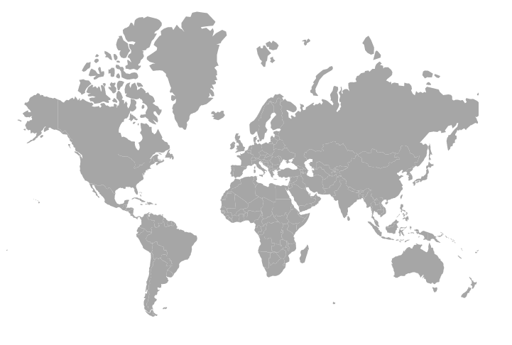
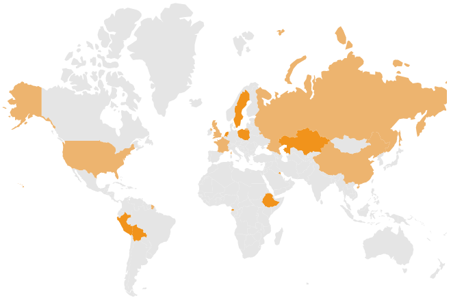
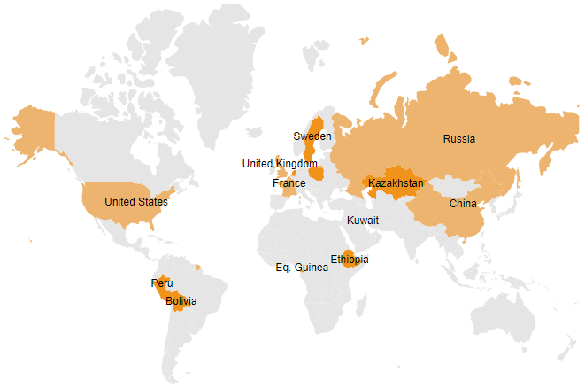

# Getting Started with Blazor Maps Component

This section briefly explains how to include a Maps component in your Blazor server-side application. You can refer to our [Getting Started with Syncfusion Blazor for server-side in Visual Studio 2019](https://blazor.syncfusion.com/documentation/getting-started/blazor-server-side-visual-studio-2019/) page for introduction and configuring common specifications.

## Importing Syncfusion Blazor Maps component in the application

1. Install **Syncfusion.Blazor.Maps** NuGet package in the application using the **NuGet Package Manager**.

2. You can add the client-side resources through CDN or local npm package in the `<head>` element of the **~/Pages/_Host.cshtml** page.

```html
    <head>
        <link href="_content/Syncfusion.Blazor.Themes/bootstrap4.css" rel="stylesheet" />
        <!---CDN--->
        @*<link href="https://cdn.syncfusion.com/blazor/{:version:}/styles/bootstrap4.css" rel="stylesheet" />*@
    </head>
```

> For Internet Explorer 11, kindly refer the polyfills. Refer the [documentation](https://blazor.syncfusion.com/documentation/common/how-to/render-blazor-server-app-in-ie/) for more information.

 ```html
    <head>
        <link href="https://cdn.syncfusion.com/blazor/{:version:}/styles/bootstrap4.css" rel="stylesheet" />
        <script src="https://github.com/Daddoon/Blazor.Polyfill/releases/download/3.0.1/blazor.polyfill.min.js"></script>
    </head>
```

## Adding component package to the application

Open the **~/_Imports.razor** file and include the **Syncfusion.Blazor.Maps** namespace.

```cshtml
@using Syncfusion.Blazor.Maps
```

## Adding SyncfusionBlazor Service in Startup.cs

Open the **Startup.cs** file and add services required by Syncfusion components using **services.AddSyncfusionBlazor()** method. Add this method in the **ConfigureServices** function as follows.

```csharp
using Syncfusion.Blazor;

namespace BlazorApplication
{
    public class Startup
    {
        ....
        ....
        public void ConfigureServices(IServiceColloection services)
        {
            ....
            ....
            services.AddSyncfusionBlazor();
        }
    }
}
```

> To enable custom client-side source loading from CRG or CDN, please refer to the section about [custom resources in Blazor application](https://blazor.syncfusion.com/documentation/common/custom-resource-generator/#how-to-use-custom-resources-in-the-blazor-application).

## Adding Maps component

The Syncfusion Maps component can be initialized in any razor page inside the **~/Pages** folder. For example, the Maps component is added to the **~/Pages/Index.razor** page. In a new application, if **Index.razor** page has any default content template, then those content can be completely removed and following code can be added.

```cshtml
@page "/"

<SfMaps>

</SfMaps>
```

The Maps will not show any content on the web page while running the application because the properties related to the layer are not initialized in the above code.

## Adding GeoJSON data in Maps layer

Bind GeoJSON data to the Maps to render any geometric shape in SVG (Scalable Vector Graphics) for powerful data visualization of shapes. For example, you can render the World map and make desired customizations on it. You can also add any number of layers in the Maps.

You can use the [`ShapeData`](https://help.syncfusion.com/cr/blazor/Syncfusion.Blazor.Maps.MapsLayer-1.html#Syncfusion_Blazor_Maps_MapsLayer_1_ShapeData) property in [`MapsLayer`](https://help.syncfusion.com/cr/blazor/Syncfusion.Blazor.Maps.MapsLayer-1.html) to load the GeoJSON shape data into the Maps component.

 ```csharp
<SfMaps>
    <MapsLayers>
        @* To load shape data *@
        <MapsLayer ShapeData='new {dataOptions= "https://cdn.syncfusion.com/maps/map-data/world-map.json"}' TValue="string">
        </MapsLayer>
    </MapsLayers>
</SfMaps>
```



> The "world-map.json" file contains the World map GeoJSON data.

## Bind data source

The [`DataSource`](https://help.syncfusion.com/cr/blazor/Syncfusion.Blazor.Maps.MapsLayer-1.html#Syncfusion_Blazor_Maps_MapsLayer_1_DataSource) property is used to represent statistical data in the Maps component. We can define a list of objects as a data source to the Maps component. This data source will be further used to color the map, display data labels, display tooltips, and more. Assign the below list **SecurityCouncilDetails** to the [`DataSource`](https://help.syncfusion.com/cr/blazor/Syncfusion.Blazor.Maps.MapsLayer-1.html#Syncfusion_Blazor_Maps_MapsLayer_1_DataSource) property in [`MapsLayer`](https://help.syncfusion.com/cr/blazor/Syncfusion.Blazor.Maps.MapsLayer-1.html).

```cshtml
@code {
    public List<UNCouncilCountry> SecurityCouncilDetails = new List<UNCouncilCountry>{
         new UNCouncilCountry { Name= "China", Membership= "Permanent"},
         new UNCouncilCountry { Name= "France", Membership= "Permanent" },
         new UNCouncilCountry { Name= "Russia", Membership= "Permanent"},
         new UNCouncilCountry { Name= "Kazakhstan", Membership= "Non-Permanent"},
         new UNCouncilCountry { Name= "Poland", Membership= "Non-Permanent"},
         new UNCouncilCountry { Name= "Sweden", Membership= "Non-Permanent"},
         new UNCouncilCountry { Name= "United Kingdom", Membership= "Permanent"},
         new UNCouncilCountry { Name= "United States", Membership= "Permanent"},
         new UNCouncilCountry { Name= "Bolivia", Membership= "Non-Permanent"},
         new UNCouncilCountry { Name= "Eq. Guinea", Membership= "Non-Permanent"},
         new UNCouncilCountry { Name= "Ethiopia", Membership= "Non-Permanent"},
         new UNCouncilCountry { Name= "Côte d Ivoire", Membership= "Permanent"},
         new UNCouncilCountry { Name= "Kuwait", Membership= "Non-Permanent"},
         new UNCouncilCountry { Name= "Netherlands", Membership= "Non-Permanent"},
         new UNCouncilCountry { Name= "Peru", Membership= "Non-Permanent"}
    };

    public class UNCouncilCountry
    {
        public string Name { get; set; }
        public string Membership { get; set; }
    };
}
```

> The United Nations Security Council data is referred from [source](https://en.wikipedia.org/wiki/List_of_members_of_the_United_Nations_Security_Council).

You should also specify the field names in the shape data and data source to the [`ShapePropertyPath`](https://help.syncfusion.com/cr/blazor/Syncfusion.Blazor.Maps.MapsLayer-1.html#Syncfusion_Blazor_Maps_MapsLayer_1_ShapePropertyPath) and [`ShapeDataPath`](https://help.syncfusion.com/cr/blazor/Syncfusion.Blazor.Maps.MapsLayer-1.html#Syncfusion_Blazor_Maps_MapsLayer_1_ShapeDataPath) properties, respectively. These are used to identify the appropriate shapes and match the specific data source values to them.

> Please [refer to the section](populate-data#data-binding) for more information on data binding.

```csharp
<SfMaps>
    <MapsLayers>
        @*To map shape data name field and data source field*@
        <MapsLayer ShapeData='new {dataOptions= "https://cdn.syncfusion.com/maps/map-data/world-map.json"}'
                   ShapePropertyPath='new string[] {"name"}'
                   DataSource="SecurityCouncilDetails"
                   ShapeDataPath="Name" TValue="UNCouncilCountry">
        </MapsLayer>
    </MapsLayers>
</SfMaps>
```

> For example, consider field names specified in [`ShapePropertyPath`](https://help.syncfusion.com/cr/blazor/Syncfusion.Blazor.Maps.MapsLayer-1.html#Syncfusion_Blazor_Maps_MapsLayer_1_ShapePropertyPath) and [`ShapeDataPath`](https://help.syncfusion.com/cr/blazor/Syncfusion.Blazor.Maps.MapsLayer-1.html#Syncfusion_Blazor_Maps_MapsLayer_1_ShapeDataPath) have the same value: **"United States"**. So corresponding color, data label and tooltip related settings will be applied to the **United States** shape.

## Apply color mapping

The color mapping supports customization of shape colors based on the underlying value of shape received from the bound data source. The values from the field name specified in the [`ShapeDataPath`](https://help.syncfusion.com/cr/blazor/Syncfusion.Blazor.Maps.MapsLayer-1.html#Syncfusion_Blazor_Maps_MapsLayer_1_ShapeDataPath) property will be compared for the shapes with the values in the field name specified in the [`ColorValuePath`](https://help.syncfusion.com/cr/blazor/Syncfusion.Blazor.Maps.MapsShapeSettings.html#Syncfusion_Blazor_Maps_MapsShapeSettings_ColorValuePath) property in [`MapsShapeSettings`](https://help.syncfusion.com/cr/blazor/Syncfusion.Blazor.Maps.MapsShapeSettings.html). Also, specify color and value in [`MapsShapeColorMapping`](https://help.syncfusion.com/cr/blazor/Syncfusion.Blazor.Maps.MapsShapeColorMapping.html). Here, in this example, **"#EDB46F"** is specified for **"Permanent"** and **"#F1931B"** is specified for **"Non-Permanent"**.

```csharp
<SfMaps>
    <MapsLayers>
        <MapsLayer ShapeData='new {dataOptions= "https://cdn.syncfusion.com/maps/map-data/world-map.json"}'
                   ShapePropertyPath='new string[] {"name"}'
                   DataSource="SecurityCouncilDetails"
                   ShapeDataPath="Name" TValue="UNCouncilCountry">
            @* Color mapping related configuration *@
            <MapsShapeSettings Fill="#E5E5E5" ColorValuePath="Membership">
                <MapsShapeColorMappings>
                    <MapsShapeColorMapping Value="Permanent" Color='new string[] {"#EDB46F"}'></MapsShapeColorMapping>
                    <MapsShapeColorMapping Value="Non-Permanent" Color='new string[] {"#F1931B"}'></MapsShapeColorMapping>
                </MapsShapeColorMappings>
            </MapsShapeSettings>
        </MapsLayer>
    </MapsLayers>
</SfMaps>
```



> Refer [code block](#bind-data-source) to know the property value of **SecurityCouncilDetails**.

## Adding data labels

Label provides information to users about the shapes, and you can enable label text to the shapes in the Maps component by setting the [`Visible`](https://help.syncfusion.com/cr/blazor/Syncfusion.Blazor.Maps.MapsDataLabelSettings.html#Syncfusion_Blazor_Maps_MapsDataLabelSettings_Visible) property as **true** and field name from data source in the [`LabelPath`](https://help.syncfusion.com/cr/blazor/Syncfusion.Blazor.Maps.MapsDataLabelSettings.html#Syncfusion_Blazor_Maps_MapsDataLabelSettings_LabelPath) property in [`MapsDataLabelSettings`](https://help.syncfusion.com/cr/blazor/Syncfusion.Blazor.Maps.MapsDataLabelSettings.html).

```csharp
<SfMaps>
    <MapsLayers>
        <MapsLayer ShapeData='new {dataOptions= "https://cdn.syncfusion.com/maps/map-data/world-map.json"}'
                   ShapePropertyPath='new string[] {"name"}'
                   DataSource="SecurityCouncilDetails"
                   ShapeDataPath="Name" TValue="UNCouncilCountry">
            @* To add data labels *@
            <MapsDataLabelSettings Visible="true" LabelPath="Name" IntersectionAction="IntersectAction.Hide"></MapsDataLabelSettings>
            <MapsShapeSettings Fill="#E5E5E5" ColorValuePath="Membership">
                <MapsShapeColorMappings>
                    <MapsShapeColorMapping Value="Permanent" Color='new string[] {"#EDB46F"}'></MapsShapeColorMapping>
                    <MapsShapeColorMapping Value="Non-Permanent" Color='new string[] {"#F1931B"}'></MapsShapeColorMapping>
                </MapsShapeColorMappings>
            </MapsShapeSettings>
        </MapsLayer>
    </MapsLayers>
</SfMaps>
```

> Refer [code block](#bind-data-source) to know the property value of **SecurityCouncilDetails**.



## Adding title for Maps

Title can be added to the Maps to provide quick information to the users about the shapes rendered in the component. You can add a title using [`Text`](https://help.syncfusion.com/cr/blazor/Syncfusion.Blazor.Maps.MapsTitleSettings.html#Syncfusion_Blazor_Maps_MapsTitleSettings_Text) property in [`MapsTitleSettings`](https://help.syncfusion.com/cr/blazor/Syncfusion.Blazor.Maps.MapsTitleSettings.html).

```csharp
<SfMaps>
    @* To add title *@
    <MapsTitleSettings Text="Members of the UN Security Council"></MapsTitleSettings>
    <MapsLayers>
        <MapsLayer ShapeData='new {dataOptions= "https://cdn.syncfusion.com/maps/map-data/world-map.json"}'
                   ShapePropertyPath='new string[] {"name"}'
                   DataSource="SecurityCouncilDetails"
                   ShapeDataPath="Name" TValue="UNCouncilCountry">
            <MapsDataLabelSettings Visible="true" LabelPath="Name" IntersectionAction="IntersectAction.Hide"></MapsDataLabelSettings>
            <MapsShapeSettings Fill="#E5E5E5" ColorValuePath="Membership">
                <MapsShapeColorMappings>
                    <MapsShapeColorMapping Value="Permanent" Color='new string[] {"#EDB46F"}'></MapsShapeColorMapping>
                    <MapsShapeColorMapping Value="Non-Permanent" Color='new string[] {"#F1931B"}'></MapsShapeColorMapping>
                </MapsShapeColorMappings>
            </MapsShapeSettings>
        </MapsLayer>
    </MapsLayers>
</SfMaps>
```

> Refer [code block](#bind-data-source) to know the property value of **SecurityCouncilDetails**.


## Enable legend

The legend items are used to denote color mapping categories, and you can show legend for the Maps by setting the [`Visible`](https://help.syncfusion.com/cr/blazor/Syncfusion.Blazor.Maps.MapsLegendSettings.html#Syncfusion_Blazor_Maps_MapsLegendSettings_Visible) property to **true** in [`MapsLegendSettings`](https://help.syncfusion.com/cr/blazor/Syncfusion.Blazor.Maps.MapsLegendSettings.html).

```csharp
<SfMaps>
    <MapsTitleSettings Text="Members of the UN Security Council"></MapsTitleSettings>
    @* To add legend *@
    <MapsLegendSettings Visible="true"></MapsLegendSettings>
    <MapsLayers>
        <MapsLayer ShapeData='new {dataOptions= "https://cdn.syncfusion.com/maps/map-data/world-map.json"}'
                   ShapePropertyPath='new string[] {"name"}'
                   DataSource="SecurityCouncilDetails"
                   ShapeDataPath="Name" TValue="UNCouncilCountry">
            <MapsDataLabelSettings Visible="true" LabelPath="Name" IntersectionAction="IntersectAction.Hide"></MapsDataLabelSettings>
            <MapsShapeSettings Fill="#E5E5E5" ColorValuePath="Membership">
                <MapsShapeColorMappings>
                    <MapsShapeColorMapping Value="Permanent" Color='new string[] {"#EDB46F"}'></MapsShapeColorMapping>
                    <MapsShapeColorMapping Value="Non-Permanent" Color='new string[] {"#F1931B"}'></MapsShapeColorMapping>
                </MapsShapeColorMappings>
            </MapsShapeSettings>
        </MapsLayer>
    </MapsLayers>
</SfMaps>
```

> Refer [code block](#bind-data-source) to know the property value of **SecurityCouncilDetails**.


## Enable tooltip

The tooltip can be used when you cannot display information using the data labels due to space constraints. You can enable tooltip by setting the [`Visible`](https://help.syncfusion.com/cr/blazor/Syncfusion.Blazor.Maps.MapsTooltipSettings.html#Syncfusion_Blazor_Maps_MapsTooltipSettings_Visible) property to **true** in [`MapsLayerTooltipSettings`](https://help.syncfusion.com/cr/blazor/Syncfusion.Blazor.Maps.MapsLayerTooltipSettings.html).

```csharp
<SfMaps>
    <MapsTitleSettings Text="Members of the UN Security Council"></MapsTitleSettings>
    <MapsLegendSettings Visible="true"></MapsLegendSettings>
    <MapsLayers>
        <MapsLayer ShapeData='new {dataOptions= "https://cdn.syncfusion.com/maps/map-data/world-map.json"}'
                   ShapePropertyPath='new string[] {"name"}'
                   DataSource="SecurityCouncilDetails"
                   ShapeDataPath="Name" TValue="UNCouncilCountry">
            <MapsDataLabelSettings Visible="true" LabelPath="Name" IntersectionAction="IntersectAction.Hide"></MapsDataLabelSettings>
            <MapsShapeSettings Fill="#E5E5E5" ColorValuePath="Membership">
                <MapsShapeColorMappings>
                    <MapsShapeColorMapping Value="Permanent" Color='new string[] {"#EDB46F"}'></MapsShapeColorMapping>
                    <MapsShapeColorMapping Value="Non-Permanent" Color='new string[] {"#F1931B"}'></MapsShapeColorMapping>
                </MapsShapeColorMappings>
            </MapsShapeSettings>
            @* To add tooltip for the shape *@
            <MapsLayerTooltipSettings Visible='true' ValuePath="Name"></MapsLayerTooltipSettings>
        </MapsLayer>
    </MapsLayers>
</SfMaps>
```

> Refer [code block](#bind-data-source) to know the property value of **SecurityCouncilDetails**.


> You can refer to our [Blazor Maps](https://www.syncfusion.com/blazor-components/blazor-map) feature tour page for its groundbreaking feature representations. You can also explore our [Blazor Maps example](https://blazor.syncfusion.com/demos/maps/default-functionalities?theme=bootstrap4) to knows how to render and configure the maps.

## See also

* [Getting Started with Syncfusion Blazor for client-side application in .NET Core CLI](https://blazor.syncfusion.com/documentation/getting-started/dotnet-cli-blazor/)

* [Getting Started with Syncfusion Blazor for server-side application in Visual Studio 2019](https://blazor.syncfusion.com/documentation/getting-started/blazor-server-side-visual-studio-2019/)

* [Getting Started with Syncfusion Blazor for server-side application in .NET Core CLI](https://blazor.syncfusion.com/documentation/getting-started/dotnet-cli-blazor-server/)